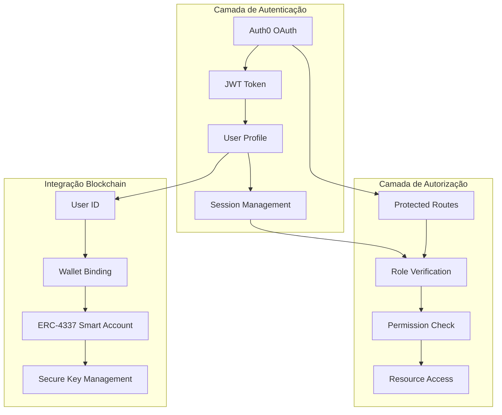
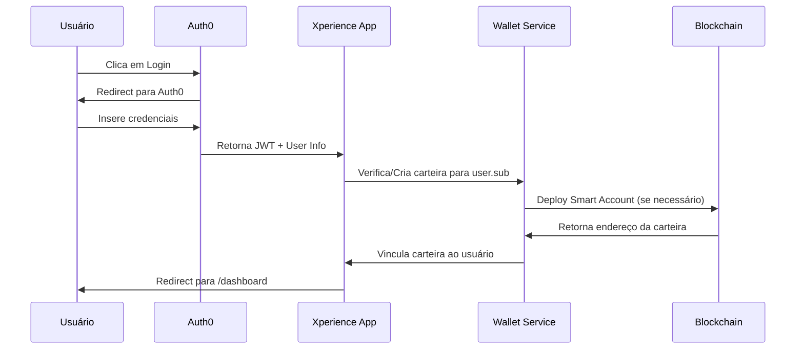
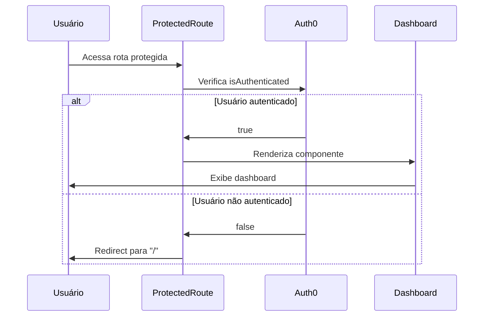

# 🔐 Sistema de Autenticação e Autorização - Xperience

## 📋 Visão Geral

O projeto Xperience implementa um sistema de autenticação e autorização moderno e seguro, integrando **Auth0** para autenticação OAuth com **ERC-4337 Account Abstraction** para gestão de carteiras blockchain. Este documento detalha como regulamos os acessos e autorizações na plataforma.

## 🏗️ Arquitetura de Segurança



## 🔑 Componentes de Autenticação

### 1. **Configuração Auth0**

```typescript
// src/auth0-config.ts
export const auth0Config = {
  domain: "dev-koop8k021nsu56xw.us.auth0.com",
  clientId: "EPuSKljSm1hQvlcfwJBGLUHR0EflH4SL",
  authorizationParams: {
    redirect_uri: window.location.origin,
  },
};
```

**Características:**
- **Provider**: Auth0 como provedor OAuth
- **Domínio**: Ambiente de desenvolvimento configurado
- **Redirect**: Retorno para origem da aplicação
- **Segurança**: Client ID público para aplicações SPA

### 2. **Componente de Autenticação**

```typescript
// src/components/AuthButton/index.tsx
const AuthButton = () => {
  const { loginWithRedirect, logout, isAuthenticated, user } = useAuth0();
  
  return (
    <div>
      {isAuthenticated ? (
        <>
          <p>Bem-vindo, {user?.name?.split(" ")[0]}</p>
          <button onClick={() => logout({ 
            logoutParams: { returnTo: window.location.origin } 
          })}>
            Logout
          </button>
        </>
      ) : (
        <button onClick={() => loginWithRedirect({
          appState: { returnTo: "/dashboard" }
        })}>
          Login
        </button>
      )}
    </div>
  );
};
```

**Funcionalidades:**
- **Login Redirect**: Redirecionamento automático para dashboard
- **Logout Seguro**: Limpeza completa da sessão
- **Estado Condicional**: Interface adaptativa baseada no status de autenticação
- **Personalização**: Exibição apenas do primeiro nome do usuário

## 🛡️ Sistema de Autorização

### 1. **Rotas Protegidas**

```typescript
// src/components/ProtectedRoute/index.tsx
const ProtectedRoute = ({ children }: { children: JSX.Element }) => {
  const { isAuthenticated, isLoading } = useAuth0();

  if (isLoading) return <p>Carregando...</p>;
  
  return isAuthenticated ? children : <Navigate to="/" />;
};
```

**Implementação:**
- **Verificação de Estado**: Checagem do status de autenticação
- **Loading State**: Tratamento de estados de carregamento
- **Redirecionamento**: Navegação automática para home se não autenticado
- **Proteção de Componentes**: Wrapper para componentes que requerem autenticação

### 2. **Aplicação de Rotas Protegidas**

```typescript
// src/App.tsx - Implementação
<Route path="/dashboard" element={
  <ProtectedRoute>
    <Dashboard />
  </ProtectedRoute>
} />
```

**Rotas Protegidas Atuais:**
- `/dashboard` - Painel principal do usuário
- Futuras rotas administrativas e de gestão de carteira

## 🏦 Integração com Blockchain (ERC-4337)

### 1. **Vinculação Usuário-Carteira**

```typescript
// src/services/userWalletService.ts
export class UserWalletService {
  async getOrCreateUserWallet(userId: string): Promise<StoredWallet> {
    const existingWallet = await this.getUserWallet(userId);
    
    if (existingWallet) {
      return existingWallet;
    }
    
    // Cria nova carteira ERC-4337 para o usuário
    const newWallet = await this.walletService.createWalletForUser(userId);
    
    const storedWallet: StoredWallet = {
      userId: newWallet.userId,
      address: newWallet.address,
      smartAccountAddress: newWallet.smartAccountAddress,
    };
    
    await this.storeUserWallet(storedWallet);
    return storedWallet;
  }
}
```

**Características:**
- **Vinculação Automática**: Cada usuário OAuth recebe uma carteira ERC-4337
- **Persistência Segura**: Armazenamento local com criptografia
- **Smart Accounts**: Carteiras inteligentes com recursos avançados
- **Recovery System**: Sistema de recuperação de carteiras

### 2. **Hook de Carteira do Usuário**

```typescript
// src/hooks/useUserWallet.ts
export const useUserWallet = () => {
  const { user, isAuthenticated } = useAuth0();
  const [walletData, setWalletData] = useState<WalletData | null>(null);
  
  const initializeWallet = useCallback(async () => {
    if (!isAuthenticated || !user?.sub) {
      setWalletData(null);
      return;
    }
    
    // Inicializa ou recupera carteira do usuário
    const wallet = await userWalletService.getOrCreateUserWallet(user.sub);
    const balance = await walletService.getBalance(wallet.smartAccountAddress);
    
    setWalletData({
      address: wallet.address,
      smartAccountAddress: wallet.smartAccountAddress,
      balance,
    });
  }, [isAuthenticated, user?.sub]);
  
  return {
    walletData,
    sendTransaction,
    refreshBalance,
    initializeWallet,
  };
};
```

## 🎯 Níveis de Acesso e Permissões

### 1. **Usuários Não Autenticados**
- **Acesso**: Páginas públicas (Home, Solutions, Plans, Contact, About, Community)
- **Restrições**: Não podem acessar dashboard ou funcionalidades premium
- **Funcionalidades**: Visualização de conteúdo público e processo de login

### 2. **Usuários Autenticados**
- **Acesso**: Todas as páginas públicas + Dashboard
- **Carteira**: Carteira ERC-4337 vinculada automaticamente
- **Funcionalidades**: 
  - Gestão de carteira blockchain
  - Transações via Account Abstraction
  - Acesso a serviços personalizados

### 3. **Sistema de Governança (Token XPT)**

```markdown
# Níveis de Acesso baseados em Token XPT:

## 🥉 Holder Básico
- Participação em votações básicas
- Acesso a recursos padrão da plataforma

## 🥈 Holder Intermediário (Staking)
- Votações com peso aumentado
- Acesso a recursos premium
- Participação em pools de liquidez

## 🥇 Holder Avançado (Alto Staking)
- Criação de propostas de governança
- Acesso antecipado a funcionalidades
- Participação em grupos de trabalho

## 💎 Fundadores/Equipe
- Acesso administrativo completo
- Gestão de contratos inteligentes
- Controle de distribuição de tokens
```

## 🔒 Segurança e Criptografia

### 1. **Gestão de Chaves Privadas**

```typescript
// Criptografia de chaves privadas
async storePrivateKey(userId: string, privateKey: string, password: string): Promise<void> {
  // Criptografia AES das chaves privadas
  const encryptedKey = CryptoJS.AES.encrypt(privateKey, password).toString();
  
  wallet.encryptedKey = encryptedKey;
  await this.storeUserWallet(wallet);
}

async getPrivateKey(userId: string, password: string): Promise<string> {
  // Descriptografia segura das chaves
  const bytes = CryptoJS.AES.decrypt(wallet.encryptedKey, password);
  const privateKey = bytes.toString(CryptoJS.enc.Utf8);
  
  return privateKey;
}
```

### 2. **Sistema de Recuperação**

```typescript
// Sistema de recovery de carteiras
async generateRecoveryKey(userId: string, password: string): Promise<string> {
  const privateKey = await this.getPrivateKey(userId, password);
  const recoveryKey = CryptoJS.lib.WordArray.random(16).toString();
  
  // Criptografia dupla para recovery
  const encryptedWithRecovery = CryptoJS.AES.encrypt(privateKey, recoveryKey).toString();
  
  localStorage.setItem(`recovery_${userId}`, encryptedWithRecovery);
  return recoveryKey;
}
```

## 📊 Fluxo de Autenticação e Autorização

### 1. **Fluxo de Login**



### 2. **Fluxo de Autorização**



## 🚀 Funcionalidades Avançadas

### 1. **Account Abstraction (ERC-4337)**
- **Gasless Transactions**: Transações sem custo de gas para usuários
- **Batch Operations**: Múltiplas operações em uma única transação
- **Social Recovery**: Recuperação de carteira via rede social
- **Multi-signature**: Assinaturas múltiplas para segurança adicional

### 2. **Integração com Pagamentos**
- **PIX**: Via Mercado Pago para pagamentos em Real
- **Bitcoin**: Pagamentos diretos em BTC
- **USDT**: Stablecoin para estabilidade de preço
- **Token XPT**: Token nativo para governança e utilidades

### 3. **Sistema de Planos**
- **START**: R$ 1.500 - Acesso básico
- **ESSENCIAL**: R$ 3.000 - Recursos intermediários  
- **PRINCIPAL**: R$ 6.000 - Funcionalidades avançadas
- **AVANÇADA**: R$ 10.000 - Acesso premium
- **PREMIUM**: R$ 30.000 - Recursos exclusivos
- **NINJA**: Fechado - Nível máximo de acesso

## 🔧 Configurações de Segurança

### 1. **Variáveis de Ambiente**
```bash
# Auth0 Configuration
VITE_AUTH0_DOMAIN=dev-koop8k021nsu56xw.us.auth0.com
VITE_AUTH0_CLIENT_ID=EPuSKljSm1hQvlcfwJBGLUHR0EflH4SL

# Blockchain Configuration
VITE_ALCHEMY_API_KEY=your_alchemy_key
VITE_CHAIN_ID=137 # Polygon Mainnet

# Payment Configuration
MERCADO_PAGO_ACCESS_TOKEN=your_mp_token
PRIVY_APP_ID=your_privy_app_id
```

### 2. **Políticas de Segurança**
- **HTTPS Only**: Todas as comunicações via HTTPS
- **JWT Validation**: Validação rigorosa de tokens
- **CORS Policy**: Política restritiva de CORS
- **Rate Limiting**: Limitação de requisições por usuário
- **Audit Logging**: Log de todas as ações sensíveis

## 📈 Monitoramento e Auditoria

### 1. **Métricas de Segurança**
- Taxa de tentativas de login falhadas
- Número de carteiras criadas por dia
- Volume de transações por usuário
- Tentativas de acesso não autorizado

### 2. **Logs de Auditoria**
- Todas as operações de carteira
- Mudanças de permissões
- Acessos a recursos protegidos
- Transações blockchain

## 🔄 Roadmap de Melhorias

### **Fase 1: Implementação Atual** ✅
- [x] Auth0 OAuth integration
- [x] Protected routes
- [x] ERC-4337 wallet binding
- [x] Basic user management

### **Fase 2: Melhorias de Segurança** 🚧
- [ ] Multi-factor authentication (MFA)
- [ ] Role-based access control (RBAC)
- [ ] Advanced audit logging
- [ ] Security monitoring dashboard

### **Fase 3: Funcionalidades Avançadas** 📋
- [ ] Social recovery implementation
- [ ] Multi-signature wallets
- [ ] Advanced governance features
- [ ] Enterprise SSO integration

## 📞 Suporte e Documentação

Para questões relacionadas à autenticação e autorização:

- **Documentação Auth0**: [auth0.com/docs](https://auth0.com/docs)
- **ERC-4337 Spec**: [eips.ethereum.org/EIPS/eip-4337](https://eips.ethereum.org/EIPS/eip-4337)
- **Suporte Técnico**: Entre em contato através do canal #tech-support

---

*Este documento é atualizado regularmente conforme novas funcionalidades de segurança são implementadas no projeto Xperience.*
