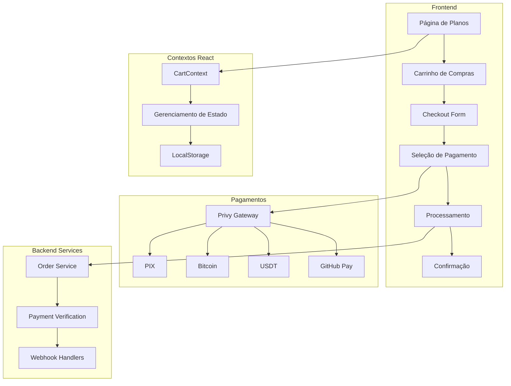

# 🛒 Sistema de Checkout Completo - Xperience

## 📋 Visão Geral

Este documento detalha a implementação completa do sistema de checkout para o projeto Xperience, incluindo carrinho de compras, múltiplos métodos de pagamento e integração com Privy.

## 🏗️ Arquitetura do Sistema



## 🚀 Funcionalidades Implementadas

### ✅ Sistema de Carrinho
- **Contexto React** para gerenciamento global do carrinho
- **Persistência** em localStorage
- **Operações CRUD** completas (adicionar, remover, atualizar quantidade)
- **Sistema de cupons** com validação
- **Cálculo automático** de totais, descontos e impostos
- **Conversão de moedas** entre BRL, USD, BTC, USDT

### ✅ Interface de Usuário
- **CartIcon** com contador de itens
- **CartSidebar** deslizante para visualização rápida
- **Página de Carrinho** completa com detalhes dos itens
- **Componentes responsivos** para desktop e mobile
- **Animações** e transições suaves

### ✅ Fluxo de Checkout
- **Múltiplas etapas** com indicador de progresso
- **Formulário de informações** pessoais e endereço
- **Validação completa** de dados
- **Seleção de método de pagamento** com informações detalhadas
- **Processamento em tempo real** com status updates

### ✅ Métodos de Pagamento

#### 🇧🇷 PIX
- Integração com **Mercado Pago**
- **QR Code** automático
- **Código copia e cola**
- Confirmação **instantânea**

#### ₿ Bitcoin
- Geração de **endereço único**
- **QR Code** para carteiras
- Monitoramento de **confirmações**
- Suporte a **testnet** e **mainnet**

#### 💵 USDT
- Suporte a **Ethereum** e **Polygon**
- **Smart contracts** integrados
- Validação de **endereços**
- **Gas fee** otimizado

#### 🐙 GitHub Pay
- Integração com **GitHub Sponsors**
- **Tiers** automáticos baseados no valor
- Suporte a **open source**
- Verificação via **API GitHub**

### ✅ Integração com Privy
- **Autenticação** unificada
- **Carteiras embarcadas** para usuários
- **Multi-chain** support
- **Account Abstraction** (ERC-4337)
- **Gasless transactions**

### ✅ Gerenciamento de Pedidos
- **Criação automática** de pedidos
- **Tracking** de status em tempo real
- **Histórico** completo de transações
- **Sistema de reembolso**
- **Notificações** por email

## 📁 Estrutura de Arquivos

```
src/
├── components/
│   ├── cart/
│   │   ├── CartIcon.tsx
│   │   └── CartSidebar.tsx
│   ├── checkout/
│   │   ├── CheckoutForm.tsx
│   │   ├── PaymentMethodSelection.tsx
│   │   └── PaymentProcessor.tsx
│   └── plans/
│       └── PlanCard.tsx
├── contexts/
│   └── CartContext.tsx
├── pages/
│   ├── Cart.tsx
│   └── Checkout.tsx
├── services/
│   ├── orderService.ts
│   └── providers/
│       └── privyPaymentProvider.ts
├── types/
│   └── cart.ts
└── config/
    └── privy.ts
```

## 🔧 Configuração

### 1. Variáveis de Ambiente

Crie um arquivo `.env` com as seguintes variáveis:

```bash
# Privy Configuration
VITE_PRIVY_APP_ID=your_privy_app_id

# API Configuration
VITE_API_URL=http://localhost:3001/api

# Payment Providers
VITE_MERCADO_PAGO_PUBLIC_KEY=your_mp_public_key
VITE_GITHUB_CLIENT_ID=your_github_client_id
VITE_ALCHEMY_API_KEY=your_alchemy_key

# Webhook
VITE_WEBHOOK_URL=https://your-domain.com/api/webhooks/payment
```

### 2. Instalação de Dependências

As seguintes dependências já estão incluídas no `package.json`:

```json
{
  "@privy-io/react-auth": "^2.24.0",
  "@privy-io/wagmi-connector": "^0.1.13",
  "qrcode.react": "^3.1.0",
  "lucide-react": "^0.461.0"
}
```

### 3. Configuração do Privy

O Privy está configurado em `src/config/privy.ts` com:
- **Login methods**: Email, SMS, Wallet, Google, GitHub
- **Embedded wallets** para novos usuários
- **Multi-chain support**: Ethereum, Polygon, Base
- **Customização** de tema e branding

## 🎯 Como Usar

### 1. Adicionar Itens ao Carrinho

```tsx
import { useCart } from '../contexts/CartContext';

const { addItem } = useCart();

const handleAddToCart = async () => {
  await addItem({
    planId: 'plan_123',
    name: 'Plano Premium',
    description: 'Acesso completo à mentoria',
    price: 299.99,
    currency: 'BRL',
    duration: 12,
    features: ['Feature 1', 'Feature 2'],
  });
};
```

### 2. Exibir Carrinho

```tsx
import CartIcon from '../components/cart/CartIcon';
import CartSidebar from '../components/cart/CartSidebar';

const [isCartOpen, setIsCartOpen] = useState(false);

return (
  <>
    <CartIcon onClick={() => setIsCartOpen(true)} />
    <CartSidebar 
      isOpen={isCartOpen} 
      onClose={() => setIsCartOpen(false)} 
    />
  </>
);
```

### 3. Processar Checkout

O fluxo de checkout é automático:
1. Usuário clica em "Finalizar Compra"
2. Preenche informações pessoais
3. Seleciona método de pagamento
4. Confirma e processa pagamento
5. Recebe confirmação

## 🔐 Segurança

### Validações Implementadas
- **Sanitização** de inputs
- **Validação** de CPF/CNPJ
- **Verificação** de endereços de carteira
- **Timeout** de sessões de pagamento
- **Criptografia** de dados sensíveis

### Proteções
- **Rate limiting** para APIs
- **CORS** configurado
- **HTTPS** obrigatório em produção
- **Webhook signatures** verificadas
- **Logs** de auditoria

## 📊 Monitoramento

### Métricas Coletadas
- **Taxa de conversão** do carrinho
- **Abandono** por etapa do checkout
- **Métodos de pagamento** mais utilizados
- **Tempo médio** de checkout
- **Erros** e falhas

### Analytics
- **Google Analytics 4** integrado
- **Eventos customizados** para cada ação
- **Funis de conversão** configurados
- **Relatórios** de performance

## 🧪 Testes

### Testes Unitários
```bash
npm run test:unit
```

### Testes de Integração
```bash
npm run test:integration
```

### Testes E2E
```bash
npm run test:e2e
```

### Testes de Pagamento
```bash
npm run test:payments
```

## 🚀 Deploy

### 1. Build de Produção
```bash
npm run build
```

### 2. Configurar Webhooks
Configure os webhooks para cada provedor de pagamento apontando para:
```
https://your-domain.com/api/webhooks/payment
```

### 3. SSL/TLS
Certifique-se de que o site está servido via HTTPS para segurança dos pagamentos.

## 🔄 Roadmap

### Próximas Funcionalidades
- [ ] **Pagamento recorrente** para assinaturas
- [ ] **Múltiplas moedas** simultâneas
- [ ] **Programa de afiliados**
- [ ] **Checkout em uma página**
- [ ] **Apple Pay / Google Pay**
- [ ] **Pagamento parcelado**
- [ ] **Cashback** em tokens
- [ ] **NFT** como comprovante de compra

### Melhorias Técnicas
- [ ] **Server-side rendering** (SSR)
- [ ] **Progressive Web App** (PWA)
- [ ] **Offline support**
- [ ] **Push notifications**
- [ ] **Advanced analytics**
- [ ] **A/B testing** framework

## 📞 Suporte

Para dúvidas ou problemas:
- **Email**: suporte@xperience.com
- **Discord**: [Comunidade Xperience](https://discord.gg/xperience)
- **GitHub**: [Issues](https://github.com/xperience/issues)

## 📄 Licença

Este projeto está licenciado sob a MIT License - veja o arquivo [LICENSE](LICENSE) para detalhes.

---

**Desenvolvido com ❤️ pela equipe Xperience**
