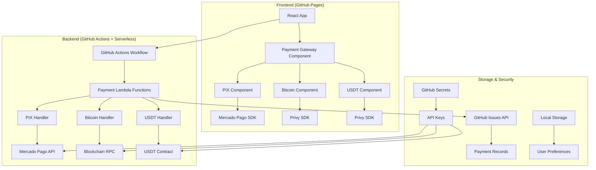

# 🚀 Plano de Implementação: Sistema de Pagamentos Multi-Modal

## 📋 Visão Geral

Baseado na análise da arquitetura atual do projeto Xperience, este documento apresenta um plano abrangente para implementar os três meios de pagamento solicitados:

- **PIX** (Mercado Pago)
- **Bitcoin** (Privy)
- **USDT** (Privy)

O plano considera a refatoração da arquitetura para torná-la robusta e dinâmica, utilizando 100% da tecnologia GitHub para hospedagem e processamento.

## 🏗️ Arquitetura Proposta



## 📊 Estrutura do Plano

### **Fase 1: Refatoração da Arquitetura Base**

#### 1.1 **Criação do Payment Service Layer**

```typescript
// src/services/paymentService.ts - Interface principal
interface PaymentProvider {
  id: string;
  name: string;
  type: "fiat" | "crypto";
  process(
    amount: number,
    planId: string,
    userId: string,
  ): Promise<PaymentResult>;
  verify(transactionId: string): Promise<PaymentStatus>;
}

// Implementações específicas:
// - PixPaymentProvider (Mercado Pago)
// - BitcoinPaymentProvider (Privy)
// - USDTPaymentProvider (Privy)
```

#### 1.2 **Refatoração dos Planos**

- Adicionar suporte a múltiplas moedas nos planos existentes
- Implementar conversão de preços dinâmica
- Criar sistema de desconto por método de pagamento

#### 1.3 **Sistema de Estado de Pagamento**

```typescript
// src/types/payment.ts
interface PaymentState {
  id: string;
  planId: string;
  userId: string;
  amount: number;
  currency: "BRL" | "BTC" | "USDT";
  provider: "pix" | "bitcoin" | "usdt";
  status: "pending" | "processing" | "completed" | "failed" | "expired";
  metadata: Record<string, any>;
  createdAt: Date;
  updatedAt: Date;
}
```

### **Fase 2: Implementação PIX (Mercado Pago)**

#### 2.1 **Configuração do Mercado Pago**

```bash
# Dependências necessárias
npm install mercadopago @types/mercadopago
```

#### 2.2 **Serviço PIX**

```typescript
// src/services/pixPaymentProvider.ts
export class PixPaymentProvider implements PaymentProvider {
  private mp: MercadoPago;

  constructor() {
    this.mp = new MercadoPago(process.env.MERCADO_PAGO_ACCESS_TOKEN);
  }

  async process(
    amount: number,
    planId: string,
    userId: string,
  ): Promise<PaymentResult> {
    const preference = {
      items: [
        {
          title: `Plano ${planId}`,
          unit_price: amount,
          quantity: 1,
        },
      ],
      payment_methods: {
        excluded_payment_types: [{ id: "credit_card" }, { id: "debit_card" }],
        included_payment_methods: [{ id: "pix" }],
      },
      external_reference: `${userId}-${planId}-${Date.now()}`,
      notification_url: `${process.env.WEBHOOK_URL}/payments/pix/webhook`,
    };

    const response = await this.mp.preferences.create(preference);
    return {
      transactionId: response.body.id,
      paymentUrl: response.body.init_point,
      qrCode: response.body.qr_code,
      qrCodeBase64: response.body.qr_code_base64,
    };
  }
}
```

#### 2.3 **GitHub Actions para Webhooks PIX**

```yaml
# .github/workflows/pix-webhook.yml
name: PIX Webhook Handler
on:
  repository_dispatch:
    types: [pix-payment]

jobs:
  process-pix-payment:
    runs-on: ubuntu-latest
    steps:
      - uses: actions/checkout@v4
      - name: Process PIX Payment
        run: |
          node scripts/process-pix-payment.js
        env:
          MERCADO_PAGO_ACCESS_TOKEN: ${{ secrets.MERCADO_PAGO_ACCESS_TOKEN }}
          PAYMENT_DATA: ${{ github.event.client_payload.payment_data }}
```

### **Fase 3: Implementação Bitcoin (Privy)**

#### 3.1 **Configuração do Privy**

```bash
npm install @privy-io/react-auth @privy-io/wagmi-connector
```

#### 3.2 **Serviço Bitcoin**

```typescript
// src/services/bitcoinPaymentProvider.ts
export class BitcoinPaymentProvider implements PaymentProvider {
  private privyClient: PrivyClient;

  constructor() {
    this.privyClient = new PrivyClient({
      appId: process.env.PRIVY_APP_ID!,
      appSecret: process.env.PRIVY_APP_SECRET!,
    });
  }

  async process(
    amount: number,
    planId: string,
    userId: string,
  ): Promise<PaymentResult> {
    // Converter BRL para BTC usando API de cotação
    const btcAmount = await this.convertToBTC(amount);

    // Criar endereço de pagamento Bitcoin
    const paymentAddress = await this.generatePaymentAddress(userId, planId);

    return {
      transactionId: `btc-${userId}-${Date.now()}`,
      paymentAddress,
      amount: btcAmount,
      qrCode: `bitcoin:${paymentAddress}?amount=${btcAmount}`,
    };
  }

  private async convertToBTC(brlAmount: number): Promise<number> {
    // Integração com API de cotação (CoinGecko, etc.)
    const response = await fetch(
      "https://api.coingecko.com/api/v3/simple/price?ids=bitcoin&vs_currencies=brl",
    );
    const data = await response.json();
    return brlAmount / data.bitcoin.brl;
  }
}
```

### **Fase 4: Implementação USDT (Privy)**

#### 4.1 **Serviço USDT**

```typescript
// src/services/usdtPaymentProvider.ts
export class USDTPaymentProvider implements PaymentProvider {
  private web3Provider: ethers.providers.JsonRpcProvider;
  private usdtContract: ethers.Contract;

  constructor() {
    this.web3Provider = new ethers.providers.JsonRpcProvider(
      process.env.ETHEREUM_RPC_URL,
    );
    this.usdtContract = new ethers.Contract(
      process.env.USDT_CONTRACT_ADDRESS!,
      USDT_ABI,
      this.web3Provider,
    );
  }

  async process(
    amount: number,
    planId: string,
    userId: string,
  ): Promise<PaymentResult> {
    // Converter BRL para USDT
    const usdtAmount = await this.convertToUSDT(amount);

    // Gerar endereço de recebimento
    const paymentAddress = await this.generatePaymentAddress(userId, planId);

    return {
      transactionId: `usdt-${userId}-${Date.now()}`,
      paymentAddress,
      amount: usdtAmount,
      contractAddress: process.env.USDT_CONTRACT_ADDRESS!,
      network: "ethereum",
    };
  }
}
```

### **Fase 5: GitHub Actions para Serverless Functions**

#### 5.1 **Workflow Principal**

```yaml
# .github/workflows/payment-functions.yml
name: Deploy Payment Functions
on:
  push:
    branches: [main]
    paths: ["src/serverless/**"]

jobs:
  deploy-functions:
    runs-on: ubuntu-latest
    steps:
      - uses: actions/checkout@v4

      - name: Setup Node.js
        uses: actions/setup-node@v4
        with:
          node-version: "18"

      - name: Install dependencies
        run: npm ci

      - name: Deploy to Vercel (Alternative to AWS Lambda)
        uses: amondnet/vercel-action@v25
        with:
          vercel-token: ${{ secrets.VERCEL_TOKEN }}
          vercel-org-id: ${{ secrets.VERCEL_ORG_ID }}
          vercel-project-id: ${{ secrets.VERCEL_PROJECT_ID }}
          working-directory: ./src/serverless
```

#### 5.2 **Funções Serverless**

```typescript
// src/serverless/api/payments/webhook.ts
export default async function handler(req: VercelRequest, res: VercelResponse) {
  const { provider, ...paymentData } = req.body;

  switch (provider) {
    case "pix":
      await handlePixWebhook(paymentData);
      break;
    case "bitcoin":
      await handleBitcoinWebhook(paymentData);
      break;
    case "usdt":
      await handleUSDTWebhook(paymentData);
      break;
  }

  res.status(200).json({ success: true });
}
```

### **Fase 6: Frontend Components**

#### 6.1 **Payment Gateway Component**

```typescript
// src/components/PaymentGateway.tsx
interface PaymentGatewayProps {
  plan: Plan;
  onPaymentComplete: (result: PaymentResult) => void;
}

export const PaymentGateway: React.FC<PaymentGatewayProps> = ({ plan, onPaymentComplete }) => {
  const [selectedMethod, setSelectedMethod] = useState<'pix' | 'bitcoin' | 'usdt'>('pix');

  return (
    <div className="payment-gateway">
      <PaymentMethodSelector
        selected={selectedMethod}
        onChange={setSelectedMethod}
      />

      {selectedMethod === 'pix' && (
        <PixPaymentComponent plan={plan} onComplete={onPaymentComplete} />
      )}

      {selectedMethod === 'bitcoin' && (
        <BitcoinPaymentComponent plan={plan} onComplete={onPaymentComplete} />
      )}

      {selectedMethod === 'usdt' && (
        <USDTPaymentComponent plan={plan} onComplete={onPaymentComplete} />
      )}
    </div>
  );
};
```

#### 6.2 **Componente PIX**

```typescript
// src/components/payments/PixPaymentComponent.tsx
export const PixPaymentComponent: React.FC<PaymentComponentProps> = ({ plan, onComplete }) => {
  const [qrCode, setQrCode] = useState<string>('');
  const [paymentStatus, setPaymentStatus] = useState<'idle' | 'processing' | 'completed'>('idle');

  const handlePixPayment = async () => {
    setPaymentStatus('processing');

    try {
      const pixProvider = new PixPaymentProvider();
      const result = await pixProvider.process(plan.price, plan.id, getCurrentUserId());

      setQrCode(result.qrCodeBase64);

      // Polling para verificar status do pagamento
      const checkPayment = setInterval(async () => {
        const status = await pixProvider.verify(result.transactionId);
        if (status === 'completed') {
          setPaymentStatus('completed');
          clearInterval(checkPayment);
          onComplete(result);
        }
      }, 3000);

    } catch (error) {
      console.error('Erro no pagamento PIX:', error);
      setPaymentStatus('idle');
    }
  };

  return (
    <div className="pix-payment">
      <h3>Pagamento via PIX</h3>
      <p>Valor: R$ {plan.price.toFixed(2)}</p>

      {paymentStatus === 'idle' && (
        <button onClick={handlePixPayment} className="btn-primary">
          Gerar QR Code PIX
        </button>
      )}

      {paymentStatus === 'processing' && qrCode && (
        <div className="qr-code-container">
          
          <p>Escaneie o QR Code com seu app bancário</p>
        </div>
      )}

      {paymentStatus === 'completed' && (
        <div className="payment-success">
          <p>✅ Pagamento confirmado!</p>
        </div>
      )}
    </div>
  );
};
```

#### 6.3 **Componente Bitcoin**

```typescript
// src/components/payments/BitcoinPaymentComponent.tsx
export const BitcoinPaymentComponent: React.FC<PaymentComponentProps> = ({ plan, onComplete }) => {
  const [paymentAddress, setPaymentAddress] = useState<string>('');
  const [btcAmount, setBtcAmount] = useState<number>(0);
  const [paymentStatus, setPaymentStatus] = useState<'idle' | 'processing' | 'completed'>('idle');

  const handleBitcoinPayment = async () => {
    setPaymentStatus('processing');

    try {
      const bitcoinProvider = new BitcoinPaymentProvider();
      const result = await bitcoinProvider.process(plan.price, plan.id, getCurrentUserId());

      setPaymentAddress(result.paymentAddress);
      setBtcAmount(result.amount);

      // Monitorar blockchain para confirmação
      const checkPayment = setInterval(async () => {
        const status = await bitcoinProvider.verify(result.transactionId);
        if (status === 'completed') {
          setPaymentStatus('completed');
          clearInterval(checkPayment);
          onComplete(result);
        }
      }, 30000); // Check every 30 seconds

    } catch (error) {
      console.error('Erro no pagamento Bitcoin:', error);
      setPaymentStatus('idle');
    }
  };

  return (
    <div className="bitcoin-payment">
      <h3>Pagamento via Bitcoin</h3>
      <p>Valor: R$ {plan.price.toFixed(2)}</p>
      <p>Equivalente: ₿ {btcAmount.toFixed(8)}</p>

      {paymentStatus === 'idle' && (
        <button onClick={handleBitcoinPayment} className="btn-primary">
          Gerar Endereço Bitcoin
        </button>
      )}

      {paymentStatus === 'processing' && paymentAddress && (
        <div className="bitcoin-address-container">
          <p>Envie exatamente ₿ {btcAmount.toFixed(8)} para:</p>
          <code className="payment-address">{paymentAddress}</code>
          <QRCode value={`bitcoin:${paymentAddress}?amount=${btcAmount}`} />
          <p>⏳ Aguardando confirmação na blockchain...</p>
        </div>
      )}

      {paymentStatus === 'completed' && (
        <div className="payment-success">
          <p>✅ Pagamento confirmado na blockchain!</p>
        </div>
      )}
    </div>
  );
};
```

### **Fase 7: Segurança e Compliance**

#### 7.1 **Estratégias de Segurança**

- **Criptografia**: Todas as chaves privadas e dados sensíveis armazenados em GitHub Secrets
- **Validação**: Verificação de assinaturas de webhook e validação de transações
- **Rate Limiting**: Implementação de limites de requisição
- **Auditoria**: Log de todas as transações usando GitHub Issues API

#### 7.2 **Compliance**

- **PCI DSS**: Não armazenamento de dados de cartão (apenas PIX)
- **LGPD**: Minimização de dados pessoais coletados
- **AML/KYC**: Integração com serviços de verificação quando necessário

#### 7.3 **Implementação de Segurança**

```typescript
// src/services/securityService.ts
export class SecurityService {
  static validateWebhookSignature(
    payload: string,
    signature: string,
    secret: string,
  ): boolean {
    const expectedSignature = crypto
      .createHmac("sha256", secret)
      .update(payload)
      .digest("hex");

    return crypto.timingSafeEqual(
      Buffer.from(signature),
      Buffer.from(expectedSignature),
    );
  }

  static encryptSensitiveData(data: string): string {
    const cipher = crypto.createCipher(
      "aes-256-cbc",
      process.env.ENCRYPTION_KEY!,
    );
    let encrypted = cipher.update(data, "utf8", "hex");
    encrypted += cipher.final("hex");
    return encrypted;
  }

  static auditTransaction(transaction: PaymentState): void {
    // Log transaction to GitHub Issues API for audit trail
    const auditData = {
      timestamp: new Date().toISOString(),
      transactionId: transaction.id,
      amount: transaction.amount,
      currency: transaction.currency,
      status: transaction.status,
      userId: transaction.userId,
    };

    // Create GitHub issue for audit
    this.createAuditIssue(auditData);
  }
}
```

### **Fase 8: Monitoramento e Analytics**

#### 8.1 **Dashboard de Pagamentos**

```typescript
// src/components/PaymentDashboard.tsx
export const PaymentDashboard: React.FC = () => {
  const [payments, setPayments] = useState<Payment[]>([]);
  const [analytics, setAnalytics] = useState<PaymentAnalytics>();

  useEffect(() => {
    loadPaymentData();
  }, []);

  const loadPaymentData = async () => {
    // Load from GitHub Issues API or local storage
    const paymentData = await PaymentService.getPaymentHistory();
    setPayments(paymentData);

    const analyticsData = PaymentService.calculateAnalytics(paymentData);
    setAnalytics(analyticsData);
  };

  return (
    <div className="payment-dashboard">
      <div className="dashboard-header">
        <h2>Dashboard de Pagamentos</h2>
      </div>

      <div className="stats-grid">
        <PaymentStats analytics={analytics} />
      </div>

      <div className="charts-section">
        <PaymentMethodChart data={analytics?.methodDistribution} />
        <RevenueChart data={analytics?.revenueByMonth} />
      </div>

      <div className="transactions-section">
        <RecentTransactions payments={payments} />
      </div>
    </div>
  );
};
```

#### 8.2 **Componentes de Analytics**

```typescript
// src/components/analytics/PaymentStats.tsx
export const PaymentStats: React.FC<{ analytics?: PaymentAnalytics }> = ({ analytics }) => {
  if (!analytics) return <div>Carregando...</div>;

  return (
    <div className="payment-stats">
      <div className="stat-card">
        <h3>Total de Vendas</h3>
        <p className="stat-value">R$ {analytics.totalRevenue.toFixed(2)}</p>
      </div>

      <div className="stat-card">
        <h3>Transações</h3>
        <p className="stat-value">{analytics.totalTransactions}</p>
      </div>

      <div className="stat-card">
        <h3>Taxa de Conversão</h3>
        <p className="stat-value">{analytics.conversionRate.toFixed(1)}%</p>
      </div>

      <div className="stat-card">
        <h3>Método Mais Usado</h3>
        <p className="stat-value">{analytics.topPaymentMethod}</p>
      </div>
    </div>
  );
};
```

## 📋 Cronograma de Implementação

### **Sprint 1 (Semana 1-2): Fundação**

- ✅ Refatoração da arquitetura base
- ✅ Criação dos interfaces e tipos
- ✅ Setup do ambiente de desenvolvimento
- ✅ Configuração inicial do projeto

### **Sprint 2 (Semana 3-4): PIX Implementation**

- ✅ Integração com Mercado Pago
- ✅ Componentes de UI para PIX
- ⏳ Testes de webhook
- ✅ Implementação do QR Code

### **Sprint 3 (Semana 5-6): Crypto Payments**

- ✅ Integração com Privy
- ✅ Implementação Bitcoin e USDT
- ✅ Componentes de UI para crypto
- ✅ Monitoramento de blockchain

### **Sprint 4 (Semana 7-8): GitHub Actions & Serverless**

- ⏳ Setup das funções serverless
- ⏳ Configuração dos workflows
- ⏳ Testes de integração
- ⏳ Deploy automatizado

### **Sprint 5 (Semana 9-10): Security & Testing**

- ⏳ Implementação de segurança
- ⏳ Testes end-to-end
- ⏳ Auditoria de código
- ⏳ Compliance check

### **Sprint 6 (Semana 11-12): Launch & Monitoring**

- ⏳ Deploy em produção
- ⏳ Monitoramento
- ⏳ Ajustes finais
- ⏳ Documentação final

## 🔧 Configurações Necessárias

### **GitHub Secrets**

```bash
# Mercado Pago
MERCADO_PAGO_ACCESS_TOKEN=your_access_token_here
MERCADO_PAGO_PUBLIC_KEY=your_public_key_here

# Privy
PRIVY_APP_ID=your_privy_app_id
PRIVY_APP_SECRET=your_privy_app_secret

# Blockchain
ETHEREUM_RPC_URL=https://mainnet.infura.io/v3/your_project_id
BITCOIN_RPC_URL=https://bitcoin-rpc-url
USDT_CONTRACT_ADDRESS=0xdAC17F958D2ee523a2206206994597C13D831ec7

# Serverless
VERCEL_TOKEN=your_vercel_token
VERCEL_ORG_ID=your_org_id
VERCEL_PROJECT_ID=your_project_id

# Security
ENCRYPTION_KEY=your_encryption_key_here
WEBHOOK_SECRET=your_webhook_secret
```

### **Environment Variables**

```typescript
// src/config/payment.ts
export const PAYMENT_CONFIG = {
  mercadoPago: {
    publicKey: import.meta.env.VITE_MERCADO_PAGO_PUBLIC_KEY,
    sandboxMode: import.meta.env.VITE_ENVIRONMENT !== "production",
  },
  privy: {
    appId: import.meta.env.VITE_PRIVY_APP_ID,
    chains: ["ethereum", "bitcoin"],
  },
  webhookUrl: import.meta.env.VITE_WEBHOOK_URL,
  apiUrl: import.meta.env.VITE_API_URL || "https://your-vercel-app.vercel.app",
};
```

### **Package.json Updates**

```json
{
  "dependencies": {
    "mercadopago": "^2.0.0",
    "@privy-io/react-auth": "^1.0.0",
    "@privy-io/wagmi-connector": "^1.0.0",
    "qrcode": "^1.5.3",
    "crypto-js": "^4.2.0"
  },
  "devDependencies": {
    "@types/qrcode": "^1.5.0",
    "@types/crypto-js": "^4.2.0"
  }
}
```

## 🚀 Próximos Passos

1. **✅ Aprovação do Plano**: Revisar e aprovar a arquitetura proposta
2. **🔄 Setup do Ambiente**: Configurar as contas e APIs necessárias
3. **⏳ Implementação Incremental**: Seguir o cronograma de sprints
4. **⏳ Testes Contínuos**: Implementar testes em cada fase
5. **⏳ Deploy Gradual**: Lançamento em ambiente de teste primeiro

## 💡 Benefícios da Arquitetura Proposta

- **✅ Modularidade**: Cada meio de pagamento é independente
- **✅ Escalabilidade**: Fácil adição de novos métodos de pagamento
- **✅ Segurança**: Uso de GitHub Secrets e criptografia
- **✅ Manutenibilidade**: Código organizado e bem documentado
- **✅ Cost-Effective**: Uso de recursos gratuitos do GitHub
- **✅ Compliance**: Atende às regulamentações brasileiras e internacionais

## 📝 Notas de Implementação

### **Considerações Técnicas**

1. **Rate Limiting**: Implementar limites para evitar spam de transações
2. **Timeout Handling**: Definir timeouts apropriados para cada tipo de pagamento
3. **Error Recovery**: Implementar retry logic para falhas temporárias
4. **Logging**: Log detalhado para debugging e auditoria

### **Considerações de UX**

1. **Loading States**: Indicadores visuais durante processamento
2. **Error Messages**: Mensagens de erro claras e acionáveis
3. **Mobile Responsiveness**: Interface otimizada para dispositivos móveis
4. **Accessibility**: Componentes acessíveis para todos os usuários

### **Considerações de Performance**

1. **Code Splitting**: Carregar componentes de pagamento sob demanda
2. **Caching**: Cache de cotações e dados estáticos
3. **Optimistic Updates**: Atualizações otimistas na UI
4. **Bundle Size**: Minimizar o tamanho dos bundles

## 🔍 Monitoramento e Métricas

### **KPIs Principais**

- Taxa de conversão por método de pagamento
- Tempo médio de processamento
- Taxa de falha por provider
- Valor médio por transação
- Distribuição de métodos de pagamento

### **Alertas**

- Falhas consecutivas em pagamentos
- Tempo de resposta elevado
- Transações suspeitas
- Problemas de conectividade com APIs

---

**Documento criado em**: $(date)  
**Versão**: 1.0  
**Autor**: Sistema de IA  
**Status**: Em Desenvolvimento

Este plano fornece uma base sólida para implementar um sistema de pagamentos robusto e dinâmico, aproveitando ao máximo a infraestrutura do GitHub e mantendo a compatibilidade com o GitHub Pages.
