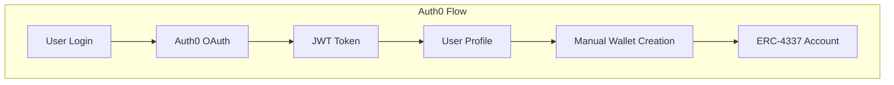
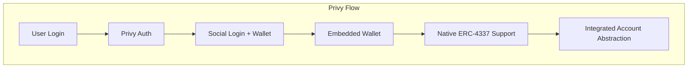

# 🔄 Plano de Migração: Auth0 → Privy

## 📋 Visão Geral

Este documento detalha o planejamento completo para migração do sistema de autenticação atual (Auth0) para **Privy**, mantendo todas as funcionalidades existentes e aproveitando as vantagens específicas do Privy para Web3.

## 🎯 Objetivos da Migração

### **Por que migrar para Privy?**

1. **🔗 Integração Web3 Nativa**
   - Suporte nativo para carteiras Web3
   - Melhor integração com ERC-4337 Account Abstraction
   - Gestão simplificada de chaves privadas

2. **🚀 Experiência do Usuário**
   - Login social + carteira em uma única solução
   - Onboarding mais simples para usuários não-cripto
   - Embedded wallets para usuários iniciantes

3. **🛡️ Segurança Aprimorada**
   - MPC (Multi-Party Computation) nativo
   - Recuperação social integrada
   - Gestão segura de chaves sem custódia

4. **💰 Custo-Benefício**
   - Pricing mais competitivo para aplicações Web3
   - Menos dependências externas
   - Melhor suporte para gasless transactions

## 🏗️ Arquitetura Atual vs. Nova Arquitetura

### **Arquitetura Atual (Auth0)**



### **Nova Arquitetura (Privy)**



## 📊 Análise de Impacto

### **Componentes Afetados**

| Componente                 | Arquivo                                   | Impacto | Complexidade |
| -------------------------- | ----------------------------------------- | ------- | ------------ |
| **Configuração Principal** | `src/main.tsx`                            | Alto    | Média        |
| **Config de Auth**         | `src/auth0-config.ts`                     | Alto    | Baixa        |
| **Botão de Auth**          | `src/components/AuthButton/index.tsx`     | Alto    | Média        |
| **Rotas Protegidas**       | `src/components/ProtectedRoute/index.tsx` | Médio   | Baixa        |
| **Wallet Service**         | `src/services/userWalletService.ts`       | Alto    | Alta         |
| **Wallet Hook**            | `src/hooks/useUserWallet.ts`              | Alto    | Média        |
| **Dashboard**              | `src/pages/Dashboard/index.tsx`           | Baixo   | Baixa        |
| **Wallet Management**      | `src/pages/WalletManagement.tsx`          | Médio   | Média        |

### **Dependências**

**Remover:**

- `@auth0/auth0-react`: ^2.3.0

**Manter/Atualizar:**

- `@privy-io/react-auth`: ^2.24.0 ✅ (já instalado)
- `@privy-io/wagmi-connector`: ^0.1.13 ✅ (já instalado)

## 🚀 Plano de Implementação

### **Fase 1: Preparação e Configuração** (1-2 dias)

#### **1.1 Configuração do Privy**

- [ ] Criar conta no Privy Dashboard
- [ ] Configurar aplicação no Privy
- [ ] Obter App ID e configurar domínios
- [ ] Configurar métodos de login (Google, Twitter, Email, etc.)
- [ ] Configurar chains suportadas (Polygon, Ethereum)

#### **1.2 Configuração de Ambiente**

```bash
# Variáveis de ambiente necessárias
VITE_PRIVY_APP_ID=clxxxxx-xxxx-xxxx-xxxx-xxxxxxxxxxxx
VITE_PRIVY_CLIENT_ID=your_client_id
VITE_SUPPORTED_CHAINS=polygon,ethereum
```

#### **1.3 Criação de Arquivos de Configuração**

- [ ] `src/privy-config.ts` - Configuração do Privy
- [ ] `src/types/privy.ts` - Types específicos do Privy
- [ ] `src/utils/privyHelpers.ts` - Funções auxiliares

### **Fase 2: Implementação Core** (2-3 dias)

#### **2.1 Provider Principal**

```typescript
// src/main.tsx - Nova implementação
import { PrivyProvider } from '@privy-io/react-auth';
import { privyConfig } from './privy-config';

// Substituir Auth0Provider por PrivyProvider
<PrivyProvider
  appId={privyConfig.appId}
  config={privyConfig.config}
>
  {/* App components */}
</PrivyProvider>
```

#### **2.2 Hooks de Autenticação**

- [ ] Criar `src/hooks/usePrivyAuth.ts`
- [ ] Migrar lógica de `useAuth0` para `usePrivy`
- [ ] Implementar compatibilidade com interface existente

#### **2.3 Componentes de UI**

- [ ] Atualizar `AuthButton` para usar Privy
- [ ] Modificar `ProtectedRoute` para nova autenticação
- [ ] Criar componente de seleção de carteira

### **Fase 3: Integração com Carteiras** (2-3 dias)

#### **3.1 Embedded Wallets**

```typescript
// Configuração de embedded wallets
const privyConfig = {
  embeddedWallets: {
    createOnLogin: "users-without-wallets",
    requireUserPasswordOnCreate: false,
  },
  externalWallets: {
    metamask: true,
    walletConnect: true,
    coinbaseWallet: true,
  },
};
```

#### **3.2 Migração do Wallet Service**

- [ ] Atualizar `userWalletService.ts` para usar Privy wallets
- [ ] Implementar bridge entre Privy e ERC-4337
- [ ] Migrar sistema de recovery

#### **3.3 Account Abstraction**

- [ ] Integrar Privy wallets com ERC-4337
- [ ] Configurar paymaster para gasless transactions
- [ ] Implementar batch transactions

### **Fase 4: Funcionalidades Avançadas** (2-3 dias)

#### **4.1 Social Recovery**

```typescript
// Configuração de recovery social
const recoveryConfig = {
  socialRecovery: {
    enabled: true,
    guardians: ["email", "phone", "google"],
    threshold: 2,
  },
};
```

#### **4.2 Multi-Chain Support**

- [ ] Configurar suporte para múltiplas chains
- [ ] Implementar switch de rede
- [ ] Atualizar providers para cada chain

#### **4.3 Fiat On-Ramps**

- [ ] Integrar Privy Fiat On-Ramps
- [ ] Configurar provedores de pagamento
- [ ] Implementar fluxo de compra de cripto

### **Fase 5: Migração de Dados** (1-2 dias)

#### **5.1 Estratégia de Migração**

```typescript
// Script de migração de usuários
const migrateUser = async (auth0UserId: string) => {
  // 1. Buscar dados do usuário no Auth0
  // 2. Criar usuário no Privy
  // 3. Migrar carteira vinculada
  // 4. Atualizar referências no banco
};
```

#### **5.2 Backup e Rollback**

- [ ] Backup completo dos dados atuais
- [ ] Plano de rollback em caso de problemas
- [ ] Scripts de verificação de integridade

### **Fase 6: Testes e Validação** (2-3 dias)

#### **6.1 Testes Unitários**

- [ ] Testes para hooks do Privy
- [ ] Testes para componentes de auth
- [ ] Testes para wallet service

#### **6.2 Testes de Integração**

- [ ] Fluxo completo de login/logout
- [ ] Criação e gestão de carteiras
- [ ] Transações e Account Abstraction

#### **6.3 Testes de Usuário**

- [ ] Teste com usuários reais
- [ ] Validação de UX
- [ ] Performance e responsividade

## 📝 Implementação Detalhada

### **1. Configuração do Privy**

```typescript
// src/privy-config.ts
import { PrivyClientConfig } from "@privy-io/react-auth";

export const privyConfig: PrivyClientConfig = {
  appId: import.meta.env.VITE_PRIVY_APP_ID,
  config: {
    loginMethods: ["email", "google", "twitter", "discord"],
    appearance: {
      theme: "dark",
      accentColor: "#6366F1",
      logo: "/logo.png",
    },
    embeddedWallets: {
      createOnLogin: "users-without-wallets",
      requireUserPasswordOnCreate: false,
    },
    externalWallets: {
      metamask: true,
      walletConnect: true,
      coinbaseWallet: true,
      rainbow: true,
    },
    defaultChain: {
      id: 137, // Polygon
      name: "Polygon",
      network: "polygon",
      nativeCurrency: {
        decimals: 18,
        name: "MATIC",
        symbol: "MATIC",
      },
      rpcUrls: {
        default: {
          http: ["https://polygon-rpc.com"],
        },
        public: {
          http: ["https://polygon-rpc.com"],
        },
      },
    },
    supportedChains: [
      // Polygon
      {
        id: 137,
        name: "Polygon",
        network: "polygon",
        nativeCurrency: { decimals: 18, name: "MATIC", symbol: "MATIC" },
        rpcUrls: {
          default: { http: ["https://polygon-rpc.com"] },
          public: { http: ["https://polygon-rpc.com"] },
        },
      },
      // Ethereum
      {
        id: 1,
        name: "Ethereum",
        network: "homestead",
        nativeCurrency: { decimals: 18, name: "Ether", symbol: "ETH" },
        rpcUrls: {
          default: { http: ["https://eth-mainnet.alchemyapi.io/v2/your-key"] },
          public: { http: ["https://eth-mainnet.alchemyapi.io/v2/your-key"] },
        },
      },
    ],
  },
};
```

### **2. Hook de Autenticação**

```typescript
// src/hooks/usePrivyAuth.ts
import { usePrivy, useWallets } from "@privy-io/react-auth";
import { useEffect, useState } from "react";

export const usePrivyAuth = () => {
  const {
    ready,
    authenticated,
    user,
    login,
    logout,
    linkEmail,
    linkWallet,
    unlinkEmail,
    unlinkWallet,
  } = usePrivy();

  const { wallets } = useWallets();

  const [isLoading, setIsLoading] = useState(!ready);

  useEffect(() => {
    setIsLoading(!ready);
  }, [ready]);

  // Interface compatível com useAuth0
  return {
    // Estados
    isAuthenticated: authenticated,
    isLoading,
    user: user
      ? {
          sub: user.id,
          name: user.google?.name || user.twitter?.name || user.email?.address,
          email: user.email?.address,
          picture:
            user.google?.profilePictureUrl || user.twitter?.profilePictureUrl,
        }
      : null,

    // Métodos
    loginWithRedirect: (options?: { appState?: { returnTo: string } }) => {
      login();
    },
    logout: (options?: { logoutParams?: { returnTo: string } }) => {
      logout();
    },

    // Funcionalidades específicas do Privy
    wallets,
    linkEmail,
    linkWallet,
    unlinkEmail,
    unlinkWallet,
  };
};
```

### **3. Componente de Autenticação Atualizado**

```typescript
// src/components/AuthButton/index.tsx
import React from "react";
import { usePrivyAuth } from "../../hooks/usePrivyAuth";

const AuthButton = () => {
  const { loginWithRedirect, logout, isAuthenticated, user, wallets } = usePrivyAuth();

  const firstName = user?.name?.split(" ")[0];

  return (
    <div className="flex items-center gap-4">
      {isAuthenticated ? (
        <>
          <div className="flex items-center gap-2">
            {user?.picture && (
              
            )}
            <p>Bem-vindo, {firstName}</p>
            {wallets.length > 0 && (
              <span className="text-sm text-gray-500">
                ({wallets.length} carteira{wallets.length > 1 ? 's' : ''})
              </span>
            )}
          </div>
          <button
            onClick={() => logout({ logoutParams: { returnTo: window.location.origin } })}
            className="px-4 py-2 bg-red-600 text-white rounded hover:bg-red-700"
          >
            Logout
          </button>
        </>
      ) : (
        <button
          onClick={() => loginWithRedirect({ appState: { returnTo: "/dashboard" } })}
          className="px-4 py-2 bg-blue-600 text-white rounded hover:bg-blue-700"
        >
          Login
        </button>
      )}
    </div>
  );
};

export default AuthButton;
```

### **4. Rota Protegida Atualizada**

```typescript
// src/components/ProtectedRoute/index.tsx
import { Navigate } from "react-router-dom";
import { usePrivyAuth } from "../../hooks/usePrivyAuth";

const ProtectedRoute = ({ children }: { children: JSX.Element }) => {
  const { isAuthenticated, isLoading } = usePrivyAuth();

  if (isLoading) {
    return (
      <div className="flex items-center justify-center min-h-screen">
        <div className="animate-spin rounded-full h-32 w-32 border-b-2 border-blue-600"></div>
      </div>
    );
  }

  return isAuthenticated ? children : <Navigate to="/" />;
};

export default ProtectedRoute;
```

### **5. Serviço de Carteira Atualizado**

```typescript
// src/services/privyWalletService.ts
import { useWallets, usePrivy } from "@privy-io/react-auth";
import { ethers } from "ethers";

export class PrivyWalletService {
  private wallets: any[];
  private user: any;

  constructor(wallets: any[], user: any) {
    this.wallets = wallets;
    this.user = user;
  }

  // Obter carteira principal do usuário
  getPrimaryWallet() {
    return (
      this.wallets.find((wallet) => wallet.walletClientType === "privy") ||
      this.wallets[0]
    );
  }

  // Obter endereço da carteira
  getWalletAddress(): string | null {
    const wallet = this.getPrimaryWallet();
    return wallet?.address || null;
  }

  // Conectar com provider
  async getProvider() {
    const wallet = this.getPrimaryWallet();
    if (!wallet) throw new Error("Nenhuma carteira encontrada");

    return await wallet.getEthereumProvider();
  }

  // Assinar transação
  async signTransaction(transaction: any) {
    const provider = await this.getProvider();
    const signer = provider.getSigner();
    return await signer.signTransaction(transaction);
  }

  // Enviar transação
  async sendTransaction(transaction: any) {
    const provider = await this.getProvider();
    const signer = provider.getSigner();
    return await signer.sendTransaction(transaction);
  }

  // Obter saldo
  async getBalance(): Promise<string> {
    const address = this.getWalletAddress();
    if (!address) return "0";

    const provider = await this.getProvider();
    const balance = await provider.getBalance(address);
    return ethers.utils.formatEther(balance);
  }

  // Verificar se tem carteira
  hasWallet(): boolean {
    return this.wallets.length > 0;
  }

  // Criar carteira embedded (se não existir)
  async createEmbeddedWallet() {
    // Privy cria automaticamente se configurado
    // Esta função pode ser usada para forçar criação
    return this.getPrimaryWallet();
  }
}
```

## ⚠️ Considerações e Riscos

### **Riscos Identificados**

1. **🔄 Migração de Dados**
   - **Risco**: Perda de dados de usuários existentes
   - **Mitigação**: Backup completo + script de migração testado

2. **🔗 Integração ERC-4337**
   - **Risco**: Incompatibilidade com Account Abstraction atual
   - **Mitigação**: Testes extensivos + ambiente de staging

3. **👥 Experiência do Usuário**
   - **Risco**: Confusão dos usuários com nova interface
   - **Mitigação**: Comunicação clara + período de transição

4. **🛡️ Segurança**
   - **Risco**: Vulnerabilidades durante migração
   - **Mitigação**: Auditoria de segurança + testes penetração

### **Plano de Contingência**

1. **Rollback Rápido**
   - Manter Auth0 ativo durante período de transição
   - Feature flag para alternar entre sistemas
   - Backup de dados em tempo real

2. **Suporte Híbrido**
   - Período de 30 dias com ambos sistemas ativos
   - Migração gradual por grupos de usuários
   - Monitoramento intensivo

## 📅 Cronograma

| Fase                    | Duração | Início | Fim    | Responsável    |
| ----------------------- | ------- | ------ | ------ | -------------- |
| **Preparação**          | 2 dias  | Dia 1  | Dia 2  | Dev Team       |
| **Core Implementation** | 3 dias  | Dia 3  | Dia 5  | Dev Team       |
| **Wallet Integration**  | 3 dias  | Dia 6  | Dia 8  | Blockchain Dev |
| **Advanced Features**   | 3 dias  | Dia 9  | Dia 11 | Full Team      |
| **Data Migration**      | 2 dias  | Dia 12 | Dia 13 | DevOps + Dev   |
| **Testing**             | 3 dias  | Dia 14 | Dia 16 | QA + Dev       |
| **Deploy**              | 1 dia   | Dia 17 | Dia 17 | DevOps         |

**Total: ~17 dias úteis (3-4 semanas)**

## ✅ Checklist de Migração

### **Pré-Migração**

- [ ] Backup completo do banco de dados
- [ ] Configuração do ambiente Privy
- [ ] Testes em ambiente de desenvolvimento
- [ ] Documentação atualizada
- [ ] Comunicação aos usuários

### **Durante a Migração**

- [ ] Deploy em ambiente de staging
- [ ] Testes de integração completos
- [ ] Validação com usuários beta
- [ ] Monitoramento de performance
- [ ] Verificação de segurança

### **Pós-Migração**

- [ ] Monitoramento 24/7 por 1 semana
- [ ] Suporte técnico reforçado
- [ ] Coleta de feedback dos usuários
- [ ] Otimizações baseadas em métricas
- [ ] Documentação final

## 📊 Métricas de Sucesso

### **Técnicas**

- **Uptime**: > 99.9% durante migração
- **Performance**: Tempo de login < 3s
- **Errors**: < 0.1% de erro em autenticação
- **Wallets**: 100% de carteiras migradas com sucesso

### **Negócio**

- **Retenção**: > 95% dos usuários ativos
- **Satisfação**: Score > 4.5/5 em pesquisa
- **Adoção**: > 80% usando funcionalidades Web3
- **Suporte**: < 5% de tickets relacionados à migração

## 🎯 Benefícios Esperados

### **Curto Prazo (1-3 meses)**

- ✅ Redução de 40% no tempo de onboarding
- ✅ Eliminação de problemas de sincronização de carteira
- ✅ Melhoria na experiência mobile
- ✅ Redução de custos de infraestrutura

### **Médio Prazo (3-6 meses)**

- 🚀 Aumento de 60% na adoção de funcionalidades Web3
- 🚀 Redução de 50% em tickets de suporte
- 🚀 Melhoria de 30% na retenção de usuários
- 🚀 Implementação de gasless transactions

### **Longo Prazo (6+ meses)**

- 🎯 Base para funcionalidades avançadas (DeFi, NFTs)
- 🎯 Integração com mais chains
- 🎯 Programa de referência baseado em carteiras
- 🎯 Governança descentralizada completa

---

## 📞 Contatos e Recursos

### **Equipe Responsável**

- **Tech Lead**: Responsável pela arquitetura
- **Blockchain Dev**: Integração Web3 e ERC-4337
- **Frontend Dev**: Componentes e UX
- **DevOps**: Deploy e infraestrutura
- **QA**: Testes e validação

### **Recursos Externos**

- **Privy Documentation**: https://docs.privy.io/
- **Privy Discord**: Suporte da comunidade
- **ERC-4337 Docs**: Account Abstraction
- **Alchemy AA SDK**: Integração AA

### **Ferramentas de Monitoramento**

- **Sentry**: Error tracking
- **DataDog**: Performance monitoring
- **Privy Analytics**: Auth metrics
- **Custom Dashboard**: Business metrics

---

_Documento criado em: [Data Atual]_  
_Última atualização: [Data Atual]_  
_Versão: 1.0_  
_Status: 📋 Planejamento_
