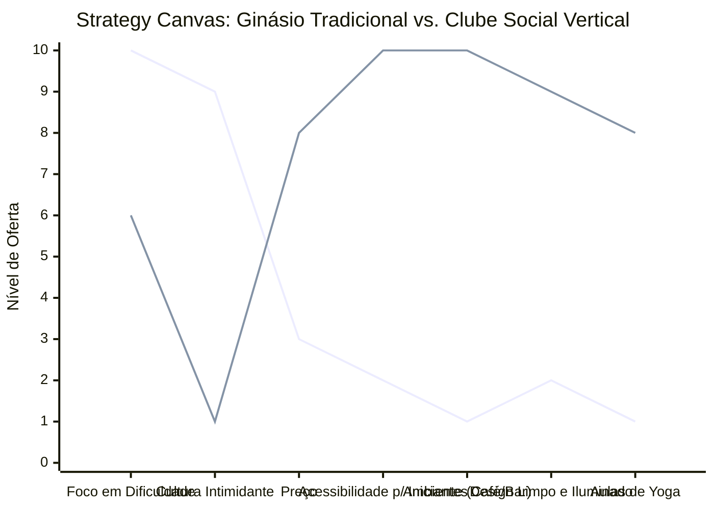

# Estudo de Caso Blue Ocean: Academia de Escalada

## O Cenário Atual (Oceano Vermelho)

O mercado tradicional de ginásios de escalada é extremamente voltado para a performance e intimidador:

1. **Foco na Alta Performance:** Construídos para atender atletas e praticantes experientes que buscam treinamento pesado e rotas de extrema dificuldade.
2. **Cultura Excludente ("Dirtbag"):** Ambientes muitas vezes rústicos, sem climatização, com foco excessivo apenas na escalada em si e sem estrutura de convivência.
3. **Barreira de Entrada Alta:** Equipamentos complexos (cordas, cadeirinhas) e a exigência de um parceiro para dar segurança afastam curiosos, iniciantes e o público que busca fitness casual.

## A Estratégia do Oceano Azul: "Clube Social Vertical"

A estratégia propõe reposicionar a escalada de um esporte de nicho extremo para uma atividade social e de bem-estar urbano, transformando o ginásio em um "Terceiro Lugar".

**A Nova Proposta de Valor:**

- **Foco:** Profissionais urbanos, famílias e pessoas que buscam uma alternativa divertida à musculação tradicional, onde a socialização é tão importante quanto o exercício.
- **Ambiente:** Foco no *bouldering* (escalada sem corda em paredes baixas sobre colchões), design limpo, iluminado, climatizado e esteticamente agradável.
- **Modelo de Negócio:** Receita diversificada não apenas em mensalidades, mas no alto consumo do café/bar integrado, lojas de equipamentos e eventos.

## Framework das Quatro Ações (ERRC Grid)

- **Eliminar:** Ambiente elitista/escuro, barreiras técnicas e equipamentos complexos para iniciantes.
- **Reduzir:** Ênfase na performance extrema e rotas impossíveis, odores fortes de suor e magnésio (climatização).
- **Elevar:** Limpeza, design arquitetônico, acessibilidade com muitas rotas fáceis e lúdicas.
- **Criar:** Áreas de socialização integradas (cafés/bares), aulas holísticas complementares como Yoga.

## Strategy Canvas

*(Nota: Linha 1 = Ginásio Hardcore; Linha 2 = Clube Social)*
