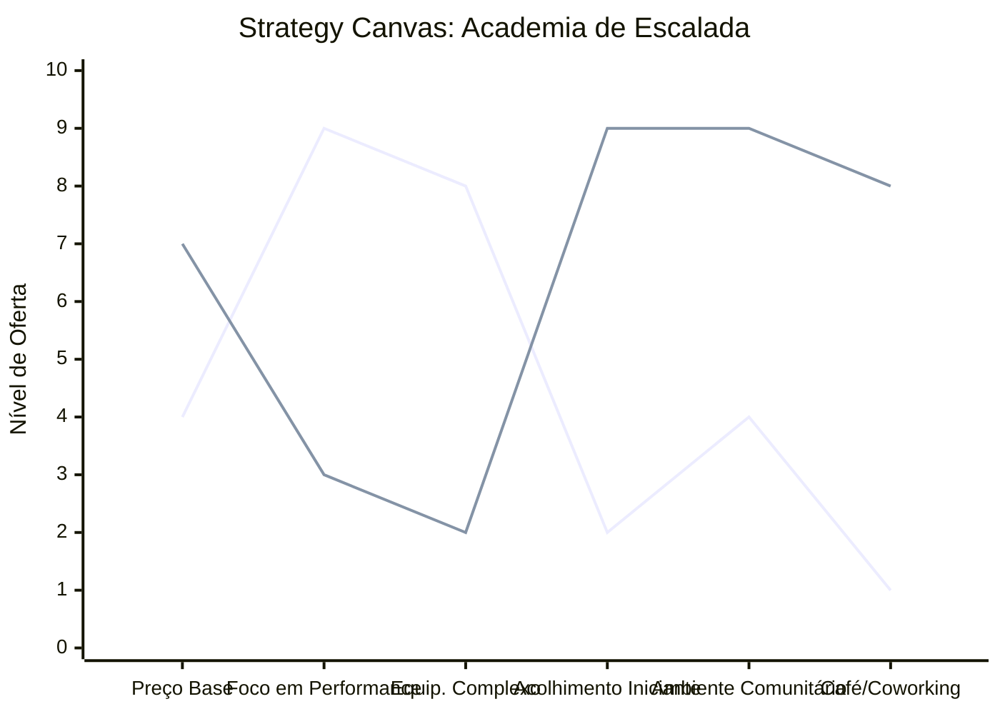

# Estudo de Caso: Academia de Escalada

## Cenários

**Oceano Vermelho:**
- Competição direta com academias tradicionais (musculação, crossfit).
- Foco em mensalidades baixas.
- Ambiente voltado exclusivamente para atletas e escaladores experientes.
- Equipamentos e vias de alta dificuldade técnica intimidantes.
- Alta rotatividade (churn) de iniciantes.

**Oceano Azul:**
- Foco em comunidade, bem-estar mental e superação lúdica (gamificação).
- Ambiente acolhedor para iniciantes, famílias e crianças.
- Espaço híbrido: integração com café, coworking e espaços de convivência.
- Aulas de introdução focadas em superação de medos (alturas, confiança).
- Venda de lifestyle, não apenas acesso às paredes.

## Matriz ERRC

- **Eliminar:** A intimidação do ambiente hipercompetitivo, foco exclusivo na performance física.
- **Reduzir:** Barreiras de entrada técnica, complexidade inicial de equipamentos, planos anuais rígidos.
- **Elevar:** Senso de comunidade, gamificação do progresso (rotas iniciantes claras), integração social.
- **Criar:** Ambientes híbridos (café/coworking), programas de mentoria para novatos, eventos sociais de integração.

## Strategy Canvas

*(Nota: Linha 1 = Oceano Vermelho; Linha 2 = Oceano Azul)*

## Veja Também

- [Turismo de Compras Têxtil](./turismo-compras-textil.md)
- [Pousadas e Campings](./pousadas-e-campings.md)
- [Personal Trainer](./personal-trainer.md)
- [Consultoria Empreendedora](./consultoria-empreendedora.md)
- [Barbearia](./barbearia.md)
- [Clínica Odontológica](./clinica-odontologica.md)
- [Pet Shop](./pet-shop.md)
