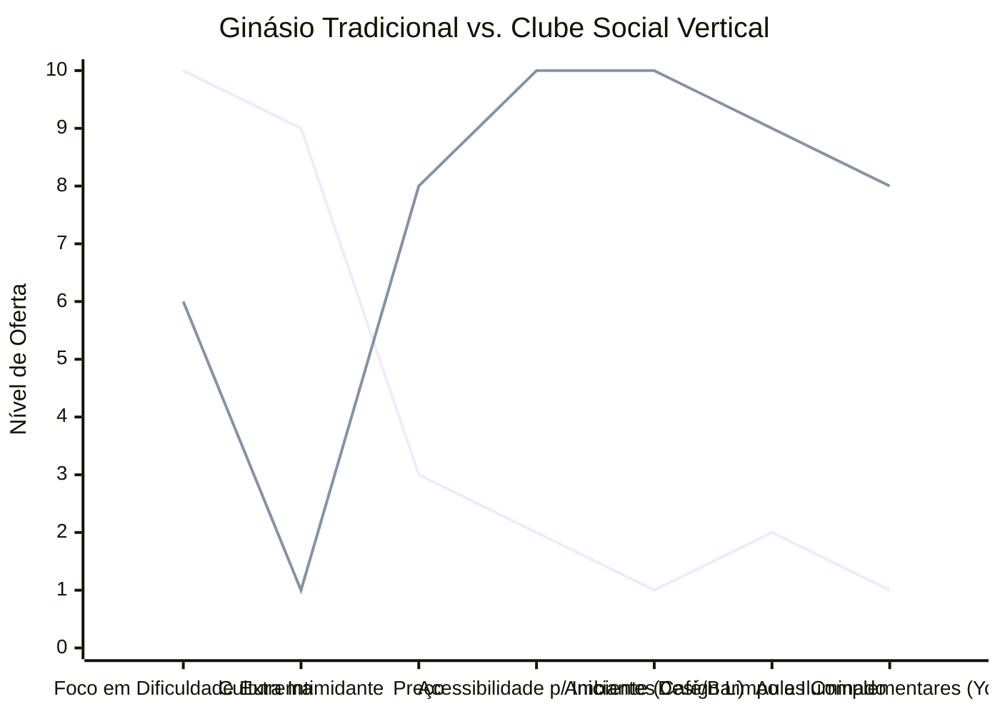

# Estudo de Caso Blue Ocean: Academia de Escalada

## Estratégia Recomendada: De "Ginásio Hardcore" para "Clube Social Vertical"

Este estudo propõe reposicionar a escalada de um esporte de nicho extremo para uma atividade social e de bem-estar urbano.

### 1. Strategy Canvas

Comparativo entre o ginásio clássico focado apenas no esporte e o novo conceito de clube social.

**Legenda:**
- **Linha 1:** Ginásio Hardcore
- **Linha 2:** Clube Social (Blue Ocean)

### 2. ERRC Grid (Quatro Ações)

| Ação | Estratégia Objetiva |
| :--- | :--- |
| **ELIMINAR** | O ambiente escuro e elitista (cultura "dirtbag") que afasta iniciantes e mulheres. |
| **REDUZIR** | A ênfase exclusiva em rotas de extrema dificuldade e foco excessivo apenas no ganho de força. |
| **AUMENTAR** | Limpeza, design do espaço, segurança percebida e a oferta de rotas fáceis e divertidas (boulder). |
| **CRIAR** | Áreas de socialização integradas (cafés, coworkings, bar) e eventos noturnos temáticos. |

### 3. Conclusão Objetiva

Transformar a academia em um "Terceiro Lugar" (entre casa e trabalho). O lucro escala não pela venda de treinos de alta performance, mas pela criação de uma comunidade que consome no bar/café e paga por bem-estar holístico.
