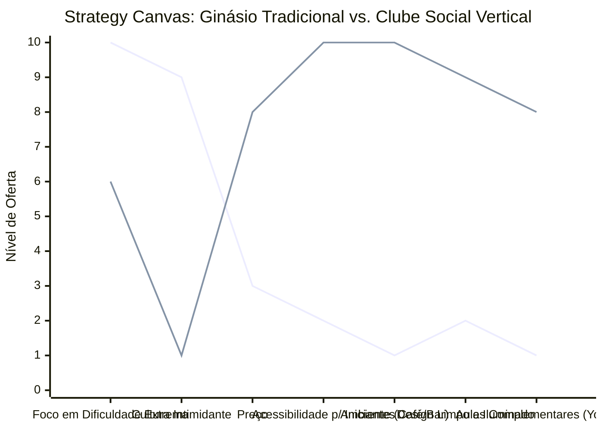

# Estudo de Caso Blue Ocean: Academia de Escalada

## De "Ginásio Hardcore" para "Clube Social Vertical"

### 1. O Cenário Atual (Oceano Vermelho)

O mercado tradicional de ginásios de escalada é extremamente voltado para a performance e intimidador:

1. **Foco na Alta Performance:** Construídos para atender atletas e praticantes experientes que buscam treinamento pesado e rotas de extrema dificuldade.
2. **Cultura Excludente ("Dirtbag"):** Ambientes muitas vezes rústicos, sem climatização, com foco excessivo apenas na escalada em si e sem estrutura de convivência.
3. **Barreira de Entrada Alta:** Equipamentos complexos (cordas, cadeirinhas) e a exigência de um parceiro para dar segurança afastam curiosos, iniciantes e o público que busca fitness casual.

### 2. A Estratégia do Oceano Azul: "Clube Social Vertical"

A estratégia propõe reposicionar a escalada de um esporte de nicho extremo para uma atividade social e de bem-estar urbano, transformando o ginásio em um "Terceiro Lugar".

**A Nova Proposta de Valor:**

- **Foco:** Profissionais urbanos, famílias e pessoas que buscam uma alternativa divertida à musculação tradicional, onde a socialização é tão importante quanto o exercício.
- **Ambiente:** Foco no *bouldering* (escalada sem corda em paredes baixas sobre colchões), design limpo, iluminado, climatizado e esteticamente agradável.
- **Modelo de Negócio:** Receita diversificada não apenas em mensalidades, mas no alto consumo do café/bar integrado, lojas de equipamentos e eventos.

### 3. Strategy Canvas (Tela Estratégica)

Comparativo entre o ginásio clássico focado apenas no esporte e o novo conceito de clube social.

**Legenda:**

- **Linha 1:** Ginásio Hardcore
- **Linha 2:** Clube Social (Blue Ocean)

> **Nota:** O Clube Social reduz drasticamente a Dificuldade Extrema e a Cultura Intimidante para focar em Acessibilidade, Design e Ambiente, o que justifica a cobrança de um Preço muito superior.

### 4. Framework das Quatro Ações (ERRC Grid)

| Ação         | O que fazer                                                                                                                                                                                                      |
| :----------- | :--------------------------------------------------------------------------------------------------------------------------------------------------------------------------------------------------------------- |
| **ELIMINAR** | **Ambiente elitista e escuro:** A cultura "dirtbag" que intimida quem nunca praticou o esporte. **Barreiras técnicas no boulder:** Reduzir o uso obrigatório de cordas para que pessoas possam ir sozinhas.   |
| **REDUZIR**  | **Ênfase na performance extrema:** Menos rotas impossíveis e menos foco em treinamento de força bruta. **Cheiro de magnésio e suor:** Melhoria drástica nos sistemas de ventilação e climatização.            |
| **AUMENTAR** | **Design e Limpeza:** Ambientes altamente iluminados, "instagramáveis", com banheiros padrão de clube premium. **Acessibilidade:** Muitas rotas iniciais, fáceis e divertidas que gerem sensação de sucesso.  |
| **CRIAR**    | **Áreas de Socialização Integradas:** Cafés de especialidade, espaços de coworking, e bares servindo cerveja artesanal. **Integração Holística:** Aulas de Yoga e treinos funcionais no mesmo espaço físico. |

### 5. Conclusão

Transformar a academia de escalada em um "Terceiro Lugar" (entre a casa e o trabalho). O negócio para de competir por "quem tem o melhor treino de força" e passa a competir no mercado de entretenimento e bem-estar. O lucro escala não apenas pelas mensalidades (que são mais altas), mas por criar uma comunidade engajada que passa horas no local, consome no bar/café e participa de eventos sociais noturnos.

### 6. Veja Também (Outros Estudos de Caso)

- [Turismo de Compras Têxtil](./turismo-compras-textil.md)
- [Pousadas e Campings](./pousadas-campings.md)
- [Personal Trainer](./personal-trainer.md)
- [Consultoria Empreendedora](./consultoria-empreendedora.md)
- [Agência de Marketing](./agencia-marketing.md)
- [Barbearia](./barbearia.md)
- [Clínica de Estética](./clinica-estetica.md)
- [Pet Shop](./pet-shop.md)
- [Cafeteria](./cafeteria.md)
- [Oficina Mecânica](./oficina-mecanica.md)
- [Escola de Idiomas](./escola-idiomas.md)
- [Startup B2B SaaS](./startup-saas.md)
- [Food Truck e Comida de Rua](./food-truck.md)
- [Delivery de Comida Saudável](./delivery-saudavel.md)
- [Loja de Roupas](./loja-roupas.md)
- [Estúdio de Yoga](./estudio-yoga.md)
- [Coworking de Nicho](./coworking.md)
- [Imobiliária Consultiva](./imobiliaria.md)
