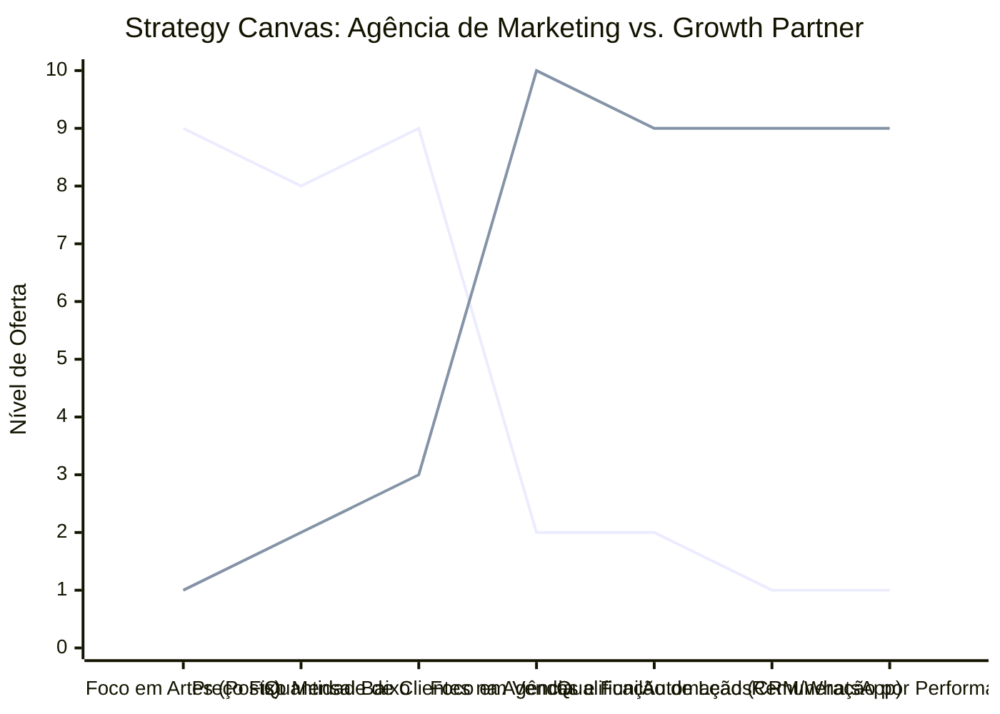

# Estudo de Caso Blue Ocean: Agência de Marketing

## Da "Publicidade de Vaidade" ao "Parceiro de Crescimento (Growth Partner)"

### 1. O Cenário Atual (Oceano Vermelho)

O mercado de agências de marketing tradicional é marcado por duas vertentes exaustivas:

1.  **Agências de "Posts Mágicos":** Vendem pacotes mensais de posts genéricos (5 artes por semana) que não geram resultados em vendas diretas, focando em "likes" ou "alcance", comoditizando o serviço.
2.  **Agências de "Tráfego Frio":** Focam puramente no CPL (Custo por Lead), muitas vezes enviando leads desqualificados, sem se preocupar com a conversão final do cliente.

A competição se dá por "quem faz o pacote mais barato de artes" ou "quem promete mais leads no Facebook Ads".

### 2. A Estratégia do Oceano Azul: "Parceiro de Crescimento"

A estratégia muda de "fornecedor de posts" para um **Growth Partner** ou **Assessor de Vendas B2B/B2C**. O foco deixa de ser os "likes" e a "criação de conteúdo" vazia e passa a ser o funil completo: atração, captura, conversão e retenção.

**A Nova Proposta de Valor:**

- **Foco:** O faturamento e o lucro final da empresa cliente. O "Parceiro" entra na gestão comercial.
- **Entrega:** Sistema de vendas automatizado, landing pages de alta conversão, e treinamento da equipe de vendas do cliente.
- **Remuneração:** Taxa fixa inicial (Setup) + Porcentagem sobre os resultados (Performance) ou Retainer alto por valor entregue.

### 3. Strategy Canvas (Tela Estratégica)

O gráfico compara a Agência Tradicional de "Pacote de Posts" com o Modelo Growth Partner.

**Legenda:**

- **Linha 1:** Agência Tradicional (Pacote de Posts)
- **Linha 2:** Growth Partner (Blue Ocean)

> **Nota:** O Growth Partner elimina a produção de artes irrelevantes, focando na construção de funis de vendas (_Foco em Vendas_, _Qualificação de Leads_, _Automação_). Isso exige atender menos clientes (alta personalização), cobrando um alto valor fixo/variável pelo aumento real nas vendas.

### 4. Framework das Quatro Ações (ERRC Grid)

Como escalar sendo um parceiro real:

| Ação         | O que fazer                                                                                                                                                                                                                                                                                                                      |
| :----------- | :------------------------------------------------------------------------------------------------------------------------------------------------------------------------------------------------------------------------------------------------------------------------------------------------------------------------------- |
| **ELIMINAR** | **Pacote de X artes por semana:** Parar de medir o sucesso pelo volume de posts no Instagram. **Métricas de Vaidade:** Não prometer seguidores ou likes (a menos que seja branding corporativo puro).                                                                                                                         |
| **REDUZIR**  | **Número de reuniões semanais "para aprovar layout":** Reduzir a dependência de design e focar em copy (texto que vende) e estrutura de funil. **Portfólio de "Faz-tudo":** Nichar a agência para se especializar em um tipo de negócio (ex: clínicas médicas).                                                               |
| **AUMENTAR** | **Integração com o Comercial do Cliente:** Ouvir as ligações, auditar o CRM, treinar os vendedores. **Transparência de Métricas (ROAS e CAC):** Mostrar o custo real de cada venda. **Automações Técnicas:** Implementar chat-bots, fluxos de email marketing e recuperação de carrinho.                                   |
| **CRIAR**    | **Modelos de Parceria em Performance:** A agência ganha uma % sobre o crescimento gerado. **Construção de Produto/Oferta:** A agência ajuda o cliente a remodelar o que vende para ser mais atrativo (a "oferta irresistível"). **Consultoria Estratégica Inclusa:** Revisão do modelo de negócios do cliente mensalmente. |

### 5. Conclusão

Ao adotar o posicionamento de **Parceiro de Crescimento**, a agência se desvencilha da brutal guerra de preços de "social media" de R$500/mês. A agência se torna um ativo valioso na empresa do cliente, muitas vezes assumindo uma parte do faturamento (Equity/Performance). O cliente para de ver a agência como "custo com o Facebook" e passa a ver como "máquina de vendas escalável".

### 6. Veja Também (Outros Estudos de Caso)

- [Turismo de Compras Têxtil](./turismo-compras-textil.md)
- [Pousadas e Campings](./pousadas-campings.md)
- [Academia de Escalada](./academia-escalada.md)
- [Personal Trainer](./personal-trainer.md)
- [Consultoria Empreendedora](./consultoria-empreendedora.md)
- [Delivery de Comida Saudável](./delivery-saudavel.md)
- [Loja de Roupas](./loja-roupas.md)
