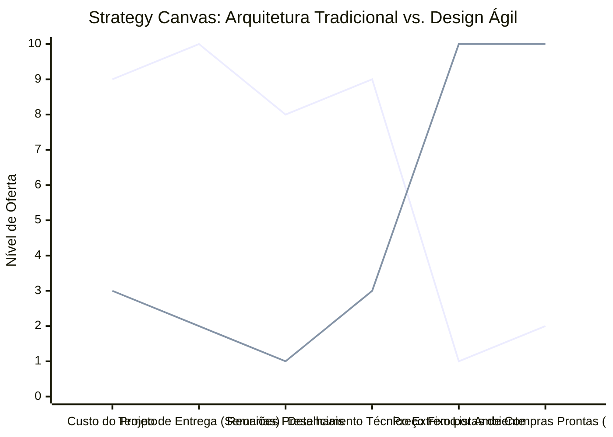

# Estudo de Caso Blue Ocean: Arquitetura e Interiores

## De "Projetos Complexos e Demorados" para "Design em Blocos Ágil"

### 1. O Cenário Atual (Oceano Vermelho)

O mercado de arquitetura de interiores tradicional sofre com processos engessados e orçamentos imprevisíveis:

1. **Ciclos Longos:** Semanas de reuniões para aprovar conceitos, seguidas por meses de detalhamento técnico exaustivo.
2. **Cobrança Imprevisível:** O preço muitas vezes varia conforme o padrão do cliente ou é um percentual sobre a obra, gerando desconfiança.
3. **Foco Excessivo em Renderizações:** Criação de imagens 3D hiper-realistas que consomem muito tempo e encarecem o projeto, muitas vezes desnecessárias para o cliente final que só quer resolver um ambiente.

### 2. A Estratégia do Oceano Azul: "Design em Blocos Ágil"

A estratégia propõe produtizar a arquitetura, oferecendo pacotes fechados de design rápido para ambientes específicos, eliminando a fricção e a imprevisibilidade de custos.

**A Nova Proposta de Valor:**

- **Foco:** Clientes jovens, novos proprietários de apartamentos ou inquilinos que precisam de soluções rápidas, práticas e esteticamente agradáveis para um ou dois cômodos.
- **Ambiente:** Processo 100% online, com questionários interativos e entregas em poucos dias, focando em moodboards e listas de compras diretas (shoppable links).
- **Modelo de Negócio:** Preço fixo por ambiente, sem surpresas, com possibilidade de upsell para acompanhamento de obra.

### 3. Strategy Canvas (Tela Estratégica)

O gráfico compara a arquitetura tradicional e detalhista com o modelo de design em blocos produtizado.

**Legenda:**

- **Linha 1:** Arquitetura Tradicional
- **Linha 2:** Design Ágil (Blue Ocean)

### 4. Framework das Quatro Ações (ERRC Grid)

| Ação         | O que fazer                                                                                                                                                                                                                           |
| :----------- | :------------------------------------------------------------------------------------------------------------------------------------------------------------------------------------------------------------------------------------ |
| **ELIMINAR** | **Orçamentos surpresa:** Eliminar a cobrança variável baseada em percentual de obra. **Múltiplas revisões infinitas:** Limitar o escopo com pacotes fechados (ex: até 2 revisões por ambiente).                                    |
| **REDUZIR**  | **Reuniões improdutivas:** Substituir reuniões presenciais longas por briefings assíncronos e formulários inteligentes. **Renders 3D complexos:** Usar moodboards e esboços 2D/3D simplificados que comunicam a ideia rapidamente. |
| **AUMENTAR** | **Velocidade de entrega:** Reduzir o tempo de entrega de meses para dias ou poucas semanas. **Transparência:** Mostrar preços e pacotes claramente no site, como um e-commerce de serviços.                                        |
| **CRIAR**    | **Pacotes de Design em Blocos:** Vender "Sala de Estar Ágil" ou "Home Office Express". **Listas de Compras Clicáveis:** Entregar um PDF onde o cliente clica no sofá e já cai na loja para comprar.                                |

### 5. Conclusão

Transformar um serviço artesanal e demorado em um produto altamente escalável. O cliente ganha previsibilidade de custos e rapidez, enquanto o escritório de arquitetura aumenta seu volume de projetos e faturamento por hora trabalhada, utilizando processos padronizados e livrarias de móveis pré-selecionados.

### 6. Veja Também (Outros Estudos de Caso)

- [Turismo de Compras Têxtil](./turismo-compras-textil.md)
- [Pousadas e Campings](./pousadas-e-campings.md)
- [Academia de Escalada](./academia-de-escalada.md)
- [Personal Trainer](./personal-trainer.md)
- [Consultoria Empreendedora](./consultoria-empreendedora.md)
- [Planejamento de Casamentos](./planejamento-casamentos.md)
- [Oficina de Bicicletas](./oficina-de-bicicletas.md)
