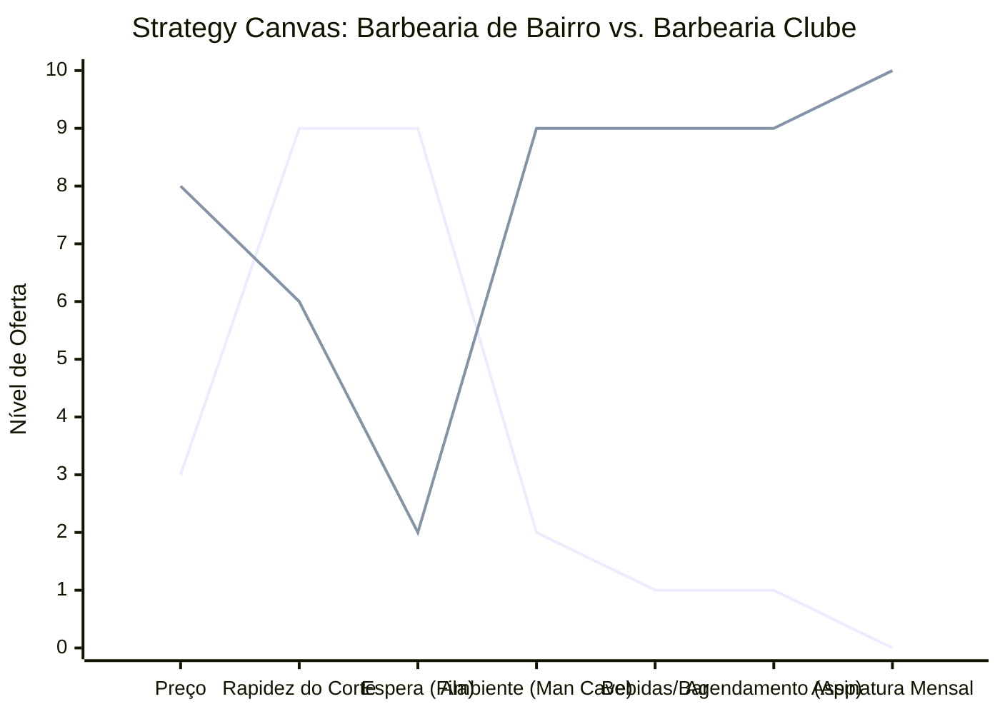

# Estudo de Caso Blue Ocean: Barbearia

## Do "Corte Rápido" ao "Clube de Cavalheiros"

### 1. O Cenário Atual (Oceano Vermelho)

O mercado de barbearias tradicionais foca em dois extremos:

1.  **Barbearia de Bairro (Tradicional):** Foco em preço baixo, corte rápido, ambiente simples, sem hora marcada (fila de espera) e leitura de revistas velhas.
2.  **Salão Unissex:** Ambiente feminino, cheiro de produtos químicos, constrangimento masculino, foco em coloração e tratamentos complexos.

A competição é baseada puramente em preço ou proximidade geográfica.

### 2. A Estratégia do Oceano Azul: "O Refúgio Masculino"

A proposta da "Barbearia Clube" (ou Gourmet) transforma o serviço de corte em uma **Experiência de Entretenimento e Relaxamento**. O cliente não vai apenas cortar o cabelo, ele vai para se desconectar, beber uma cerveja e conversar.

**A Nova Proposta de Valor:**

- **Foco:** Homens que buscam um momento de pausa e autocuidado sem perder a masculinidade.
- **Ambiente:** Decoração vintage/industrial ("Man Cave"), mesa de sinuca, bar com cerveja artesanal/whiskey, TV com esportes.
- **Modelo de Negócio:** Clube de Assinatura (Cortes ilimitados por valor fixo mensal) para gerar receita recorrente e fidelidade.

### 3. Strategy Canvas (Tela Estratégica)

O gráfico compara a Barbearia de Bairro com a Barbearia Clube.

**Legenda:**

- **Linha 1:** Barbearia de Bairro
- **Linha 2:** Barbearia Clube (Blue Ocean)

> **Nota:** A Barbearia Clube _elimina_ a espera na fila (via App) e _cria_ um ambiente de _Lounge/Bar_ com _Assinatura_, justificando um _Preço_ muito maior. A _Rapidez_ deixa de ser o foco principal em prol da experiência.

### 4. Framework das Quatro Ações (ERRC Grid)

Como transformar um corte de cabelo em um ritual:

| Ação         | O que fazer                                                                                                                                                                                                           |
| :----------- | :-------------------------------------------------------------------------------------------------------------------------------------------------------------------------------------------------------------------- |
| **ELIMINAR** | **Fila de espera física:** Agendamento 100% online/app. **Ambiente estéril/químico:** Nada de cheiro de tintura de salão unissex. **Revistas velhas:** Substituir por Wi-Fi e TV a cabo.                        |
| **REDUZIR**  | **Foco na rotatividade extrema:** O cliente pode ficar para tomar uma cerveja depois do corte. **Barulho de secadores:** Ambiente mais acústico e relaxante.                                                       |
| **AUMENTAR** | **Sofisticação do serviço:** Toalha quente, navalha clássica, massagem capilar. **Ticket Médio:** Venda de produtos (pomadas, óleos) e bebidas. **Estética:** Decoração temática (Rock, Sports, Vintage).       |
| **CRIAR**    | **Clube de Assinatura:** "Cabelo e Barba ilimitados" por R$ X/mês (Garante o MRR). **Dia do Noivo:** Pacote especial para casamentos. **Bar Integrado:** A primeira cerveja é cortesia, as outras são vendidas. |

### 5. Conclusão

Ao focar na **experiência masculina** e na **recorrência (assinatura)**, a barbearia deixa de ser uma commodity de preço e vira um "terceiro lugar" (após casa e trabalho) onde o cliente tem prazer em estar e gastar, blindando o negócio contra a concorrência de preço do bairro.

### 6. Veja Também (Outros Estudos de Caso)

- [Turismo de Compras Têxtil](./turismo-compras-textil.md)
- [Pousadas e Campings](./pousadas-campings.md)
- [Academia de Escalada](./academia-escalada.md)
- [Personal Trainer](./personal-trainer.md)
- [Consultoria Empreendedora](./consultoria-empreendedora.md)
- [Clínica de Estética](./clinica-estetica.md)
- [Pet Shop](./pet-shop.md)
- [Cafeteria](./cafeteria.md)
- [Oficina Mecânica](./oficina-mecanica.md)
- [Escola de Idiomas](./escola-idiomas.md)
