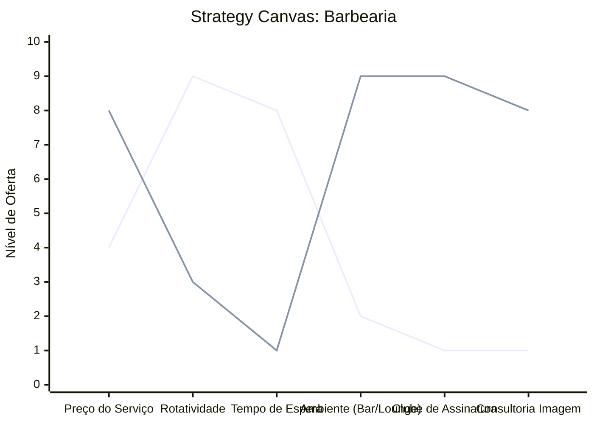

# Estudo de Caso: Barbearia

## Cenários

**Oceano Vermelho:**
- Cortes rápidos e padronizados com foco em rotatividade.
- Guerra de preços e promoções no bairro.
- Ambiente puramente funcional, de espera e serviço rápido.
- Fidelização baseada em "cartão fidelidade" (corte 10 ganhe 1).
- Profissionais focados apenas na execução técnica (sem consultoria de imagem).

**Oceano Azul:**
- Foco em Clube Masculino e experiência de relaxamento ("Refúgio Urbano").
- Ambiente imersivo com bar premium, charutaria ou lounge de jogos/networking.
- Assinatura mensal (Clubes de Assinatura) garantindo receita recorrente e visitas ilimitadas.
- Consultoria de visagismo, cuidados com pele (skincare masculino) e imagem pessoal.
- Agendamento 100% digital e atendimento pontual sem filas de espera.

## Matriz ERRC

- **Eliminar:** Filas de espera imprevisíveis, revistas velhas, "linha de montagem" de cortes.
- **Reduzir:** Competição por preço baixo, foco apenas no cabelo/barba, rotatividade de barbeiros.
- **Elevar:** Experiência sensorial (café/bar, música, aroma), pontualidade, consultoria de estilo.
- **Criar:** Modelos de assinatura recorrente (Clube), espaços de networking masculino, serviços integrados de bem-estar (skincare).

## Strategy Canvas

*(Nota: Linha 1 = Oceano Vermelho; Linha 2 = Oceano Azul)*

## Veja Também

- [Turismo de Compras Têxtil](./turismo-compras-textil.md)
- [Pousadas e Campings](./pousadas-e-campings.md)
- [Academia de Escalada](./academia-de-escalada.md)
- [Personal Trainer](./personal-trainer.md)
- [Consultoria Empreendedora](./consultoria-empreendedora.md)
- [Clínica Odontológica](./clinica-odontologica.md)
- [Pet Shop](./pet-shop.md)
