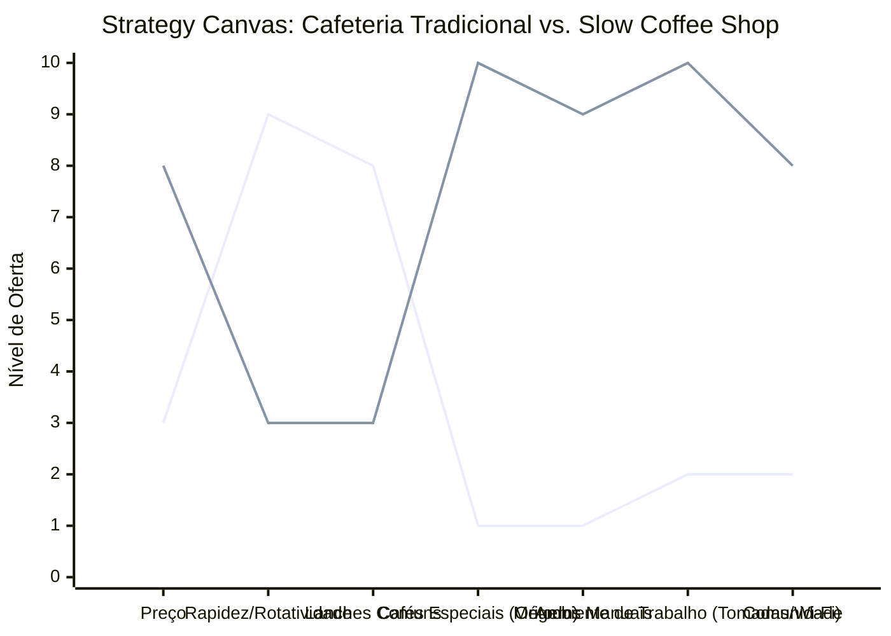

# Estudo de Caso Blue Ocean: Cafeteria
## Do "Café Rápido" à "Experiência de Cafés Especiais e Coworking"

### 1. O Cenário Atual (Oceano Vermelho)

O mercado de cafeterias divide-se em dois tipos principais:

1.  **Padarias/Lanchonetes:** Foco em café expresso genérico, pão de queijo, atendimento no balcão, rotatividade e preço baixo.
2.  **Franquias Internacionais:** Foco em bebidas açucaradas, copos de papel com o nome, ambiente padronizado, Wi-Fi com limite de tempo.

A competição se dá na venda de conveniência e lanches rápidos.

### 2. A Estratégia do Oceano Azul: "O Refúgio do Criativo"

A proposta da "Slow Coffee Shop" é vender tempo, espaço e degustação. O cliente não quer apenas a cafeína, ele busca um ambiente inspirador para trabalhar, ler ou ter reuniões, acompanhado de grãos de origem.

**A Nova Proposta de Valor:**
*   **Foco:** Profissionais autônomos, nômades digitais e amantes do café especial (geeks de café).
*   **Ambiente:** Mesas compartilhadas (coworking feel), poltronas confortáveis, iluminação de estudo, tomadas em todas as mesas, Wi-Fi ultrarrápido sem limites.
*   **Produto:** Grãos de micro-lotes, métodos de extração manuais (V60, Chemex, Aeropress), baristas que contam a história do café.

### 3. Strategy Canvas (Tela Estratégica)

O gráfico compara a Cafeteria Tradicional (Padaria/Lanchonete) com a Slow Coffee Shop.

**Legenda:**
*   **Linha 1:** Cafeteria Tradicional
*   **Linha 2:** Slow Coffee Shop (Blue Ocean)

> **Nota:** A Slow Coffee Shop *elimina* a pressa e reduz o foco em *Lanches Comuns* (que exigem cozinha pesada), enquanto aumenta drasticamente o *Ambiente de Trabalho* e a oferta de *Cafés Especiais*, criando um espaço de *Comunidade*.

### 4. Framework das Quatro Ações (ERRC Grid)

Como transformar uma xícara em uma estação de trabalho:

| Ação | O que fazer |
| :--- | :--- |
| **ELIMINAR** | **O "balcão da pressa":** O objetivo não é girar o cliente rápido, mas mantê-lo consumindo durante horas. **Bebidas excessivamente doces/industrializadas:** Focar no sabor real do grão. |
| **REDUZIR** | **Cardápio de comida complexa:** Menos pratos quentes (que cheiram forte) e mais confeitaria/sanduíches frios de alta qualidade. **Ruído:** Controlar a acústica para permitir reuniões e foco. |
| **AUMENTAR** | **Educação do cliente:** Baristas que explicam notas sensoriais e métodos. **Infraestrutura para trabalho:** Mesas com tomadas, internet corporativa. **Ticket Médio:** Venda de grãos em pacote para levar para casa, acessórios de café. |
| **CRIAR** | **Assinaturas de Café Mensais (Grãos):** Receita recorrente. **Workshops de Barista/Degustação:** Eventos noturnos que geram receita extra e fidelização. **Passes de Coworking (Opcional):** Cobrar pelo espaço + café livre para nômades fixos. |

### 5. Conclusão

Ao convidar o cliente para ficar, em vez de apressá-lo para sair, a cafeteria se torna o "escritório secundário" de muitos profissionais. O cliente pode passar a tarde gastando com café filtrado, uma torta artesanal e comprando um pacote de grãos para casa. O negócio escala pela venda de valor agregado (conhecimento do barista) e não por empurrar milhares de cafezinhos de R$ 3,00.

### 6. Veja Também (Outros Estudos de Caso)

*   [Turismo de Compras Têxtil](./turismo-compras-textil.md)
*   [Pousadas e Campings](./pousadas-campings.md)
*   [Academia de Escalada](./academia-escalada.md)
*   [Personal Trainer](./personal-trainer.md)
*   [Consultoria Empreendedora](./consultoria-empreendedora.md)
*   [Barbearia](./barbearia.md)
*   [Clínica de Estética](./clinica-estetica.md)
*   [Pet Shop](./pet-shop.md)
*   [Oficina Mecânica](./oficina-mecanica.md)
*   [Escola de Idiomas](./escola-idiomas.md)
