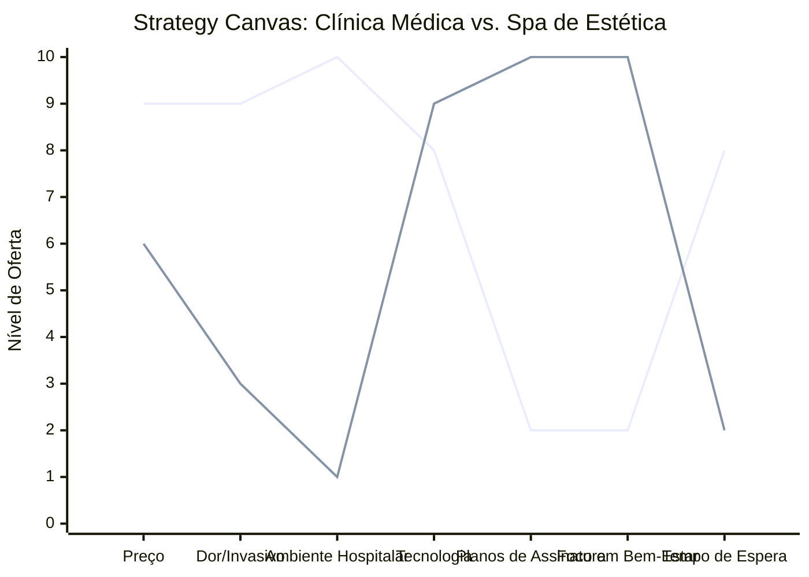

# Estudo de Caso Blue Ocean: Clínica de Estética
## Da "Beleza Dolorosa" ao "Spa de Autoestima e Bem-Estar"

### 1. O Cenário Atual (Oceano Vermelho)

O mercado de estética é altamente fragmentado e focado em procedimentos isolados:

1.  **Clínicas Tradicionais/Dermatológicas:** Foco em procedimentos médicos invasivos, dor, ambiente hospitalar frio ("Branco"), tempo de espera longo.
2.  **Spas de Luxo:** Foco apenas em relaxamento, preço proibitivo, pouco resultado estético visível a curto prazo.
3.  **Salões de Beleza:** Foco em serviços superficiais (unha, cabelo), sem tecnologia de ponta para tratamento corporal/facial.

A competição é por quem tem a "máquina da moda" ou o botox mais barato.

### 2. A Estratégia do Oceano Azul: "Estética Acessível e Humanizada"

A proposta é democratizar a alta tecnologia estética em um ambiente de **Spa Urbano**, focado em **Planos de Tratamento** (recorrência) e não em sessões avulsas. O cliente busca resultado sem o trauma do ambiente médico.

**A Nova Proposta de Valor:**
*   **Foco:** Mulheres e homens que querem se cuidar preventivamente sem cirurgia.
*   **Ambiente:** Acolhedor, aromaterapia, chás, design de interiores quente (foge do branco hospitalar).
*   **Modelo:** Planos de assinatura ou pacotes fechados com acompanhamento nutricional integrado.

### 3. Strategy Canvas (Tela Estratégica)

O gráfico compara a Clínica Tradicional com o novo conceito de Spa de Estética.

**Legenda:**
*   **Linha 1:** Clínica Médica Tradicional
*   **Linha 2:** Spa de Estética (Blue Ocean)

> **Nota:** O Spa de Estética *elimina* o ambiente hospitalar e *reduz* a dor (focando em procedimentos não-cirúrgicos), enquanto *aumenta* drasticamente o *Bem-Estar* e cria *Planos de Assinatura* que tornam o tratamento acessível e contínuo.

### 4. Framework das Quatro Ações (ERRC Grid)

Como transformar pacientes em membros de um clube de beleza:

| Ação | O que fazer |
| :--- | :--- |
| **ELIMINAR** | **Ambiente frio e intimidante:** O design deve lembrar uma sala de estar chique, não um hospital. **Procedimentos ultra-invasivos:** Focar em tratamentos que não exigem tempo de recuperação (downtime). |
| **REDUZIR** | **Tempo de espera na recepção:** Agendamento preciso. **Dor durante o tratamento:** Investir em tecnologias indolores (ex: laser frio, criofrequência). |
| **AUMENTAR** | **Tecnologia de ponta:** Equipamentos modernos são o grande diferencial de resultado. **Acolhimento:** Chá, café especial, massagem nas mãos/pés durante a espera/procedimento. |
| **CRIAR** | **Planos de Assinatura (Beleza Recorrente):** "Botox Club" ou "Detox Mensal". **Avaliação Holística:** Incluir bioimpedância e dicas nutricionais no pacote. **App de Acompanhamento:** Fotos de "antes e depois" acessíveis ao cliente. |

### 5. Conclusão

Ao migrar do modelo "médico-paciente" para o modelo "membro-clube", a clínica reduz o medo e a barreira de entrada. A recorrência garante fluxo de caixa previsível e permite investir em equipamentos melhores, criando um ciclo virtuoso onde o cliente tem resultados constantes e a clínica tem faturamento constante.

### 6. Veja Também (Outros Estudos de Caso)

*   [Turismo de Compras Têxtil](./turismo-compras-textil.md)
*   [Pousadas e Campings](./pousadas-campings.md)
*   [Academia de Escalada](./academia-escalada.md)
*   [Personal Trainer](./personal-trainer.md)
*   [Consultoria Empreendedora](./consultoria-empreendedora.md)
*   [Barbearia](./barbearia.md)
