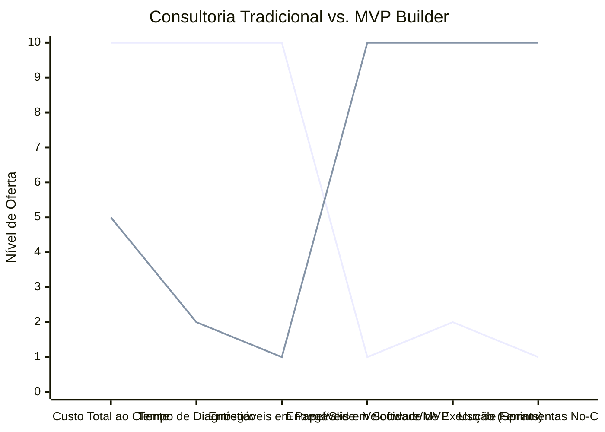

# Estudo de Caso Blue Ocean: Consultoria Empreendedora

## Estratégia Recomendada: De "Relatórios e Slides" para "MVP Builder (Tech Consultant)"

Este estudo propõe a transição da entrega de conselhos teóricos para a entrega de soluções tecnológicas validadas.

### 1. Strategy Canvas

Comparativo entre consultorias que vendem horas de diagnóstico versus consultorias focadas em construção de produto.

**Legenda:**
- **Linha 1:** Consultoria de Negócios Tradicional
- **Linha 2:** MVP Builder / Tech Consultant (Blue Ocean)

### 2. ERRC Grid (Quatro Ações)

| Ação | Estratégia Objetiva |
| :--- | :--- |
| **ELIMINAR** | Relatórios estáticos gigantescos, planos de negócios teóricos e precificação por hora/homem. |
| **REDUZIR** | O número de reuniões intermináveis para aprovação e a burocracia do planejamento estratégico inicial. |
| **AUMENTAR** | O foco na execução rápida ("feito melhor que perfeito") e na criação de automações imediatas que gerem vendas. |
| **CRIAR** | Construção de MVPs em No-Code (em semanas), dashboards de BI operacionais e entrega de sistemas rodando. |

### 3. Conclusão Objetiva

Produtizar a consultoria. O cliente não quer pagar para ouvir o que deve fazer, ele quer pagar para ter o problema resolvido. Entregar software rápido e dashboards conectados ao invés de PDFs gera valor imediato e justificativa para retainers recorrentes.
