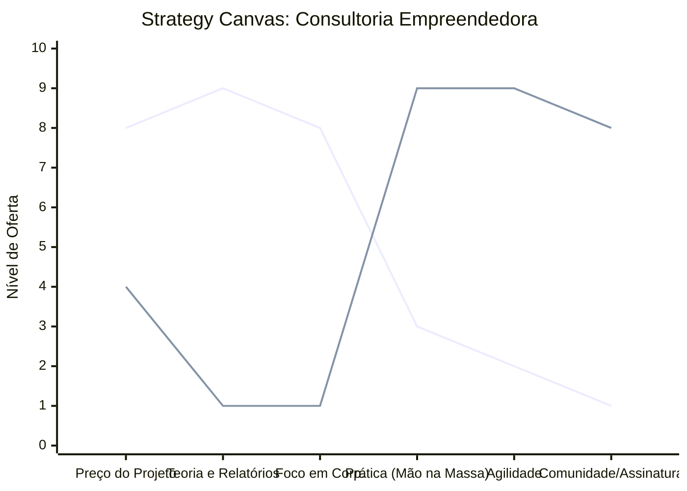

# Estudo de Caso: Consultoria Empreendedora

## Cenários

**Oceano Vermelho:**
- Relatórios densos e teóricos ("lero lero" corporativo).
- Venda de horas de consultoria genérica de gestão.
- Foco em empresas grandes e corporações tradicionais.
- Entregáveis focados no "o que fazer" e não no "como fazer".
- Baixa retenção, projetos isolados com alto custo de aquisição.

**Oceano Azul:**
- Foco em experiências enxutas e unit economics aplicados.
- Mentorias práticas com acompanhamento de implementação ("mão na massa").
- Nicho: Startups early-stage, solopreneurs e pequenas empresas em transição digital.
- Frameworks visuais rápidos, checklists acionáveis e suporte diário via canais ágeis (ex: WhatsApp, Slack).
- Modelos de assinatura e "Consultoria as a Service" (CaaS).

## Matriz ERRC

- **Eliminar:** Relatórios extensos sem aplicação prática, reuniões longas e teóricas.
- **Reduzir:** Preço inicial elevado, jargões complexos ("lero lero"), foco exclusivo em teoria.
- **Elevar:** Velocidade de implementação, objetividade extrema, acompanhamento contínuo.
- **Criar:** Produtos produtizados, checklists acionáveis, comunidade de empreendedores, assinaturas recorrentes.

## Strategy Canvas

*(Nota: Linha 1 = Oceano Vermelho; Linha 2 = Oceano Azul)*

## Veja Também

- [Salão de Beleza](./salao-de-beleza.md)
- [Pet Shop](./pet-shop.md)
- [Escola de Idiomas](./escola-de-idiomas.md)
- [Turismo de Compras Têxtil](./turismo-compras-textil.md)
- [Pousadas e Campings](./pousadas-e-campings.md)
- [Academia de Escalada](./academia-de-escalada.md)
- [Personal Trainer](./personal-trainer.md)
