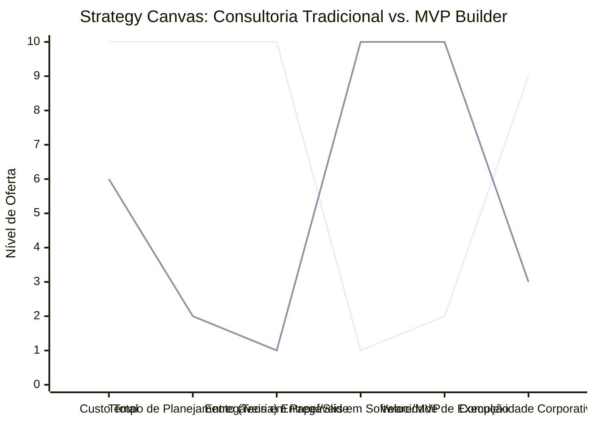

# Estudo de Caso Blue Ocean: Consultoria Empreendedora

## Do "PowerPoint" ao "Micro-SaaS & MVP Builder"

### 1. O Cenário Atual (Oceano Vermelho)

O mercado de consultoria de negócios tradicional divide-se em:

1.  **Grandes Firmas (Big 4):** Focam em grandes corporações, cobram fortunas, entregam relatórios de 500 páginas e powerpoints teóricos. A implementação fica a cargo do cliente.
2.  **Cursos/Mentores Genéricos:** Vendem "fórmulas mágicas" em massa, sem personalização ou "mão na massa".

O problema: O empreendedor moderno precisa de **velocidade** e **tecnologia**, não de mais teoria.

### 2. A Estratégia do Oceano Azul: "Consultoria Operacional Tech"

O novo consultor não entrega um PDF dizendo o que fazer. Ele entrega um **Sistema Funcionando (MVP)** ou um processo validado. Ele usa ferramentas No-Code/Low-Code e IA para construir a solução junto com o cliente ("Done-With-You").

**A Nova Proposta de Valor:**

- **Foco:** Startups em fase inicial e PMEs que precisam digitalizar.
- **Entrega:** Um MVP (Produto Mínimo Viável) em 2 semanas, automações de vendas, dashboard de BI em tempo real.
- **Modelo:** Escopo fechado (Produto) ou Retainer de Crescimento (Growth), não hora/homem.

### 3. Strategy Canvas (Tela Estratégica)

O gráfico compara a Consultoria Tradicional com a "Fábrica de MVP" (Tech Consultant).

**Legenda:**

- **Linha 1:** Consultoria Tradicional (Big 4)
- **Linha 2:** MVP Builder (Blue Ocean)

> **Nota:** O Consultor Tech _elimina_ drasticamente o tempo de planejamento teórico e a entrega de papéis, focando quase 100% na entrega de _Software/MVP_ e _Velocidade_. O cliente sai com o negócio rodando, não com um plano de negócios na gaveta.

### 4. Framework das Quatro Ações (ERRC Grid)

Como transformar conselhos em produtos digitais:

| Ação         | O que fazer                                                                                                                                                                                                                                                                   |
| :----------- | :---------------------------------------------------------------------------------------------------------------------------------------------------------------------------------------------------------------------------------------------------------------------------- |
| **ELIMINAR** | **Relatórios longos e planos de negócio estáticos:** Ninguém lê, e ficam obsoletos em um mês. **Cobrança por hora:** O foco deve ser no entregável (valor), não no tempo gasto.                                                                                            |
| **REDUZIR**  | **Reuniões de alinhamento intermináveis:** Usar metodologia ágil (Sprints curtos). **Complexidade burocrática:** Focar no "feito é melhor que perfeito" para validar logo.                                                                                                 |
| **AUMENTAR** | **Uso de Ferramentas No-Code (Bubble, Make, Airtable):** Para entregar software rápido sem precisar de dev caro. **Foco em Vendas:** O primeiro objetivo é fazer o cliente vender, não organizar a casa inteira. **Automação:** Substituir processos manuais por robôs. |
| **CRIAR**    | **Pacotes "MVP em 1 Semana":** Produto de entrada claro e definido. **Dashboard de Métricas em Tempo Real:** O cliente vê o resultado no celular, não no relatório mensal. **Comunidade de Founders:** Networking entre os clientes da consultoria.                     |

### 5. Conclusão

Ao produtizar a consultoria (transformando serviços em pacotes claros com entregáveis tangíveis), o consultor escala seu negócio e se diferencia absurdamente no mercado. O cliente percebe valor imediato ("paguei e recebi um sistema/site/app"), reduzindo o atrito de venda e aumentando a fidelização.

### 6. Veja Também (Outros Estudos de Caso)

- [Turismo de Compras Têxtil](./turismo-compras-textil.md)
- [Pousadas e Campings](./pousadas-campings.md)
- [Academia de Escalada](./academia-escalada.md)
- [Personal Trainer](./personal-trainer.md)
- [Barbearia](./barbearia.md)
- [Clínica de Estética](./clinica-estetica.md)
- [Pet Shop](./pet-shop.md)
- [Cafeteria](./cafeteria.md)
- [Oficina Mecânica](./oficina-mecanica.md)
- [Escola de Idiomas](./escola-idiomas.md)
- [Startup B2B SaaS](./startup-saas.md)
- [Food Truck e Comida de Rua](./food-truck.md)
