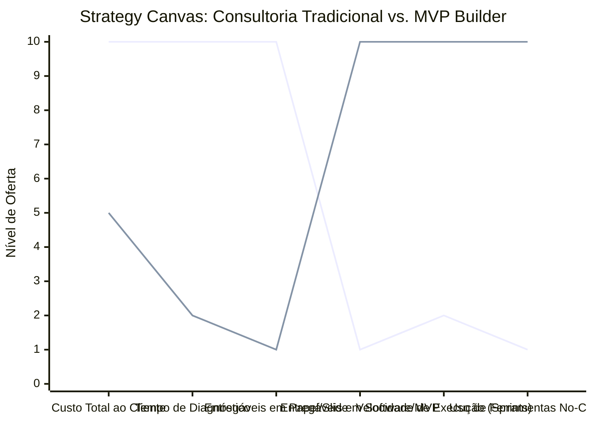

# Estudo de Caso Blue Ocean: Consultoria Empreendedora

## De "Relatórios e Slides" para "MVP Builder (Tech Consultant)"

### 1. O Cenário Atual (Oceano Vermelho)

O mercado de consultoria de negócios tradicional é visto por muitos empreendedores como lento, caro e excessivamente teórico:

1. **Foco no Papel:** Entregáveis baseados em calhamaços de PDFs e slides com análises SWOT e planos de negócios que rapidamente ficam defasados.
2. **Ciclos Longos:** Semanas ou meses de "diagnóstico" e "planejamento" antes de qualquer ação prática ou teste de mercado.
3. **Cobrança por Hora:** O consultor é remunerado pelo tempo investido em reuniões, o que não incentiva a agilidade na resolução do problema do cliente.

### 2. A Estratégia do Oceano Azul: "MVP Builder (Tech Consultant)"

A estratégia propõe a transição da entrega de conselhos teóricos para a construção de soluções tecnológicas validadas, focando em "execução" no lugar de "planejamento".

**A Nova Proposta de Valor:**

- **Foco:** Empreendedores e pequenas empresas que precisam de soluções rápidas para validar ideias, automatizar processos e aumentar vendas imediatamente.
- **Ambiente:** Ferramentas No-Code/Low-Code (Bubble, Make, Airtable), entregando protótipos funcionais em poucos dias.
- **Modelo de Negócio:** Produtização da consultoria, cobrando por "Sprint de Execução" ou "Produto Entregue" ao invés de horas de reunião.

### 3. Strategy Canvas (Tela Estratégica)

Comparativo entre consultorias que vendem horas de diagnóstico versus consultorias focadas em construção de produto.

**Legenda:**

- **Linha 1:** Consultoria de Negócios Tradicional
- **Linha 2:** MVP Builder / Tech Consultant (Blue Ocean)

> **Nota:** O MVP Builder corta drasticamente o Tempo de Diagnóstico e Entregáveis em Papel, apostando forte na Velocidade e no Uso de No-Code para entregar Software de forma ágil e com Custo Total menor que uma consultoria longa.

### 4. Framework das Quatro Ações (ERRC Grid)

| Ação         | O que fazer                                                                                                                                                                                                                         |
| :----------- | :---------------------------------------------------------------------------------------------------------------------------------------------------------------------------------------------------------------------------------- |
| **ELIMINAR** | **Relatórios estáticos:** Parar de entregar PDFs teóricos e focar em sistemas que rodam na prática. **Precificação por hora:** Eliminar a contagem de horas e cobrar por valor entregue no final da sprint.                      |
| **REDUZIR**  | **Tempo de Diagnóstico:** Menos reuniões de planejamento e mais testes empíricos com clientes reais. **Burocracia de Planejamento:** Parar de tentar prever o futuro do mercado em planilhas longas.                             |
| **AUMENTAR** | **Foco na Execução Ágil:** Entregas rápidas semanais ("feito melhor que perfeito"). **Automações de Vendas:** Focar em resolver os gargalos de receita da empresa imediatamente.                                                 |
| **CRIAR**    | **Construção de MVPs No-Code:** Entregar aplicativos, landing pages e CRMs em dias/semanas. **Dashboards Operacionais:** Fornecer BI (Business Intelligence) em tempo real no lugar de relatórios mensais estáticos do passado. |

### 5. Conclusão

Produtizar a consultoria e focar na execução tecnológica. O cliente não quer mais pagar apenas para ouvir "o que deve fazer", ele quer pagar para ver o problema resolvido. Entregar software funcional, automações e dashboards conectados em vez de PDFs gera valor financeiro imediato para a empresa, criando uma justificativa inegável para contratos recorrentes (retainers) focados em otimização contínua.

### 6. Veja Também (Outros Estudos de Caso)

- [Turismo de Compras Têxtil](./turismo-compras-textil.md)
- [Pousadas e Campings](./pousadas-campings.md)
- [Academia de Escalada](./academia-escalada.md)
- [Personal Trainer](./personal-trainer.md)
- [Agência de Marketing](./agencia-marketing.md)
- [Barbearia](./barbearia.md)
- [Clínica de Estética](./clinica-estetica.md)
- [Pet Shop](./pet-shop.md)
- [Cafeteria](./cafeteria.md)
- [Oficina Mecânica](./oficina-mecanica.md)
- [Escola de Idiomas](./escola-idiomas.md)
- [Startup B2B SaaS](./startup-saas.md)
- [Food Truck e Comida de Rua](./food-truck.md)
- [Delivery de Comida Saudável](./delivery-saudavel.md)
- [Loja de Roupas](./loja-roupas.md)
- [Estúdio de Yoga](./estudio-yoga.md)
- [Coworking de Nicho](./coworking.md)
- [Imobiliária Consultiva](./imobiliaria.md)
