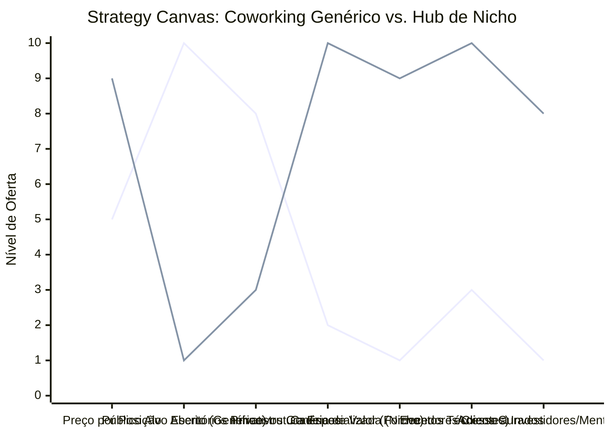

# Estudo de Caso Blue Ocean: Coworking

## De "Aluguel de Mesas" para "Hub de Inovação de Nicho"

### 1. O Cenário Atual (Oceano Vermelho)

O mercado de coworkings generalistas tornou-se uma commodity baseada em imobiliário:

1. **Guerra de Preços por Posição:** A concorrência se baseia no preço do aluguel da mesa ou da sala privativa.
2. **Ambientes Genéricos:** Espaços projetados para atender qualquer pessoa (de advogados a designers), resultando em infraestruturas medianas para todos e excelentes para ninguém.
3. **Falta de Sinérgia Real:** O "networking" prometido raramente acontece de forma orgânica, pois os negócios dos ocupantes não têm relação entre si.

### 2. A Estratégia do Oceano Azul: "Hub de Inovação Vertical (Nicho)"

A estratégia propõe abandonar o modelo de locação imobiliária genérica para se tornar um ecossistema focado em uma única vertical de mercado (ex: Hub de Startups de Saúde, Hub de Criadores de Conteúdo, Hub de Arquitetura).

**A Nova Proposta de Valor:**

- **Foco:** Profissionais e empresas de um setor específico que buscam infraestrutura hiper-especializada e conexões valiosas (clientes, parceiros, investidores).
- **Ambiente:** Infraestrutura técnica específica (ex: estúdios de gravação para criadores, plotters para arquitetos, laboratórios de prototipagem).
- **Modelo de Negócio:** Mensalidades premium justificadas pela economia em infraestrutura especializada e pelas oportunidades de negócios geradas na comunidade.

### 3. Strategy Canvas (Tela Estratégica)

Comparativo entre o Coworking Genérico focado no aluguel e o Hub de Nicho focado no ecossistema.

**Legenda:**

- **Linha 1:** Coworking Genérico
- **Linha 2:** Hub de Inovação Vertical (Blue Ocean)

### 4. Framework das Quatro Ações (ERRC Grid)

| Ação         | O que fazer                                                                                                                                                                                                                                            |
| :----------- | :----------------------------------------------------------------------------------------------------------------------------------------------------------------------------------------------------------------------------------------------------- |
| **ELIMINAR** | **O público genérico:** Parar de aceitar empresas de qualquer segmento; filtrar rigorosamente para manter a vertical. **Disputa por m² mais barato:** Sair da guerra de preços com escritórios tradicionais.                                        |
| **REDUZIR**  | **Salas privativas isoladas:** Reduzir espaços que encorajam o isolamento e focar em áreas abertas colaborativas. **Eventos sociais genéricos:** Menos "happy hours" sem propósito e mais workshops práticos.                                       |
| **AUMENTAR** | **Equipamentos e Softwares específicos:** Ter a melhor infraestrutura do mercado para aquele nicho (o que seria caro para uma pessoa sozinha ter). **Cadeia de suprimentos interna:** Conectar quem vende para quem compra dentro do próprio Hub. |
| **CRIAR**    | **Curadoria de Membros:** Processo seletivo para entrar, garantindo qualidade do ecossistema. **Fundos e Aceleradoras Residentes:** Atrair investidores focados no setor para terem mesas permanentes no local.                                     |

### 5. Conclusão

Sair do mercado imobiliário e entrar no mercado de aceleração de negócios. Um Hub focado (ex: apenas HealthTechs ou apenas Audiovisual) atrai as melhores mentes daquele mercado. O membro não paga pelo Wi-Fi ou pelo café, ele paga pelo acesso ao ecossistema, aos parceiros ideais, à infraestrutura que ele não poderia comprar sozinho e às oportunidades de investimento que só existem ali dentro.

### 6. Veja Também (Outros Estudos de Caso)

- [Turismo de Compras Têxtil](./turismo-compras-textil.md)
- [Pousadas e Campings](./pousadas-campings.md)
- [Academia de Escalada](./academia-escalada.md)
- [Personal Trainer](./personal-trainer.md)
- [Consultoria Empreendedora](./consultoria-empreendedora.md)
- [Agência de Marketing](./agencia-marketing.md)
- [Barbearia](./barbearia.md)
- [Clínica de Estética](./clinica-estetica.md)
- [Pet Shop](./pet-shop.md)
- [Cafeteria](./cafeteria.md)
- [Oficina Mecânica](./oficina-mecanica.md)
- [Escola de Idiomas](./escola-idiomas.md)
- [Startup B2B SaaS](./startup-saas.md)
- [Food Truck e Comida de Rua](./food-truck.md)
- [Delivery de Comida Saudável](./delivery-saudavel.md)
- [Loja de Roupas](./loja-roupas.md)
- [Estúdio de Yoga](./estudio-yoga.md)
- [Imobiliária Consultiva](./imobiliaria.md)
