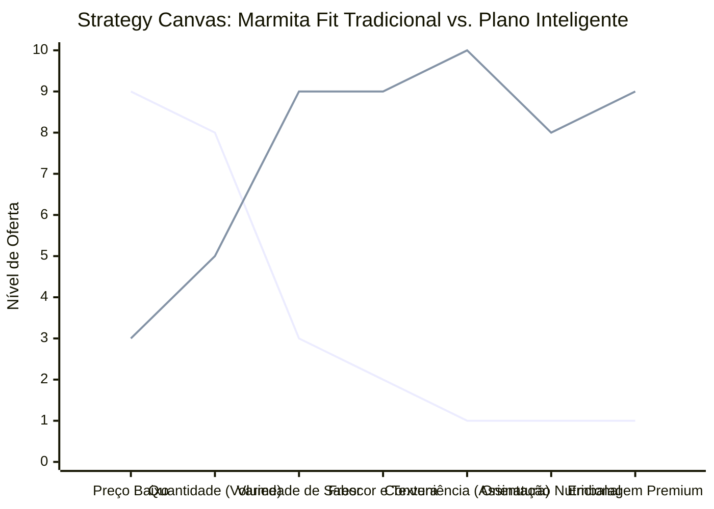

# Estudo de Caso Blue Ocean: Delivery de Comida Saudável

## Da "Marmita Fria" ao "Plano de Nutrição Inteligente"

### 1. O Cenário Atual (Oceano Vermelho)

O mercado de delivery de comida e marmitas é altamente comoditizado:

1.  **Restaurantes Tradicionais no iFood:** Focados em fast food, pizza ou lanches com alta concorrência por preço e tempo de entrega.
2.  **Vendedores Locais de "Marmita Fit":** Focados apenas em oferecer arroz integral e frango grelhado congelados, competindo agressivamente por preço.

O cliente que busca saúde não quer apenas uma marmita fria no congelador; ele quer conveniência total para manter a dieta sem pensar no que comer.

### 2. A Estratégia do Oceano Azul: "Plano de Nutrição Inteligente"

A proposta de valor sai de "vender comida" para "vender saúde no piloto automático". O negócio não vende pratos avulsos, mas um sistema de assinatura semanal/mensal integrado com objetivos do cliente (ex: emagrecimento, hipertrofia).

**A Nova Proposta de Valor:**

- **Foco:** Profissionais ocupados que querem saúde mas não têm tempo para cozinhar ou decidir o que comer diariamente.
- **Entrega:** Assinatura de refeições frescas diárias ou pacotes semanais premium, entregues de forma programada.
- **Experiência:** Embalagens sustentáveis e inteligentes que preservam a textura e sabor, menu variável sem repetições cansativas, consultoria online com nutricionista integrada.

### 3. Strategy Canvas (Tela Estratégica)

O gráfico abaixo compara o mercado tradicional de marmitas congeladas com o novo Plano Inteligente.

**Legenda:**

- **Linha 1:** Marmita Fit Tradicional
- **Linha 2:** Plano de Nutrição Inteligente (Blue Ocean)

> **Nota:** O Plano Inteligente reduz drasticamente o foco no _Preço Baixo_ e na _Quantidade_ exagerada de comida simples, para investir pesadamente em _Variedade de Sabor_, _Frescor_, _Conveniência da Assinatura_ e _Orientação Nutricional_, justificando uma mensalidade de alto valor.

### 4. Framework das Quatro Ações (ERRC Grid)

Como implementar o Plano Inteligente:

| Ação         | O que fazer                                                                                                                                                                                                                                                                                                                     |
| :----------- | :------------------------------------------------------------------------------------------------------------------------------------------------------------------------------------------------------------------------------------------------------------------------------------------------------------------------------ |
| **ELIMINAR** | **Pedidos Avulsos (Sob demanda):** Eliminar a necessidade do cliente ter que entrar em app para escolher o que comer na hora da fome. **Comida Congelada Sem Sabor:** Eliminar o padrão de marmita que perde a textura.                                                                                                      |
| **REDUZIR**  | **Foco em "Frango com Batata Doce":** Reduzir a monotonia oferecendo pratos de chef com foco saudável. **Custos de Entrega Sob Demanda:** Entregas programadas reduzem o custo logístico de urgência.                                                                                                                        |
| **AUMENTAR** | **Conveniência:** Tudo chega na hora certa, todo dia ou toda semana. **Qualidade dos Ingredientes:** Foco em orgânicos e temperos naturais de verdade. **Sustentabilidade:** Embalagens retornáveis ou biodegradáveis.                                                                                                    |
| **CRIAR**    | **Modelos de Assinatura (Subscrição):** O cliente paga um valor mensal para não pensar no almoço/jantar. **Perfil Nutricional Personalizado:** O menu é gerado baseado nos macros e restrições do cliente (low carb, vegan, etc). **Suporte Nutricional Básico:** Um canal rápido via WhatsApp para dúvidas com um nutri. |

### 5. Conclusão

Ao migrar para um modelo de assinatura focada em **conveniência** e **nutrição personalizada**, a empresa sai da guerra de centavos do delivery tradicional e cria um oceano azul com receita recorrente garantida (MRR), previsibilidade de estoque (zero desperdício) e uma base de clientes altamente engajada. O cliente não está comprando um prato feito, está comprando "paz de espírito e saúde garantida" todos os dias.

### 6. Veja Também (Outros Estudos de Caso)

- [Turismo de Compras Têxtil](./turismo-compras-textil.md)
- [Pousadas e Campings](./pousadas-campings.md)
- [Academia de Escalada](./academia-escalada.md)
- [Personal Trainer](./personal-trainer.md)
- [Consultoria Empreendedora](./consultoria-empreendedora.md)
- [Agência de Marketing](./agencia-marketing.md)
- [Loja de Roupas](./loja-roupas.md)
- [Startup B2B SaaS](./startup-saas.md)
- [Food Truck e Comida de Rua](./food-truck.md)
