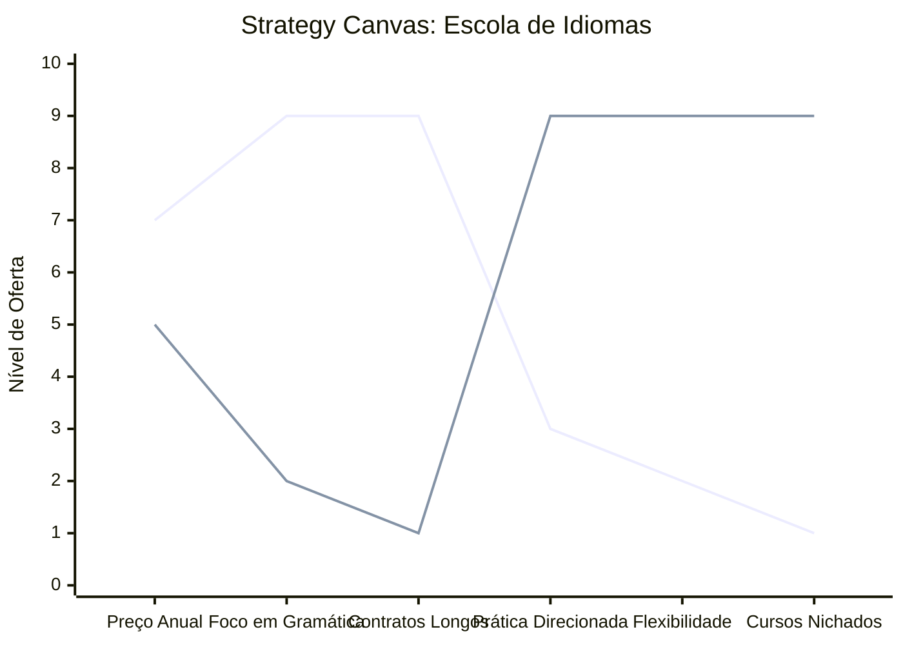

# Estudo de Caso: Escola de Idiomas

## Cenários

**Oceano Vermelho:**
- Aulas focadas apenas em gramática teórica e livros engessados.
- Contratos de longo prazo (anos) com altas taxas de cancelamento.
- Competição massiva entre redes de franquias oferecendo "fluência em x anos".
- Avaliações baseadas apenas em provas escritas.
- Turmas grandes e heterogêneas sem foco específico.

**Oceano Azul:**
- Ensino orientado a objetivos práticos imediatos (Inglês para Entrevistas de TI, Espanhol para Viagens de Negócios).
- Imersão cultural e vivência (aulas em cenários reais, degustação cultural).
- Assinatura flexível de módulos rápidos e independentes.
- Gamificação do aprendizado com forte integração de comunidade de conversação diária.
- Mentoria de carreira atrelada à fluência.

## Matriz ERRC

- **Eliminar:** Contratos engessados de 2 a 5 anos, livros didáticos ultrapassados, testes teóricos irrelevantes.
- **Reduzir:** Aulas apenas de gramática, promessas genéricas de fluência, turmas muito grandes.
- **Elevar:** Aplicabilidade imediata do idioma, networking na comunidade de alunos, prática oral diária.
- **Criar:** Cursos ultra-nichados (por profissão/objetivo), mentorias culturais, plataformas de conexão entre nativos e alunos.

## Strategy Canvas

*(Nota: Linha 1 = Oceano Vermelho; Linha 2 = Oceano Azul)*

## Veja Também

- [Salão de Beleza](./salao-de-beleza.md)
- [Pet Shop](./pet-shop.md)
- [Turismo de Compras Têxtil](./turismo-compras-textil.md)
- [Pousadas e Campings](./pousadas-e-campings.md)
- [Academia de Escalada](./academia-de-escalada.md)
- [Personal Trainer](./personal-trainer.md)
- [Consultoria Empreendedora](./consultoria-empreendedora.md)
