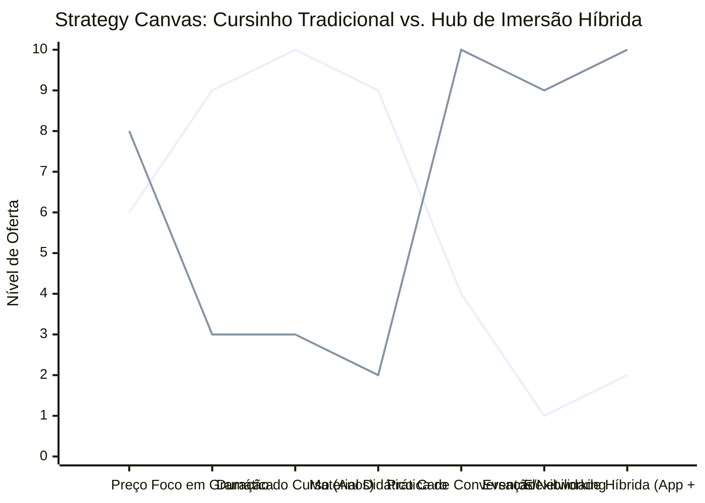

# Estudo de Caso Blue Ocean: Escola de Idiomas
## Do "Cursinho de Inglês" à "Imersão Cultural Híbrida"

### 1. O Cenário Atual (Oceano Vermelho)

O mercado de ensino de idiomas está saturado de promessas de fluência:

1.  **Franquias Tradicionais:** Foco em gramática maçante ("The book is on the table"), cursos longos de 5 a 7 anos, material didático engessado e caro, horários fixos.
2.  **Plataformas EAD Genéricas/Apps:** Foco em custo quase zero, estudo 100% solitário, gamificação simples (Duolingo), falta de prática real de conversação ("trava na hora de falar").

A competição baseia-se em "quem promete fluência mais rápido" (muitas vezes de forma leviana) ou quem tem a mensalidade mais barata.

### 2. A Estratégia do Oceano Azul: "O Hub de Imersão e Networking"

A "Imersão Cultural Híbrida" foca em resolver a dor real do aluno adulto: o medo de falar e a falta de tempo. Em vez de vender "aulas", a escola vende um **Clube de Conversação e Networking**. O foco é prático, com teoria assíncrona (em casa) e prática imersiva e social (ao vivo/presencial).

**A Nova Proposta de Valor:**
*   **Foco:** Jovens profissionais e adultos que precisam do idioma para a carreira, não para passar de ano.
*   **Metodologia "Flipped Classroom" (Sala Invertida):** Teoria (gramática/vocabulário) no app próprio antes da aula, e o encontro ao vivo é 100% conversação prática sobre temas reais (Business, Viagens).
*   **Ambiente:** Espaços que lembram pubs ou salas de reunião de startups, eventos sociais em inglês (Karaokê, Happy Hour, Palestras).

### 3. Strategy Canvas (Tela Estratégica)

O gráfico compara o Cursinho Tradicional com o Hub de Imersão.

**Legenda:**
*   **Linha 1:** Cursinho Tradicional
*   **Linha 2:** Hub de Imersão Híbrida (Blue Ocean)

> **Nota:** O Hub de Imersão Híbrida *elimina* o uso de *Material Didático Caro* (substituído pelo app/plataforma) e a longa *Duração do Curso*, reduzindo o foco maçante em *Gramática*. Em compensação, maximiza a *Conversação*, o *Networking* e a *Flexibilidade*, permitindo um ticket superior voltado para o mercado adulto.

### 4. Framework das Quatro Ações (ERRC Grid)

Como transformar aulas chatas em conexões valiosas:

| Ação | O que fazer |
| :--- | :--- |
| **ELIMINAR** | **Aulas expositivas de gramática presencial:** O aluno consome a teoria em casa no seu tempo (vídeo/app). **As "provas" no papel:** Avaliação constante através da prática oral, não de decoreba. |
| **REDUZIR** | **Apostilas grossas de editoras terceiras:** Criar material próprio online e iterativo. **Turmas heterogêneas infantis/adultos juntas:** Focar estritamente no público adulto/profissional. |
| **AUMENTAR** | **O tempo de fala do aluno (Teacher Talking Time < Student Talking Time):** O professor atua como um mediador/facilitador do debate. **Cultura e Networking:** Temas de aula baseados em artigos de negócios (Harvard Business Review), simulação de entrevistas e pitches em inglês. |
| **CRIAR** | **Ecossistema Social:** "English Pub Nights" (cerveja e conversa), clubes do livro em inglês, palestras sobre carreiras internacionais. **Mentorias 1-on-1 on-demand:** Agendamento flexível via app para destravar dificuldades pontuais. |

### 5. Conclusão

Ao focar no profissional que já tentou vários métodos e continua travado ("eterno nível intermediário"), a escola deixa de vender gramática (que é grátis no YouTube) e passa a vender **confiança e ambiente**. A recorrência é mantida não pela obrigação de terminar o "livro 4", mas pela comunidade que o aluno não quer abandonar. Ele paga pela mentoria e pelas portas que o networking global abre.

### 6. Veja Também (Outros Estudos de Caso)

*   [Turismo de Compras Têxtil](./turismo-compras-textil.md)
*   [Pousadas e Campings](./pousadas-campings.md)
*   [Academia de Escalada](./academia-escalada.md)
*   [Personal Trainer](./personal-trainer.md)
*   [Consultoria Empreendedora](./consultoria-empreendedora.md)
*   [Barbearia](./barbearia.md)
*   [Clínica de Estética](./clinica-estetica.md)
*   [Pet Shop](./pet-shop.md)
*   [Cafeteria](./cafeteria.md)
*   [Oficina Mecânica](./oficina-mecanica.md)
