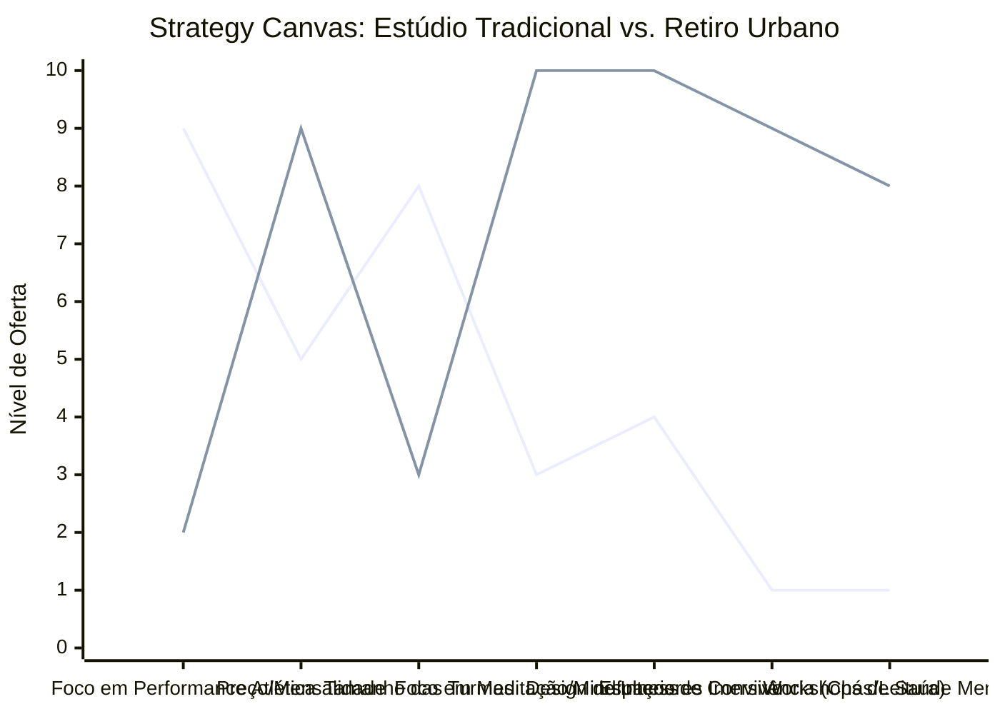

# Estudo de Caso Blue Ocean: Estúdio de Yoga

## De "Academia de Alongamento" para "Retiro Urbano de Saúde Mental"

### 1. O Cenário Atual (Oceano Vermelho)

O mercado tradicional de estúdios de yoga frequentemente compete com academias convencionais, com foco apenas no exercício físico:

1. **Foco na Flexibilidade e Acrobacia:** Aulas vendidas como puramente "fitness", afastando pessoas menos flexíveis ou que não buscam performance atlética.
2. **Ambiente Impessoal:** Salas de aula rotativas onde o aluno entra, faz a aula e sai, sem conexão real com a comunidade ou com o espaço.
3. **Pacotes Mensais Rígidos:** Modelos de negócio baseados em "x vezes por semana", com pouca flexibilidade para o aluno moderno.

### 2. A Estratégia do Oceano Azul: "Retiro Urbano"

A estratégia propõe reposicionar o estúdio como um santuário de descompressão mental e bem-estar no meio da cidade, muito além do tapete de yoga.

**A Nova Proposta de Valor:**

- **Foco:** Profissionais sobrecarregados e pessoas em busca de alívio para a ansiedade, que querem um momento de paz no meio da rotina caótica.
- **Ambiente:** Iluminação suave, aromaterapia, espaços de leitura e chás integrados, silêncio absoluto.
- **Modelo de Negócio:** "Passaporte de Paz" (acesso livre) em vez de controle de frequência, com foco em retenção pelo ambiente e pela comunidade.

### 3. Strategy Canvas (Tela Estratégica)

Comparativo entre o estúdio tradicional voltado ao fitness e o modelo de retiro urbano focado na saúde mental.

**Legenda:**

- **Linha 1:** Estúdio Tradicional de Yoga
- **Linha 2:** Retiro Urbano (Blue Ocean)

### 4. Framework das Quatro Ações (ERRC Grid)

| Ação         | O que fazer                                                                                                                                                                                                |
| :----------- | :--------------------------------------------------------------------------------------------------------------------------------------------------------------------------------------------------------- |
| **ELIMINAR** | **Julgamento de performance:** Parar de focar em poses acrobáticas avançadas que intimidam iniciantes. **Cobrança por aula avulsa:** Eliminar o atrito da compra por sessão, focando na associação.     |
| **REDUZIR**  | **Tamanho das turmas:** Menos alunos por sessão para garantir exclusividade e silêncio. **Espelhos grandes:** Reduzir o apelo estético para focar na introspecção e sentir o corpo.                     |
| **AUMENTAR** | **Práticas Restaurativas:** Mais sessões de Yin Yoga, meditação guiada e breathwork. **Conforto Sensorial:** Investimento massivo em aromaterapia, acústica impecável e iluminação relaxante (penumbra). |
| **CRIAR**    | **Espaço de "Descompressão":** Lounge com chás medicinais e biblioteca onde os alunos podem ficar antes/depois da aula. **Curadoria de Estilo de Vida:** Retiros de final de semana e masterclasses.    |

### 5. Conclusão

Sair da competição com as grandes redes de academia que oferecem "aulas de alongamento". Ao focar na saúde mental, descompressão e na criação de um "santuário urbano", o estúdio justifica tickets premium. O aluno não está pagando por 60 minutos de exercícios físicos; ele está pagando por paz de espírito, silêncio e pertencimento a uma comunidade consciente no meio da cidade.

### 6. Veja Também (Outros Estudos de Caso)

- [Turismo de Compras Têxtil](./turismo-compras-textil.md)
- [Pousadas e Campings](./pousadas-campings.md)
- [Academia de Escalada](./academia-escalada.md)
- [Personal Trainer](./personal-trainer.md)
- [Consultoria Empreendedora](./consultoria-empreendedora.md)
- [Agência de Marketing](./agencia-marketing.md)
- [Barbearia](./barbearia.md)
- [Clínica de Estética](./clinica-estetica.md)
- [Pet Shop](./pet-shop.md)
- [Cafeteria](./cafeteria.md)
- [Oficina Mecânica](./oficina-mecanica.md)
- [Escola de Idiomas](./escola-idiomas.md)
- [Startup B2B SaaS](./startup-saas.md)
- [Food Truck e Comida de Rua](./food-truck.md)
- [Delivery de Comida Saudável](./delivery-saudavel.md)
- [Loja de Roupas](./loja-roupas.md)
- [Coworking de Nicho](./coworking.md)
- [Imobiliária Consultiva](./imobiliaria.md)
