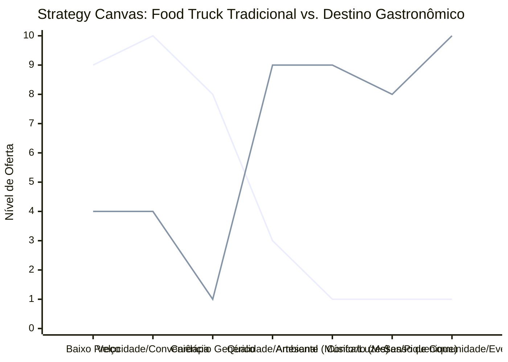

# Estudo de Caso Blue Ocean: Food Truck e Comida de Rua

## Do "Lanche Rápido na Calçada" para o "Festival Gastronômico Móvel"

### 1. O Cenário Atual (Oceano Vermelho)

O mercado de comida de rua e food trucks tradicionais é altamente saturado e focado na conveniência extrema.

**Características do Oceano Vermelho:**

- **Foco:** Refeição rápida para quem está com pressa.
- **Cardápio:** Genérico (hambúrgueres, cachorros-quentes, pastéis).
- **Preço:** Muito baixo, competindo diretamente com grandes redes de fast-food.
- **Experiência:** Comer em pé na calçada, sem conforto, lidando com filas e barulho.

### 2. A Estratégia do Oceano Azul: "O Evento Gastronômico"

A estratégia é tirar o food truck da "rua movimentada de passagem" e transformá-lo em um **Destino Gastronômico e Cultural**, focado em criar um evento em torno da comida.

**A Nova Proposta de Valor:**

- **Foco:** Grupos de amigos e famílias buscando lazer no final de semana.
- **Cardápio:** Especializado e artesanal (ex: culinária tailandesa de rua autêntica, ou sobremesas moleculares).
- **Preço:** Premium acessível. Mais caro que um lanche rápido, mas mais barato que um restaurante fino.
- **Experiência:** Parques, praças fechadas ou "Food Parks" com música ao vivo, iluminação cênica, mantas de piquenique e ambiente seguro.

### 3. Strategy Canvas (Tela Estratégica)

O gráfico abaixo compara o Food Truck tradicional de calçada com o modelo de Destino Gastronômico.

**Legenda:**

- **Linha 1:** Food Truck Tradicional
- **Linha 2:** Destino Gastronômico (Blue Ocean)

> **Nota:** O modelo de Destino Gastronômico reduz o foco extremo em _Velocidade_ e _Baixo Preço_ e foca na _Qualidade_ e no _Senso de Evento_. A refeição deixa de ser uma necessidade urgente e passa a ser uma forma de lazer.

### 4. Framework das Quatro Ações (ERRC Grid)

Para criar este novo mercado, devemos aplicar as quatro ações:

| Ação         | O que fazer                                                                                                                                                                                                                                                              |
| :----------- | :----------------------------------------------------------------------------------------------------------------------------------------------------------------------------------------------------------------------------------------------------------------------- |
| **ELIMINAR** | **A briga por espaço na calçada:** Sair de vias expressas e buscar locais fechados ou praças de bairro. **Menu gigante e confuso:** Focar em poucos itens, mas com qualidade excepcional.                                                                             |
| **REDUZIR**  | **Tempo de espera na fila em pé:** Implementar pedidos via app/QR Code onde o cliente retira apenas quando pronto. **Foco no "mata-fome":** A comida é parte da experiência, não apenas combustível.                                                                  |
| **AUMENTAR** | **Estética do Food Truck:** Design atrativo, "Instagramável". **Qualidade dos ingredientes:** Usar produtos locais, orgânicos ou importados de alta qualidade.                                                                                                        |
| **CRIAR**    | **Ambiente no entorno:** Fornecer cadeiras de praia, toalhas de piquenique, cordões de luzes. **Parcerias:** Juntar-se a trucks de cerveja artesanal ou sobremesa para criar um "Mini Festival". **Música:** Som ambiente curado ou música ao vivo (voz e violão). |

### 5. Conclusão

Ao transformar a comida de rua em um **evento de lazer**, o food truck se descola da guerra de preços contra o McDonald's e contra o carrinho de cachorro-quente da esquina. O cliente não vai apenas para "comer", ele vai para "passar o tempo", justificando um ticket médio muito mais alto e atraindo um público que normalmente iria para um restaurante tradicional, mas que agora busca um ambiente mais descontraído e ao ar livre.

### 6. Veja Também (Outros Estudos de Caso)

- [Turismo de Compras Têxtil](./turismo-compras-textil.md)
- [Pousadas e Campings](./pousadas-campings.md)
- [Academia de Escalada](./academia-escalada.md)
- [Personal Trainer](./personal-trainer.md)
- [Consultoria Empreendedora](./consultoria-empreendedora.md)
- [Barbearia](./barbearia.md)
- [Clínica de Estética](./clinica-estetica.md)
- [Pet Shop](./pet-shop.md)
- [Cafeteria](./cafeteria.md)
- [Oficina Mecânica](./oficina-mecanica.md)
- [Escola de Idiomas](./escola-idiomas.md)
- [Startup B2B SaaS](./startup-saas.md)
