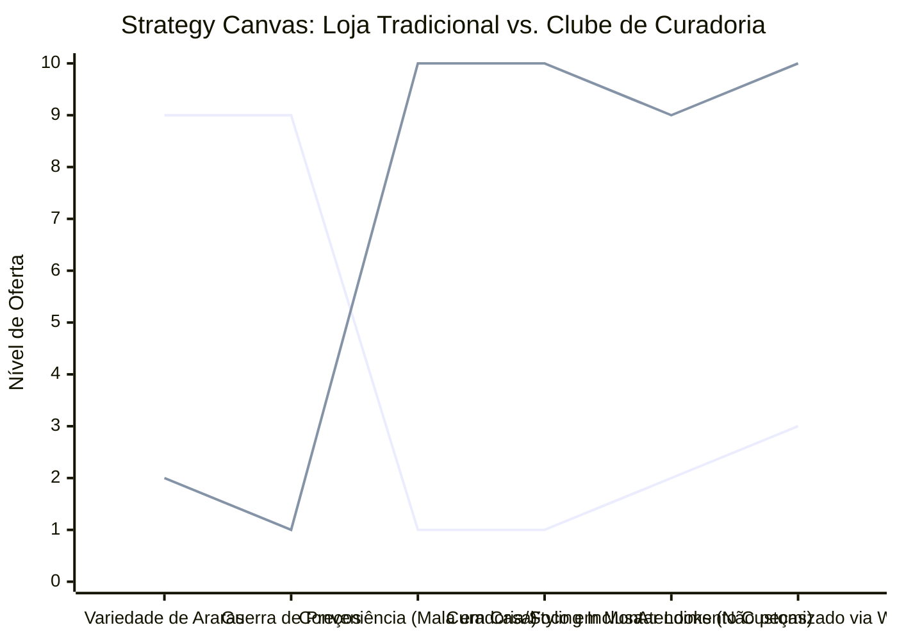

# Estudo de Caso Blue Ocean: Loja de Roupas

## Do "Varejo Genérico" ao "Clube de Curadoria e Personal Stylist"

### 1. O Cenário Atual (Oceano Vermelho)

O mercado de lojas de roupas (físicas ou e-commerce) é brutalmente competitivo e sofre de "commodity fashion":

1.  **Varejo Fast Fashion (Shein, Renner, C&A):** Acessível, de tendências rápidas, mas genérico. Ganha na escala.
2.  **Lojas de Bairro Multimarcas:** Repassam marcas conhecidas com margens apertadas e perdem clientes para a internet.
3.  **Marcas Premium (Oceano Vermelho de Luxo):** Disputam status e qualidade superior.

A loja comum apenas empilha cabides e espera o cliente comprar. O preço é o fator decisório na maioria das vezes.

### 2. A Estratégia do Oceano Azul: "Clube de Curadoria de Imagem"

A nova loja (ou marca digital) não vende "peças de roupa avulsas". Ela vende **"O Guarda-Roupa Inteligente"** e **"Economia de Tempo e Imagem"**. O cliente contrata a curadoria, não a costura.

**A Nova Proposta de Valor:**

- **Foco:** Profissionais ocupados que querem se vestir bem sem gastar horas em shoppings ou em provadores online.
- **Entrega:** Uma mala (Bag) enviada periodicamente para a casa do cliente (ou um atendimento premium agendado na loja física) baseada no seu perfil.
- **Modelo:** O "Personal Stylist" passa a ser o serviço central, e as roupas são a consequência da consultoria.

### 3. Strategy Canvas (Tela Estratégica)

O gráfico compara a Loja de Roupas Tradicional com o Modelo de Curadoria (Fashion Bag/Styling).

**Legenda:**

- **Linha 1:** Loja de Roupas Tradicional
- **Linha 2:** Clube de Curadoria (Blue Ocean)

> **Nota:** A Loja de Curadoria reduz radicalmente a necessidade de um _Grande Estoque Exposto (Variedade de Araras)_ e foca 100% na _Conveniência da Mala em Casa_ e na _Curadoria do Styling_. O cliente paga um ticket médio muito mais alto por não precisar escolher nada; ele prova o que já foi selecionado para ele.

### 4. Framework das Quatro Ações (ERRC Grid)

Como implementar o modelo de curadoria inteligente:

| Ação         | O que fazer                                                                                                                                                                                                                                                                                           |
| :----------- | :---------------------------------------------------------------------------------------------------------------------------------------------------------------------------------------------------------------------------------------------------------------------------------------------------- |
| **ELIMINAR** | **A exposição genérica no salão de vendas:** Se houver loja física, ela se torna um showroom intimista ou estúdio. **O papel do "vendedor chato":** Aquele que persegue o cliente na loja. Ele agora é um Consultor de Estilo.                                                                     |
| **REDUZIR**  | **Variedade infinita de estoque:** Focar em coleções cápsula e peças-chave de alta combinabilidade. **A dependência do tráfego de rua:** A loja vai até o cliente.                                                                                                                                 |
| **AUMENTAR** | **Conveniência e Experiência em Casa:** A "Mala Delivery" onde o cliente prova no próprio quarto e devolve o que não quer. **Conhecimento do Cliente:** CRM robusto (registrar medidas, gostos, cores favoritas e histórico). **Fidelização:** O cliente se sente VIP e para de ir ao shopping. |
| **CRIAR**    | **Serviço de "Mala Delivery" Programada:** A "Bag" chega na mudança de estação ou antes de viagens importantes. **Consultoria de Imagem Inclusa:** Dicas de como combinar as peças enviadas. **Planos de Assinatura de Básicos:** (Ex: reposição de camisetas e meias a cada 3 meses).          |

### 5. Conclusão

Ao adotar o posicionamento de **Clube de Curadoria de Imagem**, a loja foge da comparação brutal de preços com o e-commerce chinês ou os grandes magazines. Ela não vende mais "uma blusinha", ela vende "uma hora de conforto e a certeza de estar bem vestido". O ticket médio explode (cliente leva 3-5 peças que combinam, não apenas uma), a devolução cai por ser curada, e o LTV (Lifetime Value) do cliente se torna altíssimo pela fidelidade ao "seu estilista pessoal".

### 6. Veja Também (Outros Estudos de Caso)

- [Turismo de Compras Têxtil](./turismo-compras-textil.md)
- [Pousadas e Campings](./pousadas-campings.md)
- [Academia de Escalada](./academia-escalada.md)
- [Personal Trainer](./personal-trainer.md)
- [Consultoria Empreendedora](./consultoria-empreendedora.md)
- [Delivery de Comida Saudável](./delivery-saudavel.md)
- [Agência de Marketing](./agencia-marketing.md)
