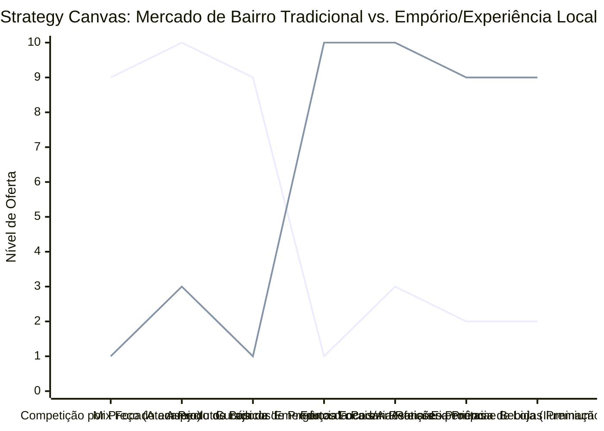

# Estudo de Caso Blue Ocean: Mercado de Bairro

## Do "Minimercado de Emergência" para o "Centro de Experiência Gastronômica Local"

### 1. O Cenário Atual (Oceano Vermelho)

Os pequenos mercados de bairro (mercearias/minimercados) enfrentam uma pressão dupla e impiedosa:

1. **Guerra de Preços Injusta:** É impossível competir em preço de produtos industrializados básicos (arroz, feijão, sabão em pó) com os grandes hipermercados e atacarejos.
2. **Posicionamento de "Emergência":** O cliente só vai ao mercado de bairro quando "esqueceu" alguma coisa no atacarejo, o que limita o ticket médio a compras pequenas de última hora.
3. **Ambiente Sem Atrativos:** Lojas espremidas, mal iluminadas, com mix de produtos genéricos, sem proporcionar nenhuma experiência agradável de compra.

### 2. A Estratégia do Oceano Azul: "Centro de Experiência Gastronômica Local"

A estratégia propõe tirar o pequeno mercado da categoria de "abastecimento de commodities por necessidade" e movê-lo para o nicho de "compra rápida premium, curadoria de produtos e consumo imediato".

**A Nova Proposta de Valor:**

- **Foco:** Moradores locais que buscam produtos frescos, artesanais, pães recém-assados, vinhos, cortes de carne premium e produtos para um jantar especial sem precisarem pegar o carro para ir ao hipermercado.
- **Ambiente:** Layout limpo (conceito empório/boutique), iluminação quente, padaria central atraente, seção de hortifrúti fresco e impecável.
- **Modelo de Negócio:** Maior margem de lucro através de produtos de valor agregado (padaria própria, rotisseria, adega, marcas artesanais locais) e menor foco na guerra do arroz com feijão.

### 3. Strategy Canvas (Tela Estratégica)

Comparativo entre o minimercado tradicional (focado em marcas de massa) e o mercado de experiência local.

**Legenda:**

- **Linha 1:** Mercado de Bairro Tradicional
- **Linha 2:** Centro de Experiência / Empório Local (Blue Ocean)

### 4. Framework das Quatro Ações (ERRC Grid)

| Ação         | O que fazer                                                                                                                                                                                                                                              |
| :----------- | :------------------------------------------------------------------------------------------------------------------------------------------------------------------------------------------------------------------------------------------------------- |
| **ELIMINAR** | **A tentativa de competir em preço:** Parar de queimar margem tentando vender produtos básicos de limpeza mais barato que o atacarejo do bairro vizinho.                                                                                                 |
| **REDUZIR**  | **Espaço de gôndola para grandes marcas comoditizadas:** Diminuir a variedade absurda de sabonetes e focar em abrir espaço para produtos de maior margem. **Estoque estagnado:** Reduzir produtos de baixíssimo giro.                                 |
| **AUMENTAR** | **O papel do Hortifrúti e Padaria:** Esses devem ser a "âncora" da loja, impecáveis, frescos e muito bem expostos. **Produtos de impulso e consumo imediato:** Bebidas geladas premium, lanches frescos, refeições prontas (grab and go).           |
| **CRIAR**    | **Setor de Curadoria (Empório):** Vinhos selecionados de bom custo-benefício, queijos artesanais, carnes nobres. **Parcerias Locais:** Vender o pão de fermentação natural daquele vizinho, a cerveja artesanal da região, gerando senso de comunidade. |

### 5. Conclusão

Sair da rota de colisão com os hipermercados. O cliente vai ao atacarejo no final de semana para fazer a compra "pesada", mas quer o empório do bairro para comprar o pão quente da manhã, o vinho e a carne nobre para a sexta-feira à noite, e o queijo artesanal. Essa mudança aumenta drasticamente a margem de lucro e atrai um público disposto a pagar pela conveniência premium, transformando a "loja de emergência" em um ponto agradável de compras locais e descobertas gastronômicas.

### 6. Veja Também (Outros Estudos de Caso)

- [Lavanderia](./lavanderia.md)
- [Fotografia](./fotografia.md)
- [Odontologia](./odontologia.md)
- [Escritório de Advocacia](./escritorio-advocacia.md)
- [Turismo de Compras Têxtil](./turismo-compras-textil.md)
- [Pousadas e Campings](./pousadas-campings.md)
- [Academia de Escalada](./academia-escalada.md)
- [Personal Trainer](./personal-trainer.md)
- [Consultoria Empreendedora](./consultoria-empreendedora.md)
- [Agência de Marketing](./agencia-marketing.md)
- [Barbearia](./barbearia.md)
- [Clínica de Estética](./clinica-estetica.md)
- [Pet Shop](./pet-shop.md)
- [Cafeteria](./cafeteria.md)
- [Oficina Mecânica](./oficina-mecanica.md)
- [Escola de Idiomas](./escola-idiomas.md)
- [Startup B2B SaaS](./startup-saas.md)
- [Food Truck e Comida de Rua](./food-truck.md)
- [Delivery de Comida Saudável](./delivery-saudavel.md)
- [Loja de Roupas](./loja-roupas.md)
- [Estúdio de Yoga](./estudio-yoga.md)
- [Coworking de Nicho](./coworking.md)
- [Imobiliária Consultiva](./imobiliaria.md)
