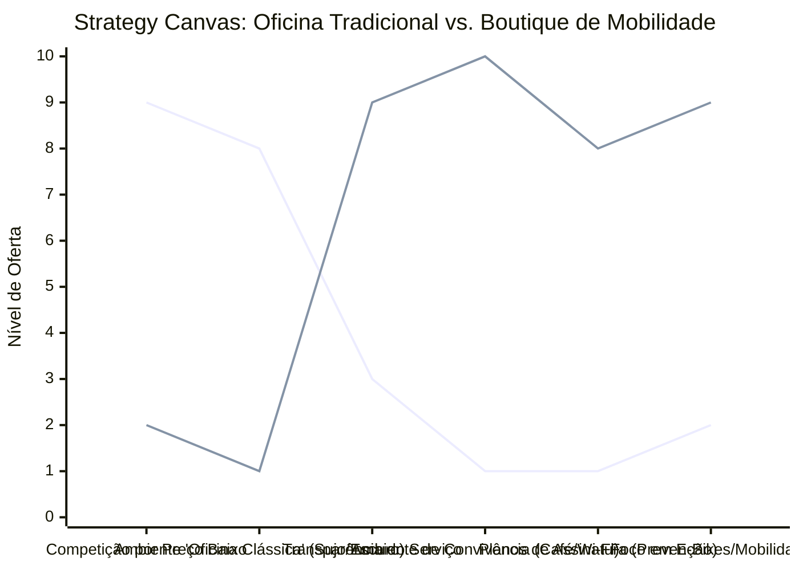

# Estudo de Caso Blue Ocean: Oficina de Bicicletas

## De "Mecânica Graxeira" para "Boutique de Mobilidade e Café"

### 1. O Cenário Atual (Oceano Vermelho)

As oficinas de bicicletas tradicionais competem em um mercado saturado e muitas vezes amador:

1. **Ambiente Desagradável:** Locais apertados, sujos de graxa, escuros e pouco convidativos para o público em geral.
2. **Atendimento Focado no Conserto:** O cliente deixa a bicicleta e vai embora. Não há motivo para permanecer no local.
3. **Público Restrito:** Foco apenas em ciclistas hardcore ou em serviços de baixíssimo custo (remendos rápidos), ignorando o novo público de mobilidade urbana e bicicletas elétricas.

### 2. A Estratégia do Oceano Azul: "Boutique de Mobilidade e Café"

A estratégia transforma a oficina em um "Hub de Mobilidade Urbana", integrando serviços de manutenção de alta qualidade com um ambiente de convivência (café) e consultoria para ciclistas diários.

**A Nova Proposta de Valor:**

- **Foco:** Profissionais urbanos, ciclistas iniciantes e donos de e-bikes que buscam confiança, transparência e um ambiente agradável.
- **Ambiente:** Oficina envidraçada (transparência), limpa, iluminada, integrada a um café de especialidade com Wi-Fi.
- **Modelo de Negócio:** Receitas híbridas combinando pacotes de revisão agendados (mensalidade/assinatura), venda de acessórios de lifestyle e consumo no café.

### 3. Strategy Canvas (Tela Estratégica)

O gráfico compara a oficina mecânica tradicional (focada em custo e serviço rápido) com o novo modelo de Boutique & Café.

**Legenda:**

- **Linha 1:** Oficina de Bicicletas Tradicional (Oceano Vermelho)
- **Linha 2:** Boutique de Mobilidade e Café (Blue Ocean)

### 4. Framework das Quatro Ações (ERRC Grid)

| Ação         | O que fazer                                                                                                                                                                                                                    |
| :----------- | :----------------------------------------------------------------------------------------------------------------------------------------------------------------------------------------------------------------------------- |
| **ELIMINAR** | **Ambiente hostil:** Eliminar a bagunça, o cheiro forte de produtos químicos no salão principal e a linguagem excessivamente técnica que afasta iniciantes.                                                                    |
| **REDUZIR**  | **Tempo de espera às cegas:** Reduzir a incerteza do cliente implementando orçamentos digitais detalhados e agendamentos via app. **Foco em consertos baratos isolados:** Reduzir o volume de "apaga-incêndios".             |
| **AUMENTAR** | **Transparência e Limpeza:** Mecânicos trabalhando atrás de paredes de vidro, como em cozinhas de restaurantes modernos. **Acolhimento:** Criar um espaço onde o cliente queira ficar trabalhando enquanto espera a bike. |
| **CRIAR**    | **Planos de Manutenção Preventiva (Assinatura):** Um valor fixo mensal que inclui lavagem e lubrificação. **Café Integrado e Eventos:** Workshops de mecânica básica e ponto de encontro para passeios (rides) urbanos.     |

### 5. Conclusão

Descolar o negócio da simples "venda de reparos mecânicos" e elevá-lo para "venda de lifestyle e comunidade". Ao integrar um café e oferecer planos de assinatura, a Boutique de Mobilidade garante receita recorrente, aumenta o ticket médio (o cliente gasta enquanto espera) e atrai um público premium que valoriza o cuidado, a estética e a conveniência.

### 6. Veja Também (Outros Estudos de Caso)

- [Turismo de Compras Têxtil](./turismo-compras-textil.md)
- [Pousadas e Campings](./pousadas-e-campings.md)
- [Academia de Escalada](./academia-de-escalada.md)
- [Personal Trainer](./personal-trainer.md)
- [Consultoria Empreendedora](./consultoria-empreendedora.md)
- [Arquitetura e Interiores](./arquitetura-interiores.md)
- [Planejamento de Casamentos](./planejamento-casamentos.md)
