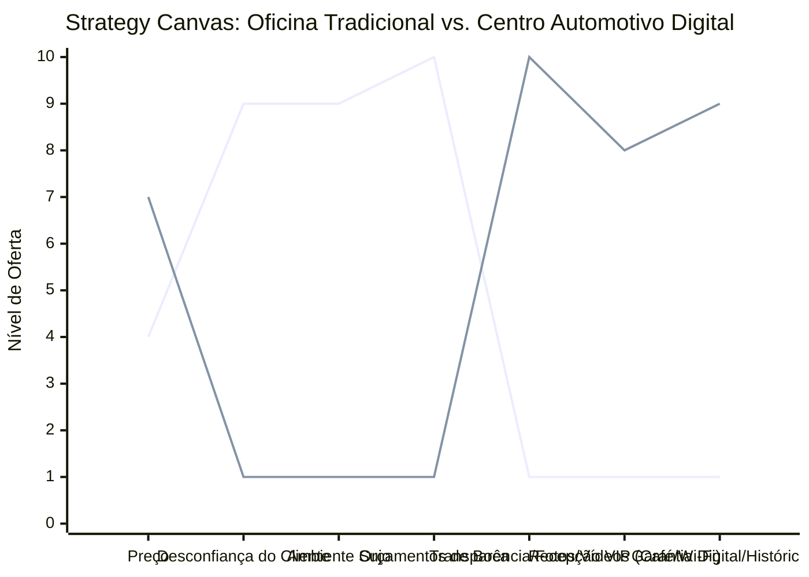

# Estudo de Caso Blue Ocean: Oficina Mecânica

## Da "Oficina de Bairro" ao "Centro Automotivo de Transparência Digital"

### 1. O Cenário Atual (Oceano Vermelho)

O mercado de reparação automotiva é fortemente estigmatizado:

1.  **Oficinas de Bairro:** Ambiente sujo, sem organização, orçamentos imprecisos, forte desconfiança do cliente ("empurroterapia"), demora na entrega.
2.  **Concessionárias:** Ambiente limpo, peças originais, processos claros, porém com preços extremamente abusivos e inflexíveis.

A competição nas oficinas independentes se dá apenas por quem cobra a mão de obra mais barata, sacrificando a qualidade e a honestidade.

### 2. A Estratégia do Oceano Azul: "A Oficina 2.0 (Transparência Total)"

A proposta do "Centro Automotivo Digital" é atacar o principal problema do mercado: a **desconfiança**. O foco não é vender "conserto", é vender "segurança e clareza". O cliente (especialmente o público feminino ou sem conhecimento técnico) não quer entender de motor, ele quer entender pelo que está pagando.

**A Nova Proposta de Valor:**

- **Foco:** Motoristas que prezam pela manutenção preventiva e que fogem do estereótipo do mecânico "enrolão".
- **Processo:** Check-list digital com fotos/vídeos enviados por WhatsApp, aprovação de orçamento online, peças rastreáveis.
- **Ambiente:** Limpo (estilo laboratório), sala de espera com Wi-Fi, café e vista para os boxes (vidros).

### 3. Strategy Canvas (Tela Estratégica)

O gráfico compara a Oficina Tradicional de Bairro com o Centro Automotivo Digital.

**Legenda:**

- **Linha 1:** Oficina Tradicional
- **Linha 2:** Centro Automotivo Digital (Blue Ocean)

> **Nota:** O Centro Automotivo Digital _elimina_ o _Ambiente Sujo_ e a _Desconfiança_ generalizada, enquanto aumenta o foco na _Transparência_ tecnológica e na _Garantia Digital_, permitindo cobrar um _Preço_ intermediário (entre a oficina comum e a concessionária).

### 4. Framework das Quatro Ações (ERRC Grid)

Como transformar graxa em tecnologia:

| Ação         | O que fazer                                                                                                                                                                                                                                                                                                             |
| :----------- | :---------------------------------------------------------------------------------------------------------------------------------------------------------------------------------------------------------------------------------------------------------------------------------------------------------------------- |
| **ELIMINAR** | **A "Caixa Preta" do Orçamento:** Acabar com orçamentos falados ou escritos em papel de pão. **Ambiente caótico e sujo:** A oficina deve ser organizada, com piso limpo e ferramentas no lugar (Metodologia 5S).                                                                                                     |
| **REDUZIR**  | **Dependência exclusiva da "mão na graxa" do dono:** O dono deve ser o gestor, não o único mecânico. **Reparação corretiva de emergência:** Focar em agendamentos de manutenção preventiva (planejada).                                                                                                              |
| **AUMENTAR** | **Registro visual (Fotos/Vídeos):** Mecânico filma a peça danificada no carro do cliente e manda via link para aprovação. **Acolhimento na Recepção:** Sofá, ar-condicionado, máquina de café, banheiro limpo (crucial para o público feminino). **Tecnologia:** Scanners modernos e software de gestão (CRM).    |
| **CRIAR**    | **Painel do Cliente (Histórico do Veículo):** Um app/site onde o cliente vê tudo o que já foi feito, quilometragem e quando voltar. **Serviço de Leva e Traz (Valet):** O cliente não perde tempo indo à oficina. **Pacotes de Manutenção Anual:** Assinatura para revisões básicas (óleo, filtros, alinhamento). |

### 5. Conclusão

Ao aplicar o conceito de "Transparência Total" via ferramentas digitais simples (como vídeos no WhatsApp e check-lists em tablets), a oficina atrai o melhor cliente do mercado: aquele que paga sem reclamar, desde que sinta que não está sendo enganado. A fidelização não acontece pelo preço baixo da peça paralela, mas pela clareza do processo. É a eficiência de uma concessionária com o calor humano (e preço justo) de um negócio local.

### 6. Veja Também (Outros Estudos de Caso)

- [Turismo de Compras Têxtil](./turismo-compras-textil.md)
- [Pousadas e Campings](./pousadas-campings.md)
- [Academia de Escalada](./academia-escalada.md)
- [Personal Trainer](./personal-trainer.md)
- [Consultoria Empreendedora](./consultoria-empreendedora.md)
- [Barbearia](./barbearia.md)
- [Clínica de Estética](./clinica-estetica.md)
- [Pet Shop](./pet-shop.md)
- [Cafeteria](./cafeteria.md)
- [Escola de Idiomas](./escola-idiomas.md)
- [Startup B2B SaaS](./startup-saas.md)
- [Food Truck e Comida de Rua](./food-truck.md)
