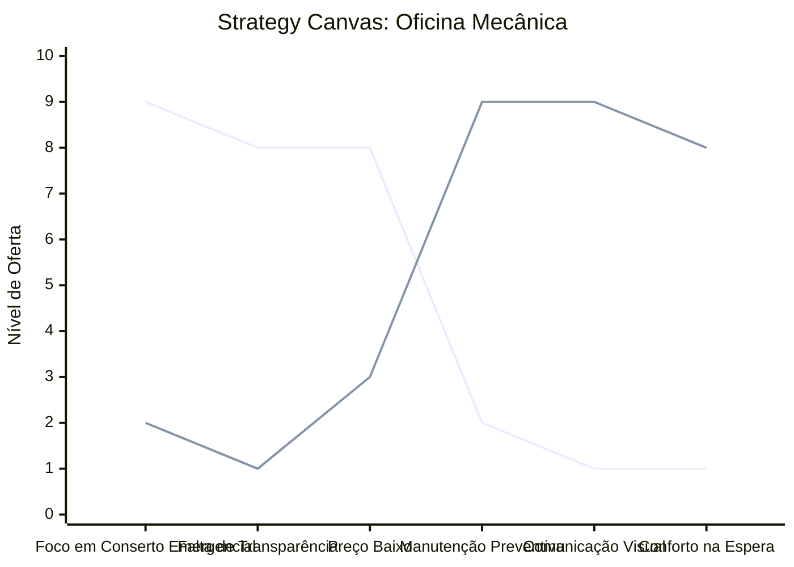

# Estudo de Caso: Oficina Mecânica

## Cenários

**Oceano Vermelho:**
- Ambientes sujos, escuros e desorganizados.
- Atendimento focado em conserto emergencial ("apagar incêndios").
- Preços baseados apenas na mão de obra barata.
- Falta de transparência nos orçamentos, gerando desconfiança crônica nos clientes.
- Comunicação técnica e confusa para o cliente leigo.

**Oceano Azul:**
- Foco em manutenção preventiva e "saúde automotiva".
- Ambientes limpos, organizados e com sala de espera confortável (café, Wi-Fi).
- Transparência total: vídeos e fotos enviadas pelo WhatsApp mostrando o problema e as peças trocadas.
- Atendimento consultivo e didático, explicando de forma simples para leigos.
- Planos de assinatura de revisão periódica e serviços "Leva e Traz".

## Matriz ERRC

- **Eliminar:** Linguagem excessivamente técnica com o cliente final, ambiente inóspito de espera.
- **Reduzir:** Surpresas no orçamento final, consertos emergenciais de última hora.
- **Elevar:** Transparência nos diagnósticos, limpeza e organização do espaço, comodidade (serviço leva e traz).
- **Criar:** Relatórios visuais (fotos/vídeos) das manutenções, planos de assinatura para revisões preventivas, consultoria automotiva.

## Strategy Canvas

*(Nota: Linha 1 = Oceano Vermelho; Linha 2 = Oceano Azul)*

## Veja Também

- [Turismo de Compras Têxtil](./turismo-compras-textil.md)
- [Pousadas e Campings](./pousadas-e-campings.md)
- [Academia de Escalada](./academia-de-escalada.md)
- [Personal Trainer](./personal-trainer.md)
- [Consultoria Empreendedora](./consultoria-empreendedora.md)
- [Padaria Artesanal](./padaria-artesanal.md)
