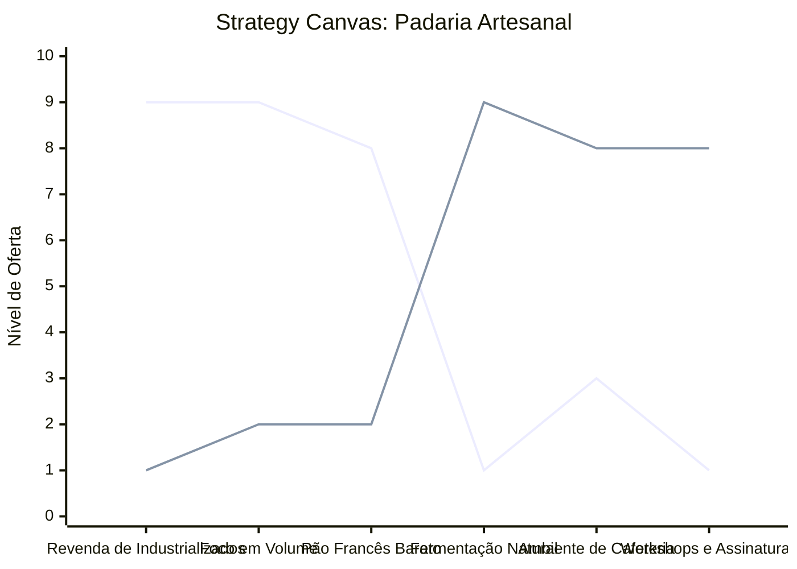

# Estudo de Caso: Padaria Artesanal

## Cenários

**Oceano Vermelho:**
- Padarias tradicionais focadas em volume e preço do pão francês.
- Ambiente puramente transacional de balcão (fila rápida).
- Extensa oferta de produtos industrializados de revenda (bebidas, snacks, cigarros).
- Uso intensivo de misturas prontas e conservantes artificiais.
- Picos de movimento apenas nos horários de pico (início da manhã, fim de tarde).

**Oceano Azul:**
- Foco em fermentação natural e ingredientes orgânicos locais (Farm-to-Table).
- Espaço de vivência e cafeteria de especialidade integrada.
- Menu enxuto, focado na qualidade extrema de poucos itens sazonais.
- Oferta de workshops de panificação e venda de "kits padeiro amador" (farinha, levain).
- Assinaturas semanais de pães e cestas de café da manhã entregues em casa.

## Matriz ERRC

- **Eliminar:** Venda de produtos industrializados genéricos, foco em volume extremo de itens de balcão.
- **Reduzir:** Competição por preço no pão francês comum, filas transacionais impessoais.
- **Elevar:** Qualidade dos ingredientes (fermentação natural), experiência no salão de consumo, conhecimento do cliente sobre o processo.
- **Criar:** Experiências imersivas (workshops), clube de assinaturas de pães frescos, cafeteria de especialidade no mesmo ambiente.

## Strategy Canvas

*(Nota: Linha 1 = Oceano Vermelho; Linha 2 = Oceano Azul)*

## Veja Também

- [Turismo de Compras Têxtil](./turismo-compras-textil.md)
- [Pousadas e Campings](./pousadas-e-campings.md)
- [Academia de Escalada](./academia-de-escalada.md)
- [Personal Trainer](./personal-trainer.md)
- [Consultoria Empreendedora](./consultoria-empreendedora.md)
- [Oficina Mecânica](./oficina-mecanica.md)
