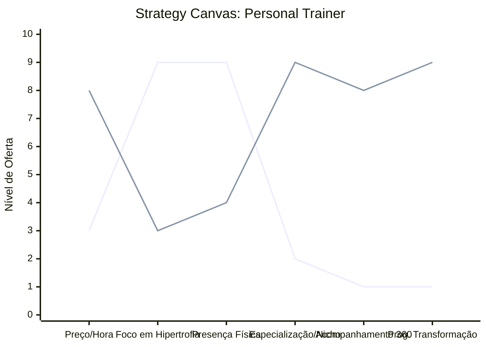

# Estudo de Caso: Personal Trainer

## Cenários

**Oceano Vermelho:**
- Venda de horas e treinos avulsos ("hora/aula").
- Foco exclusivo em estética (emagrecimento, hipertrofia).
- Disputa de preços no salão de musculação.
- Rotina exaustiva para o profissional (baixa escalabilidade).
- Atendimento focado apenas no tempo presencial da sessão.

**Oceano Azul:**
- Venda de programas de transformação e mentoria de estilo de vida.
- Foco em nichos específicos (ex: reabilitação postural para executivos, preparo para grávidas, atletas de fim de semana).
- Pacotes híbridos (presencial + consultoria online).
- Acompanhamento 360º: sono, gestão de estresse, nutrição básica, rotina diária.
- Alta percepção de valor (premium), com receita recorrente e menos dependência de horas.

## Matriz ERRC

- **Eliminar:** Venda de hora/aula isolada, concorrência por preço no salão.
- **Reduzir:** Foco puramente em hipertrofia genérica, dependência da presença física.
- **Elevar:** Especialização de nicho, acompanhamento diário digital, métricas de bem-estar global.
- **Criar:** Programas de transformação (com começo, meio e fim), mentoria de hábitos, comunidade online de alunos.

## Strategy Canvas

*(Nota: Linha 1 = Oceano Vermelho; Linha 2 = Oceano Azul)*

## Veja Também

- [Turismo de Compras Têxtil](./turismo-compras-textil.md)
- [Pousadas e Campings](./pousadas-e-campings.md)
- [Academia de Escalada](./academia-de-escalada.md)
- [Consultoria Empreendedora](./consultoria-empreendedora.md)
- [Barbearia](./barbearia.md)
- [Clínica Odontológica](./clinica-odontologica.md)
- [Pet Shop](./pet-shop.md)
