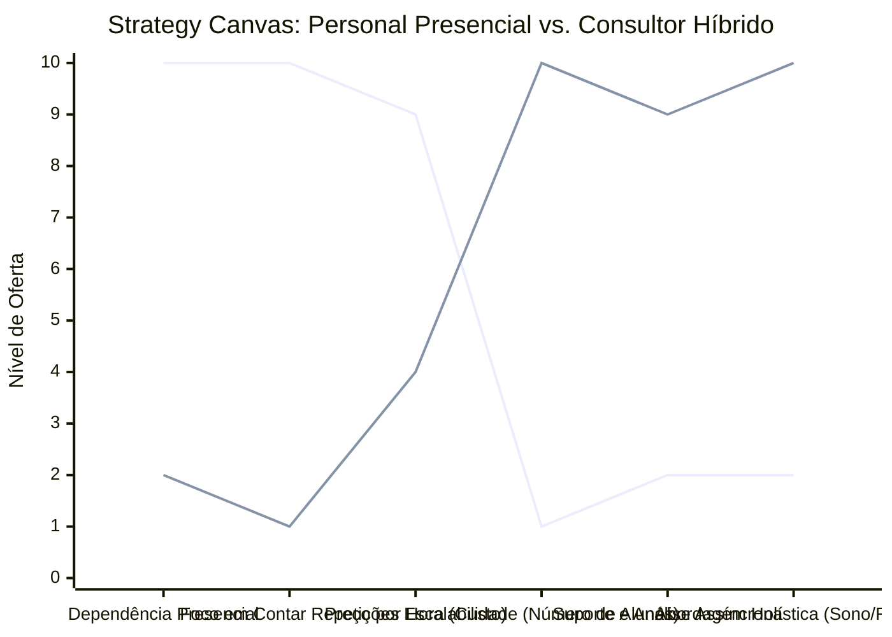

# Estudo de Caso Blue Ocean: Personal Trainer

## De "Vendedor de Horas" para "Consultor de Saúde Híbrido"

### 1. O Cenário Atual (Oceano Vermelho)

O mercado de Personal Trainers convencionais sofre com o teto de faturamento imposto pela limitação de tempo:

1. **Venda de Horas:** O profissional troca diretamente o seu tempo por dinheiro, limitando severamente sua capacidade de escalar a receita.
2. **Dependência Presencial:** O ganho financeiro depende totalmente de estar presente na academia, sofrendo com cancelamentos, feriados e trânsito constante entre locais.
3. **Foco Limitado ao Treino:** A entrega resume-se a "contar repetições" e orientar equipamentos, sem controle real sobre os hábitos do aluno no restante do dia.

### 2. A Estratégia do Oceano Azul: "Consultor de Saúde Híbrido"

A estratégia propõe a transição de um acompanhante de academia para um gestor do estilo de vida do cliente (Consultor Híbrido/Online), agregando mais valor enquanto ganha escalabilidade.

**A Nova Proposta de Valor:**

- **Foco:** Profissionais ocupados que não conseguem conciliar horários com um personal fixo e precisam de gestão de saúde (treino, sono, rotina) e não apenas alguém os vigiando levantar peso.
- **Ambiente:** Digital e assíncrono (WhatsApp, aplicativos de treino), com encontros pontuais esporádicos para correção.
- **Modelo de Negócio:** Mensalidade recorrente mais barata que a hora/aula, mas que permite atender 50+ alunos simultaneamente.

### 3. Strategy Canvas (Tela Estratégica)

Comparativo entre o modelo tradicional de acompanhamento físico e a consultoria híbrida/online.

**Legenda:**

- **Linha 1:** Personal Presencial Tradicional
- **Linha 2:** Consultor Híbrido (Blue Ocean)

> **Nota:** O Consultor Híbrido reduz quase a zero a Dependência Presencial e o Preço por Hora para focar na Escalabilidade e na Abordagem Holística da saúde do cliente.

### 4. Framework das Quatro Ações (ERRC Grid)

| Ação         | O que fazer                                                                                                                                                                                                            |
| :----------- | :--------------------------------------------------------------------------------------------------------------------------------------------------------------------------------------------------------------------- |
| **ELIMINAR** | **Venda de pacotes de horas/aula:** O aluno não compra mais "3 vezes por semana", compra o programa mensal. **Deslocamento constante:** Reduzir ou eliminar o trânsito insano entre diferentes academias.           |
| **REDUZIR**  | **Presença física diária:** O papel do instrutor não é mais "contar repetições" ao vivo ou motivar gritando. **Foco excessivo apenas em hipertrofia:** Reduzir o nicho "marombeiro" e expandir para "saúde global". |
| **AUMENTAR** | **Suporte assíncrono:** Atendimento constante via WhatsApp/Apps para dúvidas rápidas e ajustes na rotina. **Foco em Resultados:** Orientação voltada para a aderência ao treino e não à exaustão pontual.           |
| **CRIAR**    | **Planos de Estilo de Vida:** Gestão integral incluindo ajustes de sono, manejo de stress e nutrição básica (em parceria com nutris). **Análise de Execução em Vídeo:** Correção técnica por vídeos gravados.       |

### 5. Conclusão

Parar de vender a presença física e passar a vender a transformação e o acesso contínuo. O modelo híbrido quebra a barreira do faturamento por hora. Permite escalar o número de clientes exponencialmente (de 10 alunos presenciais para 100 alunos online), mantendo a percepção de alto valor agregado através do cuidado holístico com a saúde do aluno 24/7, e não apenas por 1 hora.

### 6. Veja Também (Outros Estudos de Caso)

- [Turismo de Compras Têxtil](./turismo-compras-textil.md)
- [Pousadas e Campings](./pousadas-campings.md)
- [Academia de Escalada](./academia-escalada.md)
- [Consultoria Empreendedora](./consultoria-empreendedora.md)
- [Agência de Marketing](./agencia-marketing.md)
- [Barbearia](./barbearia.md)
- [Clínica de Estética](./clinica-estetica.md)
- [Pet Shop](./pet-shop.md)
- [Cafeteria](./cafeteria.md)
- [Oficina Mecânica](./oficina-mecanica.md)
- [Escola de Idiomas](./escola-idiomas.md)
- [Startup B2B SaaS](./startup-saas.md)
- [Food Truck e Comida de Rua](./food-truck.md)
- [Delivery de Comida Saudável](./delivery-saudavel.md)
- [Loja de Roupas](./loja-roupas.md)
- [Estúdio de Yoga](./estudio-yoga.md)
- [Coworking de Nicho](./coworking.md)
- [Imobiliária Consultiva](./imobiliaria.md)
