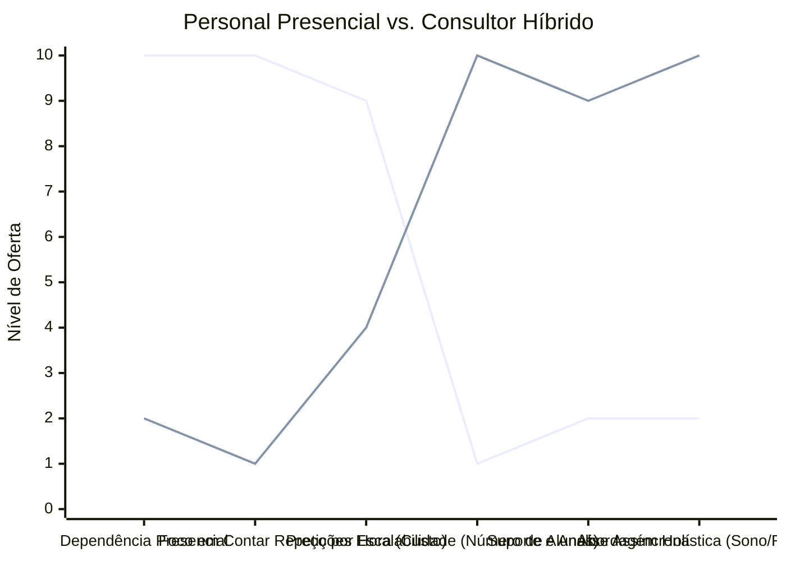

# Estudo de Caso Blue Ocean: Personal Trainer

## Estratégia Recomendada: De "Vendedor de Horas" para "Consultor de Saúde Híbrido"

Este estudo resolve o problema do teto de faturamento do profissional de educação física presencial.

### 1. Strategy Canvas

Comparativo entre o modelo tradicional de acompanhamento físico e a consultoria híbrida/online.

**Legenda:**
- **Linha 1:** Personal Presencial Tradicional
- **Linha 2:** Consultor Híbrido (Blue Ocean)

### 2. ERRC Grid (Quatro Ações)

| Ação | Estratégia Objetiva |
| :--- | :--- |
| **ELIMINAR** | Venda de pacotes de horas/aula e o deslocamento constante entre academias. |
| **REDUZIR** | A presença física diária do instrutor apenas para "contar repetições" e motivar gritando. |
| **AUMENTAR** | O suporte assíncrono (via WhatsApp/Apps) e a orientação voltada para resultados a longo prazo. |
| **CRIAR** | Planos focados no estilo de vida integral (ajustes de sono, manejo de stress, nutrição básica) e análise de vídeos de execução. |

### 3. Conclusão Objetiva

Parar de vender presença física e passar a vender transformação e acesso. O modelo híbrido permite escalar o número de clientes mantendo a percepção de alto valor agregado através do cuidado holístico com a saúde do aluno.
