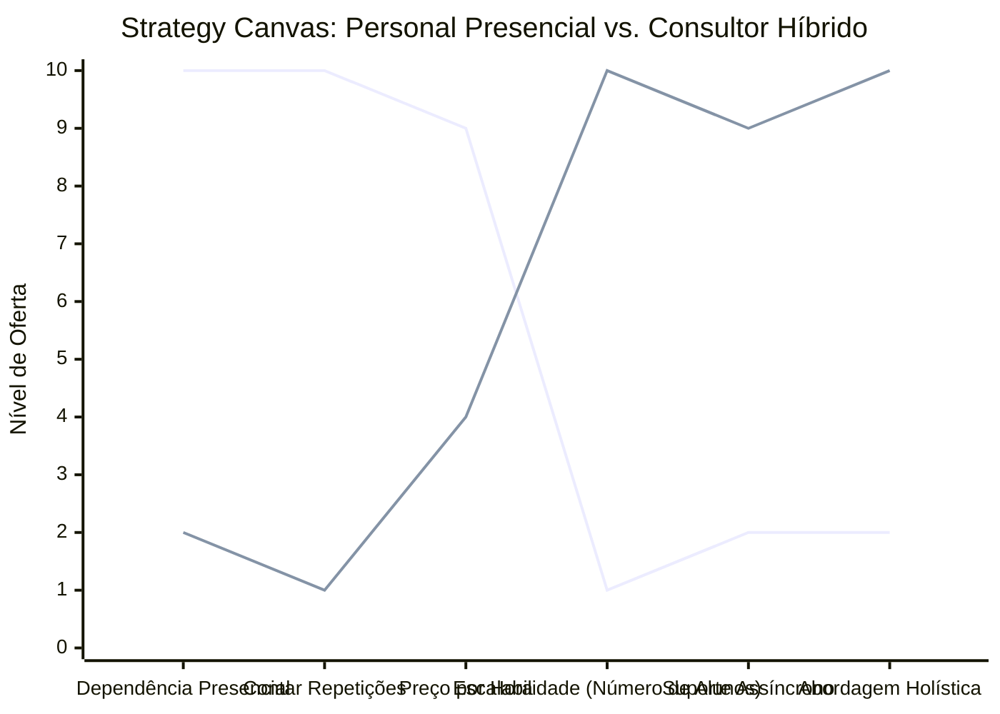

# Estudo de Caso Blue Ocean: Personal Trainer

## O Cenário Atual (Oceano Vermelho)

O mercado de Personal Trainers convencionais sofre com o teto de faturamento imposto pela limitação de tempo:

1. **Venda de Horas:** O profissional troca diretamente o seu tempo por dinheiro, limitando severamente sua capacidade de escalar a receita.
2. **Dependência Presencial:** O ganho financeiro depende totalmente de estar presente na academia, sofrendo com cancelamentos, feriados e trânsito constante entre locais.
3. **Foco Limitado ao Treino:** A entrega resume-se a "contar repetições" e orientar equipamentos, sem controle real sobre os hábitos do aluno no restante do dia.

## A Estratégia do Oceano Azul: "Consultor de Saúde Híbrido"

A estratégia propõe a transição de um acompanhante de academia para um gestor do estilo de vida do cliente (Consultor Híbrido/Online), agregando mais valor enquanto ganha escalabilidade.

**A Nova Proposta de Valor:**

- **Foco:** Profissionais ocupados que não conseguem conciliar horários com um personal fixo e precisam de gestão de saúde (treino, sono, rotina) e não apenas alguém os vigiando levantar peso.
- **Ambiente:** Digital e assíncrono (WhatsApp, aplicativos de treino), com encontros pontuais esporádicos para correção.
- **Modelo de Negócio:** Mensalidade recorrente mais barata que a hora/aula, mas que permite atender 50+ alunos simultaneamente.

## Framework das Quatro Ações (ERRC Grid)

- **Eliminar:** Venda de pacotes de horas limitadas, deslocamento constante entre academias.
- **Reduzir:** Presença física obrigatória, foco exclusivo apenas em hipertrofia mecânica.
- **Elevar:** Suporte assíncrono online, foco em resultados globais e aderência à rotina.
- **Criar:** Planos de estilo de vida integrais (sono, stress), análise de execução biomecânica por vídeo.

## Strategy Canvas

*(Nota: Linha 1 = Personal Presencial Tradicional; Linha 2 = Consultor Híbrido)*
