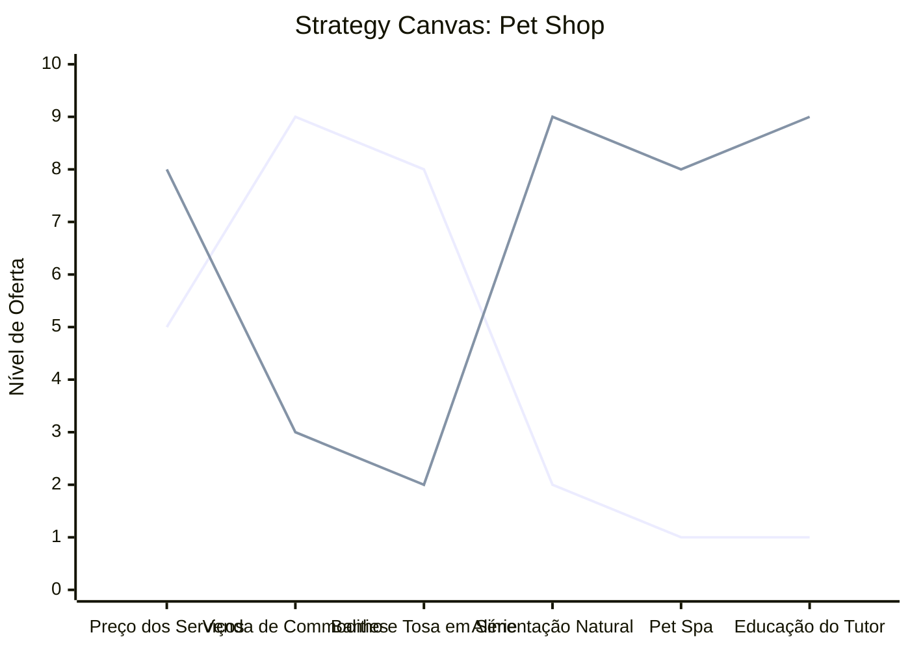

# Estudo de Caso: Pet Shop

## Cenários

**Oceano Vermelho:**
- Venda focada em rações comuns e acessórios massificados.
- Competição direta em preço de banho e tosa.
- Atendimento impessoal no balcão.
- Margens espremidas por grandes redes de hipermercados pet.
- Espaço apenas para compra rápida, sem permanência.

**Oceano Azul:**
- Foco em saúde, bem-estar e alimentação natural para pets.
- Especialização em raças ou condições específicas (pets idosos, alérgicos).
- Serviços de "Pet Spa" e tratamentos relaxantes integrados.
- Criação de uma padaria ou confeitaria pet no local para gerar engajamento.
- Cursos rápidos para tutores (adestramento básico em casa, nutrição pet).

## Matriz ERRC

- **Eliminar:** Venda de animais, briga por centavos na venda de ração básica.
- **Reduzir:** Banho e tosa em série industrial, prateleiras apenas com commodities.
- **Elevar:** Cuidados preventivos, alimentação natural e específica, educação do tutor.
- **Criar:** Produtos gastronômicos para pets, estética premium (spa), eventos de socialização de raças.

## Strategy Canvas

*(Nota: Linha 1 = Oceano Vermelho; Linha 2 = Oceano Azul)*

## Veja Também

- [Salão de Beleza](./salao-de-beleza.md)
- [Escola de Idiomas](./escola-de-idiomas.md)
- [Turismo de Compras Têxtil](./turismo-compras-textil.md)
- [Pousadas e Campings](./pousadas-e-campings.md)
- [Academia de Escalada](./academia-de-escalada.md)
- [Personal Trainer](./personal-trainer.md)
- [Consultoria Empreendedora](./consultoria-empreendedora.md)
