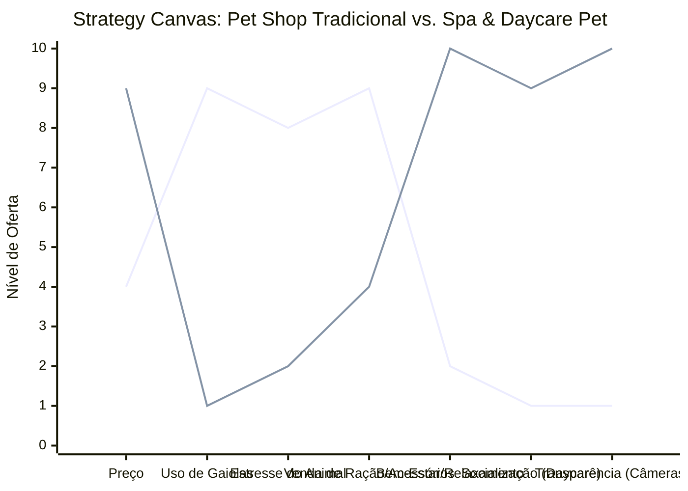

# Estudo de Caso Blue Ocean: Pet Shop

## Do "Banho e Tosa Genérico" ao "Spa & Daycare Pet"

### 1. O Cenário Atual (Oceano Vermelho)

O mercado de pet shops tradicionais foca em venda de ração, acessórios e serviços básicos:

1.  **Pet Shop de Bairro:** Foco em conveniência e preço baixo para banho e tosa. Competição ferrenha por cada centavo no preço do banho.
2.  **Grandes Redes:** Foco em volume de vendas de produtos, com serviços de estética muitas vezes industrializados e estressantes para os animais.

A competição é baseada puramente em preço, proximidade ou variedade de marcas de ração.

### 2. A Estratégia do Oceano Azul: "Oásis de Bem-Estar Pet"

A proposta do "Spa & Daycare Pet" é transformar o momento do banho, que muitas vezes é um trauma, em um momento de relaxamento e socialização. O cliente (tutor) não busca apenas um cachorro limpo, mas um animal feliz, calmo e bem cuidado.

**A Nova Proposta de Valor:**

- **Foco:** Tutores que tratam seus pets como filhos ("pais de pet") e valorizam o bem-estar mental do animal.
- **Ambiente:** Sem gaiolas (cage-free), musicoterapia, cromoterapia, espaço de socialização pré e pós-banho.
- **Serviços:** Daycare educacional, banhos terapêuticos (ozonioterapia), estética focada em redução de estresse.

### 3. Strategy Canvas (Tela Estratégica)

O gráfico compara o Pet Shop Tradicional com o Spa & Daycare Pet.

**Legenda:**

- **Linha 1:** Pet Shop Tradicional
- **Linha 2:** Spa & Daycare Pet (Blue Ocean)

> **Nota:** O Spa & Daycare Pet _elimina_ o uso de gaiolas e reduz drasticamente o _Estresse do Animal_, criando um ambiente de _Bem-Estar_ e _Socialização_ que justifica um _Preço_ superior. A venda de produtos passa a ser secundária em relação aos serviços de alto valor agregado.

### 4. Framework das Quatro Ações (ERRC Grid)

Como transformar um serviço de higiene em uma experiência de saúde:

| Ação         | O que fazer                                                                                                                                                                                                                                                                   |
| :----------- | :---------------------------------------------------------------------------------------------------------------------------------------------------------------------------------------------------------------------------------------------------------------------------- |
| **ELIMINAR** | **Gaiolas de espera:** Substituir por baias de vidro ou áreas de soltura supervisionadas. **Secadores barulhentos:** Usar equipamentos silenciosos para reduzir o pânico.                                                                                                  |
| **REDUZIR**  | **Foco exclusivo na venda de produtos:** O espaço da loja dá lugar a áreas de recreação. **Agendamentos em massa:** Menos atendimentos por dia para garantir atenção individualizada.                                                                                      |
| **AUMENTAR** | **Transparência:** Câmeras online onde o tutor pode acompanhar o pet em tempo real. **Treinamento da equipe:** Profissionais capacitados em comportamento animal, não apenas em tosa. **Comunicação com o tutor:** Relatórios diários de comportamento e saúde.         |
| **CRIAR**    | **Planos de Assinatura:** "Clube do Banho + Daycare" (recorrência garantida). **Serviços Terapêuticos:** Banhos com ozônio, cromoterapia, massagem relaxante. **Avaliação Comportamental:** Triagem antes de aceitar o pet no daycare para garantir um ambiente seguro. |

### 5. Conclusão

Ao focar no bem-estar e na transparência, o negócio sai da guerra de preços do "banho a R$ 40" e entra no mercado de serviços premium. O tutor paga pela tranquilidade de saber que seu pet está sendo tratado com respeito e carinho, criando um vínculo de confiança inquebrável com a marca e garantindo receita recorrente através de planos de assinatura.

### 6. Veja Também (Outros Estudos de Caso)

- [Turismo de Compras Têxtil](./turismo-compras-textil.md)
- [Pousadas e Campings](./pousadas-campings.md)
- [Academia de Escalada](./academia-escalada.md)
- [Personal Trainer](./personal-trainer.md)
- [Consultoria Empreendedora](./consultoria-empreendedora.md)
- [Barbearia](./barbearia.md)
- [Clínica de Estética](./clinica-estetica.md)
- [Cafeteria](./cafeteria.md)
- [Oficina Mecânica](./oficina-mecanica.md)
- [Escola de Idiomas](./escola-idiomas.md)
