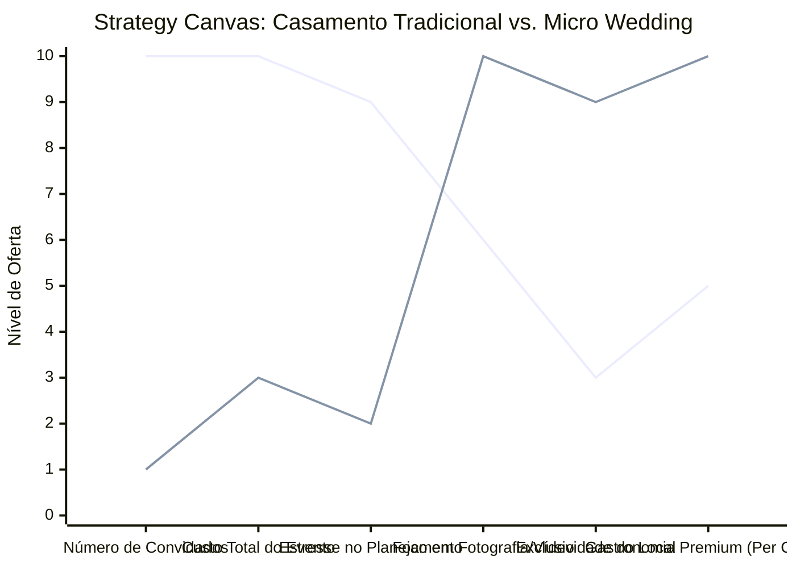

# Estudo de Caso Blue Ocean: Planejamento de Casamentos

## De "Organização Estressante" para "Casamento em Micro-Módulos" (Micro Weddings)

### 1. O Cenário Atual (Oceano Vermelho)

O mercado de eventos e casamentos é dominado por pacotes grandiosos e orçamentos astronômicos:

1. **Escala Gigante:** Foco em festas para 200 a 500 convidados, o que eleva exponencialmente os custos com buffet, decoração e espaço.
2. **Ciclos de Estresse:** Um ano inteiro ou mais de planejamento, dezenas de fornecedores para coordenar e ansiedade constante para os noivos.
3. **Pacotes Rígidos:** Cerimonialistas que cobram fortunas para gerenciar planilhas complexas, muitas vezes empurrando fornecedores parceiros caros.

### 2. A Estratégia do Oceano Azul: "Micro Weddings & Elopements"

A estratégia propõe focar em casamentos íntimos e experiências intensas (Micro Weddings e Elopements), reduzindo a quantidade de convidados para maximizar a qualidade e reduzir o estresse.

**A Nova Proposta de Valor:**

- **Foco:** Casais que priorizam a experiência a dois (ou com até 30 convidados), viagens inesquecíveis e fotos espetaculares, sem o peso de financiar uma festa enorme.
- **Ambiente:** Locais inusitados na natureza (montanhas, praias desertas, florestas) ou espaços boutique (restaurantes intimistas, galerias de arte).
- **Modelo de Negócio:** Pacotes "All-Inclusive" ágeis (organizados em 1 a 3 meses) focados em experiência premium (gastronomia e fotografia) ao invés de volume.

### 3. Strategy Canvas (Tela Estratégica)

O gráfico compara o casamento tradicional (grande porte) com o novo modelo de Micro Wedding.

**Legenda:**

- **Linha 1:** Casamento Tradicional (Oceano Vermelho)
- **Linha 2:** Micro Wedding / Elopement (Blue Ocean)

### 4. Framework das Quatro Ações (ERRC Grid)

| Ação         | O que fazer                                                                                                                                                                                                            |
| :----------- | :--------------------------------------------------------------------------------------------------------------------------------------------------------------------------------------------------------------------- |
| **ELIMINAR** | **Listas de convidados gigantes:** Eliminar a pressão social de convidar centenas de pessoas. **Tradições engessadas:** Cortar protocolos longos e cansativos que não fazem sentido para o casal.                   |
| **REDUZIR**  | **Tempo de planejamento:** Reduzir de 18 meses para 2 a 4 meses, com pacotes pré-desenhados. **Número de fornecedores:** Simplificar a gestão centralizando os serviços principais (local, comida, foto).           |
| **AUMENTAR** | **Qualidade da experiência por pessoa:** O orçamento per capita sobe, permitindo menus assinados e vinhos de alta qualidade. **Foco no registro:** Maior investimento em fotografia e vídeo documental/cinematográfico. |
| **CRIAR**    | **Pacotes "Pop-Up Wedding":** Locações secretas reveladas apenas algumas semanas antes. **Experiências imersivas:** Finais de semana inteiros com os (poucos) convidados, não apenas uma festa de 6 horas.            |

### 5. Conclusão

Criar um nicho onde "menos é mais". Ao focar em Micro Weddings, a empresa de planejamento atrai um público disposto a pagar um alto valor per capita por uma experiência impecável, livre de estresse e altamente memorável. O tempo de execução cai, permitindo realizar mais eventos no ano, com fornecedores exclusivos e margens de lucro superiores, sem competir com os mega-buffets tradicionais.

### 6. Veja Também (Outros Estudos de Caso)

- [Turismo de Compras Têxtil](./turismo-compras-textil.md)
- [Pousadas e Campings](./pousadas-e-campings.md)
- [Academia de Escalada](./academia-de-escalada.md)
- [Personal Trainer](./personal-trainer.md)
- [Consultoria Empreendedora](./consultoria-empreendedora.md)
- [Arquitetura e Interiores](./arquitetura-interiores.md)
- [Oficina de Bicicletas](./oficina-de-bicicletas.md)
