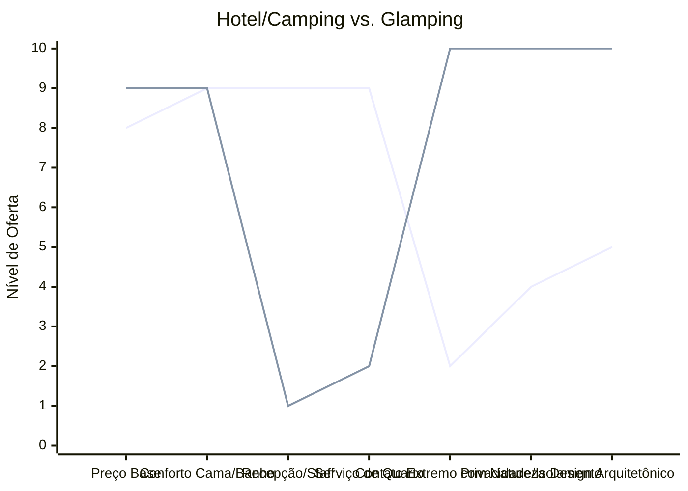

# Estudo de Caso Blue Ocean: Pousadas e Campings

## Estratégia Recomendada: De "Hospedagem" para "Glamping e Imersão na Natureza"

Este estudo propõe a criação de um novo nicho unindo o isolamento do camping com o conforto da hotelaria boutique.

### 1. Strategy Canvas

Comparativo entre as ofertas hoteleiras convencionais e o novo modelo de Glamping.

**Legenda:**
- **Linha 1:** Hotel Tradicional
- **Linha 2:** Glamping / Cabanas (Blue Ocean)

### 2. ERRC Grid (Quatro Ações)

| Ação | Estratégia Objetiva |
| :--- | :--- |
| **ELIMINAR** | Recepção física (uso de check-in digital) e serviço de quarto diário (garantindo privacidade total). |
| **REDUZIR** | Custo com staff operacional on-site e áreas comuns superlotadas (foco na cabana). |
| **AUMENTAR** | Conectividade (Starlink), qualidade do enxoval e o aspecto "instagramável" da hospedagem. |
| **CRIAR** | Kits de auto-serviço premium (fogueira, vinho, café da manhã em cesta) e arquitetura imersiva (vidros, domos). |

### 3. Conclusão Objetiva

Fugir da guerra de preços do Booking/Airbnb. Ao eliminar custos fixos pesados com staff e recepção, investe-se na cabana como destino final, atraindo clientes dispostos a pagar tickets altos por refúgio e silêncio.
