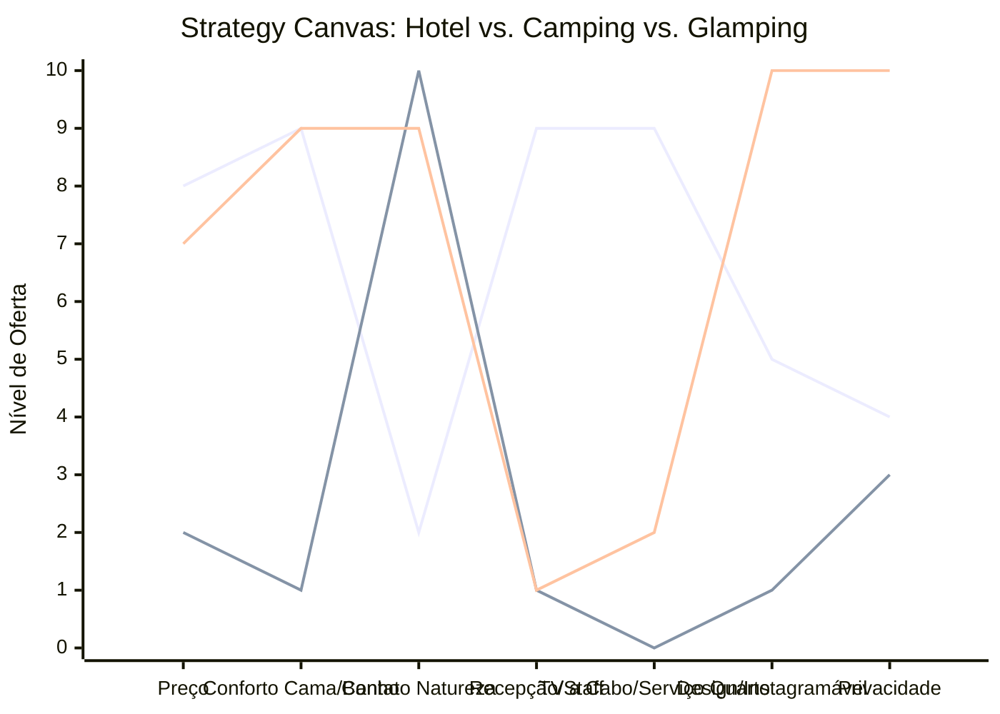

# Estudo de Caso Blue Ocean: Pousadas e Campings

## "Glamping" e a Nova Hotelaria de Experiência

### 1. O Cenário Atual (Oceano Vermelho)

O mercado de hospedagem tradicional divide-se fortemente em dois extremos:

1.  **Hotéis/Pousadas Tradicionais:** Focam em conforto padronizado, serviços de quarto e localização urbana ou turística, mas muitas vezes desconectados da natureza real.
2.  **Campings:** Focam no contato extremo com a natureza e baixo custo, mas exigem que o hóspede leve equipamento e aceite desconforto (banheiros compartilhados, insetos, chão duro).

A competição aqui é baseada ou em **estrelas (luxo)** ou em **preço (camping)**.

### 2. A Estratégia do Oceano Azul: "O Conforto da Selva"

A proposta do Glamping (Glamour + Camping) ou das "Cabanas Isoladas" é oferecer a imersão total do camping com o conforto de um hotel boutique. O hóspede busca **isolamento**, **design** e **experiência**, não apenas uma cama.

**A Nova Proposta de Valor:**

- **Foco:** Casais, nômades digitais e buscadores de "detox urbano" com conforto.
- **Estrutura:** Domos geodésicos, cabanas A-frame, containers de luxo em locais remotos.
- **Experiência:** Check-in autônomo, fogueira privativa, banheira externa, internet de alta velocidade (Starlink) no meio do nada.

### 3. Strategy Canvas (Tela Estratégica)

O gráfico compara a hotelaria convencional, o camping raiz e o Glamping.

**Legenda:**

- **Linha 1:** Hotel Tradicional
- **Linha 2:** Camping Raiz
- **Linha 3:** Glamping (Blue Ocean)

> **Nota:** O Glamping elimina custos operacionais pesados como _Recepção 24h_ e _Staff on-site_ (usando fechaduras digitais e kits pré-prontos), enquanto eleva drasticamente o _Design_ e a _Privacidade_. Ele cobra preço de hotel entregando experiência de natureza exclusiva.

### 4. Framework das Quatro Ações (ERRC Grid)

Como criar uma oferta de valor única neste setor:

| Ação         | O que fazer                                                                                                                                                                                                                                            |
| :----------- | :----------------------------------------------------------------------------------------------------------------------------------------------------------------------------------------------------------------------------------------------------- |
| **ELIMINAR** | **Recepção física (Check-in):** Substituir por códigos digitais/keypads. **Serviço de quarto diário:** Garantir privacidade total (o hóspede não quer ser incomodado). **Áreas comuns lotadas:** Focar na experiência individual da cabana.      |
| **REDUZIR**  | **Tamanho da equipe operacional:** Menos funcionários visíveis. **Cardápio extenso de restaurante:** Substituir por kits "faça você mesmo" de alta qualidade.                                                                                       |
| **AUMENTAR** | **Conectividade (Internet):** Essencial para atrair nômades digitais em dias de semana. **Qualidade do enxoval:** Lençóis de fios altos e colchões premium são inegociáveis. **Estética ("Instagramabilidade"):** Cada ângulo deve ser uma foto. |
| **CRIAR**    | **Kits de Experiência:** Cesta de piquenique, kit s'mores para fogueira, vinho local. **Guias de Autoconhecimento:** Mapas de trilhas exclusivas, telescópio para estrelas. **Arquitetura Imersiva:** Paredes de vidro, tetos transparentes.     |

### 5. Conclusão

Ao adotar essa estratégia, o empreendedor foge da guerra de preços das plataformas de reserva (Booking/Airbnb genéricos). O produto deixa de ser "uma diária" para ser "uma vivência". A redução de custos fixos com pessoal (Recepção/Serviço) permite investir pesado na estrutura física (Cabana) e cobrar um ticket médio elevado, atraindo um público qualificado que busca refúgio e não apenas teto.

### 6. Veja Também (Outros Estudos de Caso)

- [Turismo de Compras Têxtil](./turismo-compras-textil.md)
- [Academia de Escalada](./academia-escalada.md)
- [Personal Trainer](./personal-trainer.md)
- [Consultoria Empreendedora](./consultoria-empreendedora.md)
- [Barbearia](./barbearia.md)
- [Clínica de Estética](./clinica-estetica.md)
- [Pet Shop](./pet-shop.md)
- [Cafeteria](./cafeteria.md)
- [Oficina Mecânica](./oficina-mecanica.md)
- [Escola de Idiomas](./escola-idiomas.md)
