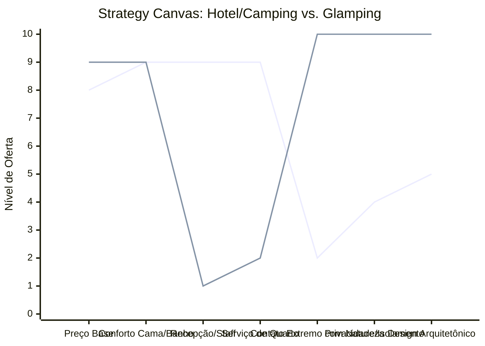

# Estudo de Caso Blue Ocean: Pousadas e Campings

## De "Hospedagem Tradicional" para "Glamping e Imersão na Natureza"

### 1. O Cenário Atual (Oceano Vermelho)

O mercado de hospedagem para turismo de natureza e lazer divide-se em duas categorias de alta competição:

1. **Hospedagem Convencional (Pousadas/Hotéis):** Disputa de preços no Booking/Airbnb, altos custos fixos com staff (recepção, camareiras, manutenção) e áreas comuns superlotadas.
2. **Campings Tradicionais:** Foco no preço extremamente baixo, falta de conforto, banheiros compartilhados e apelo restrito a um público específico mais rústico.

A competição se dá puramente pelo "preço da diária" e pela "proximidade dos pontos turísticos".

### 2. A Estratégia do Oceano Azul: "Glamping e Refúgio"

A estratégia propõe a criação de um novo nicho ("Glamorous Camping" ou Refúgios), unindo o isolamento do camping com o conforto da hotelaria boutique, focando na cabana como destino final e não apenas um lugar para dormir.

**A Nova Proposta de Valor:**

- **Foco:** Casais ou viajantes que buscam desconexão, silêncio e contato com a natureza, sem abrir mão de muito conforto.
- **Ambiente:** Arquitetura imersiva (domos geodésicos, cabanas de vidro, A-frames) em locais isolados.
- **Modelo de Negócio:** Alto valor agregado com baixíssimo custo de folha de pagamento (auto-serviço premium).

### 3. Strategy Canvas (Tela Estratégica)

O gráfico compara as ofertas hoteleiras convencionais com o novo modelo de Glamping.

**Legenda:**

- **Linha 1:** Hotel Tradicional
- **Linha 2:** Glamping / Cabanas (Blue Ocean)

> **Nota:** O Glamping diminui drasticamente a dependência de Staff e Serviço de Quarto, focando toda a experiência na Natureza, Privacidade e Design, o que justifica manter o Preço Base elevado.

### 4. Framework das Quatro Ações (ERRC Grid)

| Ação         | O que fazer                                                                                                                                                                                                                                              |
| :----------- | :------------------------------------------------------------------------------------------------------------------------------------------------------------------------------------------------------------------------------------------------------- |
| **ELIMINAR** | **Recepção física:** Substituir por check-in/check-out 100% digital via smart lock. **Serviço de quarto diário:** Garantir a privacidade total do hóspede durante a estadia.                                                                        |
| **REDUZIR**  | **Custos com staff on-site:** Minimizar a folha de pagamento ao focar no auto-atendimento. **Áreas comuns:** Reduzir espaços compartilhados e focar na experiência privativa da cabana.                                                               |
| **AUMENTAR** | **Conectividade:** Internet de alta qualidade (ex: Starlink). **Conforto no isolamento:** Enxoval premium, colchão de hotelaria de luxo. **Apelo Visual:** Design "instagramável" que funciona como o próprio marketing do negócio.              |
| **CRIAR**    | **Kits de Auto-serviço Premium:** Cestas de café da manhã pré-montadas, kits para fogueira/marshmallows, vinhos selecionados. **Arquitetura Imersiva:** Cabanas com paredes de vidro, banheiras com vista para a natureza, fire pits particulares. |

### 5. Conclusão

Fugir da guerra de preços das plataformas de reserva tradicionais. Ao eliminar os pesados custos fixos com staff e recepção presencial, o investimento é redirecionado para a infraestrutura e design da cabana em si. A cabana vira o destino principal, atraindo clientes dispostos a pagar tickets elevados pelo luxo do silêncio, privacidade e imersão na natureza.

### 6. Veja Também (Outros Estudos de Caso)

- [Turismo de Compras Têxtil](./turismo-compras-textil.md)
- [Academia de Escalada](./academia-de-escalada.md)
- [Personal Trainer](./personal-trainer.md)
- [Consultoria Empreendedora](./consultoria-empreendedora.md)
- [Agência de Marketing](./agencia-de-marketing.md)
- [Barbearia](./barbearia.md)
- [Clínica de Estética](./clinica-de-estetica.md)
- [Pet Shop](./pet-shop.md)
- [Cafeteria](./cafeteria.md)
- [Oficina Mecânica](./oficina-mecanica.md)
- [Escola de Idiomas](./escola-de-idiomas.md)
- [Startup B2B SaaS](./startup-b2b-saas.md)
- [Food Truck e Comida de Rua](./food-truck.md)
- [Delivery de Comida Saudável](./delivery-de-comida-saudavel.md)
- [Loja de Roupas](./loja-de-roupas.md)
- [Estúdio de Yoga](./estudio-de-yoga.md)
- [Coworking de Nicho](./coworking-de-nicho.md)
- [Imobiliária Consultiva](./imobiliaria-consultiva.md)
