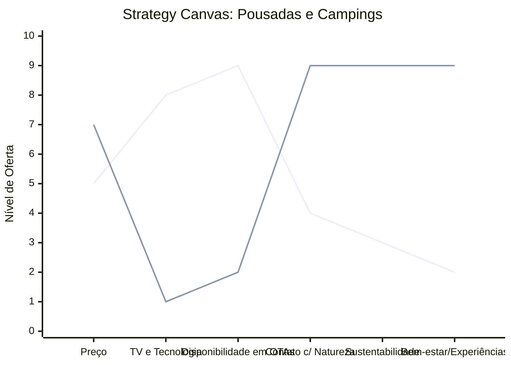

# Estudo de Caso: Pousadas e Campings

## Cenários

**Oceano Vermelho:**
- Batalha por preços nas plataformas de reserva (Booking, Airbnb).
- Foco em infraestrutura básica: cama, banheiro, café da manhã padrão.
- Sazonalidade extrema, alta ociosidade na baixa temporada.
- Concorrência predatória regional.
- Marketing focado em descontos e "pernoite".

**Oceano Azul:**
- Foco em "Retiros de Desconexão" (Digital Detox) e turismo de experiência.
- Integração profunda com a natureza, design sustentável.
- Experiências imersivas: oficinas gastronômicas, trilhas guiadas com propósito, yoga.
- Público-alvo: Trabalhadores remotos estressados, casais buscando reconexão e ecoturistas premium.
- Pacotes all-inclusive focados em bem-estar holístico.

## Matriz ERRC

- **Eliminar:** Check-in burocrático, dependência de OTAs (Agências de Turismo Online), distrações urbanas (TVs nos quartos).
- **Reduzir:** Estruturas de concreto, custos de marketing genérico, ociosidade de baixa temporada.
- **Elevar:** Imersão na natureza, personalização do atendimento, práticas sustentáveis (ESG).
- **Criar:** Espaços de "Glamping" (camping com glamour), pacotes de vivência, espaços híbridos para nômades digitais.

## Strategy Canvas

*(Nota: Linha 1 = Oceano Vermelho; Linha 2 = Oceano Azul)*

## Veja Também

- [Turismo de Compras Têxtil](./turismo-compras-textil.md)
- [Academia de Escalada](./academia-de-escalada.md)
- [Personal Trainer](./personal-trainer.md)
- [Consultoria Empreendedora](./consultoria-empreendedora.md)
