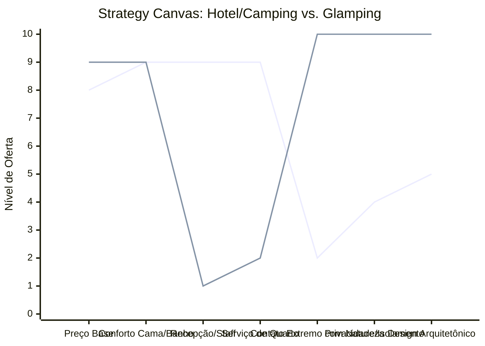

# Estudo de Caso Blue Ocean: Pousadas e Campings

## O Cenário Atual (Oceano Vermelho)

O mercado de hospedagem para turismo de natureza e lazer divide-se em duas categorias de alta competição:

1. **Hospedagem Convencional (Pousadas/Hotéis):** Disputa de preços no Booking/Airbnb, altos custos fixos com staff (recepção, camareiras, manutenção) e áreas comuns superlotadas.
2. **Campings Tradicionais:** Foco no preço extremamente baixo, falta de conforto, banheiros compartilhados e apelo restrito a um público específico mais rústico.

## A Estratégia do Oceano Azul: "Glamping e Refúgio"

A estratégia propõe a criação de um novo nicho ("Glamorous Camping" ou Refúgios), unindo o isolamento do camping com o conforto da hotelaria boutique, focando na cabana como destino final e não apenas um lugar para dormir.

**A Nova Proposta de Valor:**

- **Foco:** Casais ou viajantes que buscam desconexão, silêncio e contato com a natureza, sem abrir mão de muito conforto.
- **Ambiente:** Arquitetura imersiva (domos geodésicos, cabanas de vidro, A-frames) em locais isolados.
- **Modelo de Negócio:** Alto valor agregado com baixíssimo custo de folha de pagamento (auto-serviço premium).

## Framework das Quatro Ações (ERRC Grid)

- **Eliminar:** Recepção física (check-in digital) e serviço de quarto diário intrometido.
- **Reduzir:** Custos com staff on-site, grandes áreas comuns compartilhadas.
- **Elevar:** Isolamento, conforto (enxoval premium), design instagramável da acomodação.
- **Criar:** Kits de auto-serviço premium (cestas de café, lenha para fogueira), arquitetura imersiva na natureza.

## Strategy Canvas

*(Nota: Linha 1 = Hotel Tradicional; Linha 2 = Glamping / Cabanas)*
