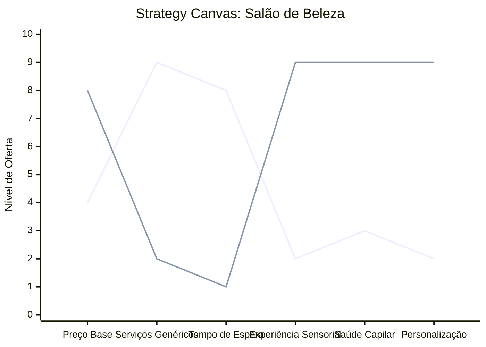

# Estudo de Caso: Salão de Beleza

## Cenários

**Oceano Vermelho:**
- Guerra de preços por cortes e serviços básicos.
- Atendimento focado apenas na execução rápida do serviço.
- Longo tempo de espera em ambientes ruidosos e caóticos.
- Dependência de pacotes de química genérica.
- Público generalista sem diferenciação de nicho.

**Oceano Azul:**
- Foco em "Spa Urbano" e saúde do couro cabeludo e fios (tricologia).
- Consultoria de imagem integrada ao visagismo.
- Atendimento com hora marcada estrita em ambiente relaxante (aromaterapia, som ambiente).
- Especialização em nichos (ex: transição capilar, cacheadas, terapia capilar orgânica).
- Assinaturas recorrentes de manutenção e venda de tratamentos exclusivos.

## Matriz ERRC

- **Eliminar:** Serviços superlotados de baixa margem, leitura de revistas antigas, pacotes genéricos.
- **Reduzir:** Tempo de espera, ruído excessivo de secadores, competição por preço em serviços básicos.
- **Elevar:** Saúde dos fios, experiência sensorial, consultoria personalizada de imagem.
- **Criar:** Terapias holísticas capilares, assinaturas de manutenção mensal, diagnósticos precisos de tricologia.

## Strategy Canvas

*(Nota: Linha 1 = Oceano Vermelho; Linha 2 = Oceano Azul)*

## Veja Também

- [Pet Shop](./pet-shop.md)
- [Escola de Idiomas](./escola-de-idiomas.md)
- [Turismo de Compras Têxtil](./turismo-compras-textil.md)
- [Pousadas e Campings](./pousadas-e-campings.md)
- [Academia de Escalada](./academia-de-escalada.md)
- [Personal Trainer](./personal-trainer.md)
- [Consultoria Empreendedora](./consultoria-empreendedora.md)
