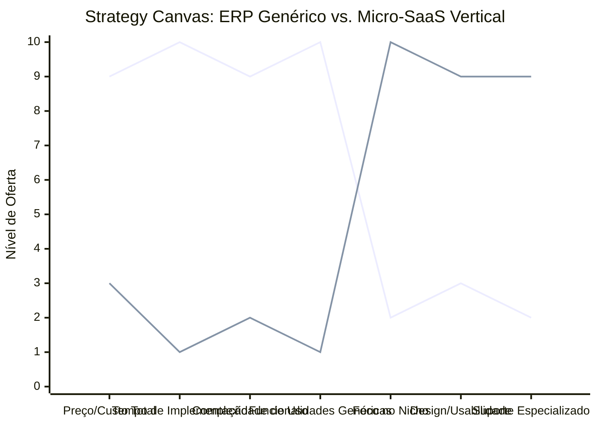

# Estudo de Caso Blue Ocean: Startup B2B SaaS

## Do "Software Genérico Complexo" para a "Solução de Nicho Especializada"

### 1. O Cenário Atual (Oceano Vermelho)

O mercado de software B2B tradicional é dominado por grandes ERPs (Enterprise Resource Planning) e CRMs genéricos, onde a competição ocorre por quem oferece o maior número de funcionalidades complexas.

**Características do Oceano Vermelho:**

- **Foco:** Atender a todos os tipos de indústrias com uma única plataforma complexa.
- **Implementação:** Longa, cara e exige treinamento extenso.
- **Preço:** Alto custo de licenciamento, consultoria e manutenção.
- **Experiência:** Sistemas lentos, difíceis de usar e repletos de botões que a maioria dos usuários nunca clica.

### 2. A Estratégia do Oceano Azul: "O Micro-SaaS Vertical"

A proposta é fugir da guerra contra os gigantes da tecnologia criando um **Micro-SaaS Vertical**, um software focado em resolver dores muito específicas de um único nicho de mercado (ex: software de gestão exclusivo para clínicas de fisioterapia, ou para frotas de guinchos).

**A Nova Proposta de Valor:**

- **Foco:** Um nicho de mercado ultra-específico e suas dores particulares.
- **Implementação:** Setup instantâneo (Self-service) sem necessidade de consultores.
- **Preço:** Assinatura mensal (MRR) acessível, cobrada no cartão de crédito.
- **Experiência:** Design moderno, interface minimalista apenas com o que o nicho realmente precisa, e integrações simplificadas.

### 3. Strategy Canvas (Tela Estratégica)

O gráfico abaixo compara o ERP/CRM genérico tradicional com o modelo de Micro-SaaS Vertical.

**Legenda:**

- **Linha 1:** ERP/CRM Genérico
- **Linha 2:** Micro-SaaS Vertical (Blue Ocean)

> **Nota:** O Micro-SaaS Vertical elimina drasticamente a _Complexidade de Uso_ e o _Tempo de Implementação_, reduzindo _Funcionalidades Genéricas_ para focar agressivamente no _Foco no Nicho_ e no _Design/Usabilidade_. Ele não tenta fazer de tudo, mas faz perfeitamente o que o nicho precisa.

### 4. Framework das Quatro Ações (ERRC Grid)

Para criar este novo mercado, devemos aplicar as quatro ações:

| Ação         | O que fazer                                                                                                                                                                                                      |
| :----------- | :--------------------------------------------------------------------------------------------------------------------------------------------------------------------------------------------------------------- |
| **ELIMINAR** | **Necessidade de consultores para setup:** O sistema deve ser "Plug and Play". **Módulos inúteis para o nicho:** Eliminar tudo que não resolve o problema principal.                                          |
| **REDUZIR**  | **Curva de aprendizado:** Interfaces intuitivas focadas na jornada diária do usuário. **Custos de aquisição do cliente (CAC):** Utilizar marketing focado no nicho específico, barateando anúncios.           |
| **AUMENTAR** | **Design e Experiência do Usuário (UX/UI):** O software precisa parecer um app de consumidor final. **Especialização do Suporte:** O atendimento deve entender do negócio do cliente, não apenas do software. |
| **CRIAR**    | **Comunidade de Nicho:** Fóruns ou grupos para os usuários trocarem experiências do setor. **Integrações hiper-relevantes:** Conectar o software diretamente às ferramentas que o nicho já usa no dia a dia.  |

### 5. Conclusão

Ao escolher um nicho específico, a startup deixa de competir no "Oceano Vermelho" dos gigantes de software, onde os orçamentos de marketing são infinitos. No "Oceano Azul" de um nicho, o Micro-SaaS se torna a escolha óbvia. O cliente percebe o produto como feito sob medida para ele, o que aumenta a retenção, diminui o suporte e cria defensores fiéis da marca.

### 6. Veja Também (Outros Estudos de Caso)

- [Turismo de Compras Têxtil](./turismo-compras-textil.md)
- [Pousadas e Campings](./pousadas-campings.md)
- [Academia de Escalada](./academia-escalada.md)
- [Personal Trainer](./personal-trainer.md)
- [Consultoria Empreendedora](./consultoria-empreendedora.md)
- [Barbearia](./barbearia.md)
- [Clínica de Estética](./clinica-estetica.md)
- [Pet Shop](./pet-shop.md)
- [Cafeteria](./cafeteria.md)
- [Oficina Mecânica](./oficina-mecanica.md)
- [Escola de Idiomas](./escola-idiomas.md)
- [Food Truck e Comida de Rua](./food-truck.md)
