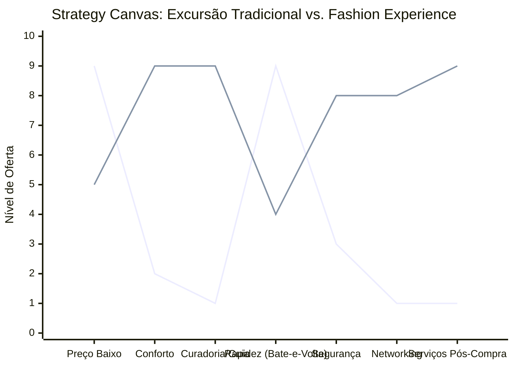

# Estudo de Caso Blue Ocean: Turismo de Compras Têxtil
## "Fashion Experience" vs. Turismo de Sacoleiro

### 1. O Cenário Atual (Oceano Vermelho)

O turismo de compras tradicional (ex: excursões para o Brás/SP, Feira da Madrugada, Santa Cruz do Capibaribe) é caracterizado por uma competição extrema baseada em **preço baixo** e **volume**.

**Características do Oceano Vermelho:**
*   **Foco:** Compra de revenda em massa ("sacoleiro").
*   **Transporte:** Ônibus lotados, desconfortáveis, horários exaustivos (bate-e-volta noturno).
*   **Experiência:** Estresse, insegurança, alimentação precária, "cada um por si".
*   **Valor Percebido:** Apenas o preço da mercadoria. O serviço de turismo é uma *commodity* (transporte).

### 2. A Estratégia do Oceano Azul: "Curadoria & Experiência Fashion"

A proposta é transformar a "excursão de compras" em uma **"Imersão de Moda"**. O público-alvo deixa de ser apenas o revendedor focado no centavo e passa a ser o lojista boutique ou o consumidor final que busca **curadoria** e **conforto**.

**A Nova Proposta de Valor:**
*   **Foco:** Acesso a peças exclusivas e networking.
*   **Transporte:** Veículos menores (vans executivas) ou parcerias com hotéis.
*   **Experiência:** Guia de estilo (Personal Shopper) incluso, roteiro de lojas selecionadas (sem "bater perna" no ruim), logística de despacho das compras.

### 3. Strategy Canvas (Tela Estratégica)

O gráfico abaixo compara o modelo tradicional de excursão com a nova proposta de "Fashion Experience".

**Legenda:**
*   **Linha 1:** Excursão Tradicional
*   **Linha 2:** Fashion Experience (Blue Ocean)

> **Nota:** Enquanto a excursão tradicional foca obsessivamente em *Preço Baixo* e *Rapidez* (sacrificando todo o resto), a Fashion Experience reduz a ênfase na "correria" para aumentar drasticamente o *Conforto*, a *Curadoria* e os *Serviços Agregados*.

### 4. Framework das Quatro Ações (ERRC Grid)

Para criar este novo mercado, devemos aplicar as quatro ações:

| Ação | O que fazer |
| :--- | :--- |
| **ELIMINAR** | **"Bate-e-volta" exaustivo:** Eliminar viagens noturnas sem pernoite ou descanso. **Paradas genéricas:** Fim das visitas a "shoppings" que pagam comissão mas têm produtos ruins. |
| **REDUZIR** | **Foco obsessivo no menor preço de transporte:** Cobrar mais caro pelo serviço para entregar qualidade. **Tamanho dos grupos:** Reduzir de ônibus de 50 lugares para vans ou grupos VIP. |
| **AUMENTAR** | **Conforto:** Poltronas, Wifi, lanches de qualidade. **Segurança:** Monitoramento e rotas seguras. **Networking:** Jantares ou momentos de troca entre os lojistas/compradores. |
| **CRIAR** | **Consultoria de Estilo (Personal Shopper):** Guia que entende de moda, não apenas de rotas. **Logística Integrada:** A operadora cuida do despacho das caixas para a cidade de origem. **Acesso aos "Bastidores":** Visitas a fábricas ou showrooms fechados. |

### 5. Conclusão

Ao migrar do modelo de transporte de massa para o modelo de consultoria e experiência, a empresa sai da guerra de preços das passagens de ônibus (onde a margem é ínfima) e entra no mercado de serviços de alto valor agregado. O cliente não paga apenas pelo assento, mas pelo **acesso privilegiado** e pela **inteligência de compra** que a empresa oferece.

### 6. Veja Também (Outros Estudos de Caso)

*   [Pousadas e Campings](./pousadas-campings.md)
*   [Academia de Escalada](./academia-escalada.md)
*   [Personal Trainer](./personal-trainer.md)
*   [Consultoria Empreendedora](./consultoria-empreendedora.md)
*   [Barbearia](./barbearia.md)
*   [Clínica de Estética](./clinica-estetica.md)
