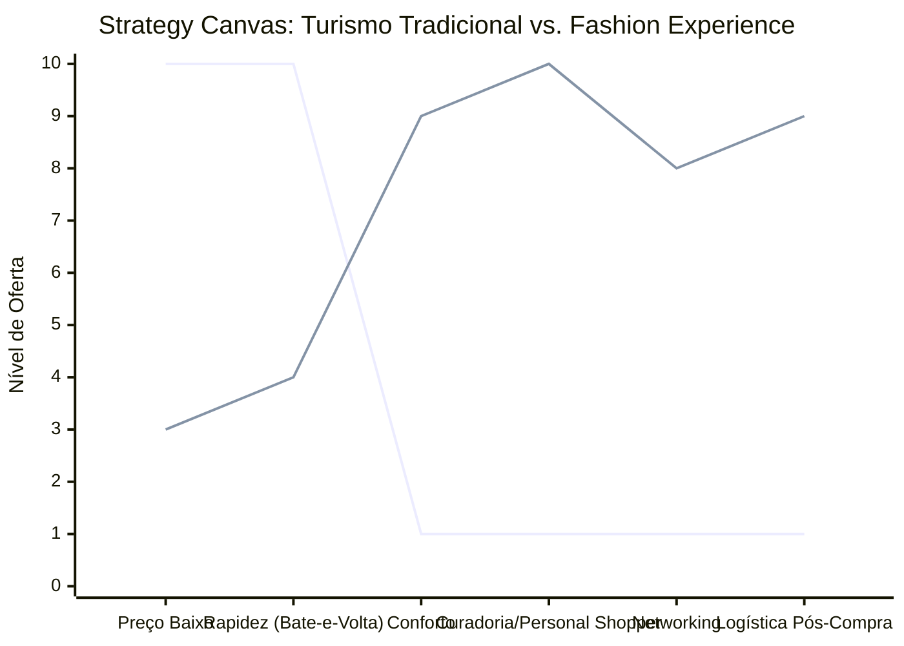

# Estudo de Caso Blue Ocean: Turismo de Compras Têxtil

## O Cenário Atual (Oceano Vermelho)

O mercado de turismo de compras tradicional é focado na redução extrema de custos de transporte:

1. **Excursões em Massa ("Bate-e-Volta"):** Viagens noturnas e extremamente cansativas de ônibus lotados.
2. **Guerra de Preços no Transporte:** Competição unicamente focada em oferecer a "passagem mais barata" para cobrir a viagem.
3. **Falta de Estrutura:** Paradas em lojas de pouca qualidade para ganhos comissionados, ignorando as reais necessidades dos lojistas e revendedores.

## A Estratégia do Oceano Azul: "Fashion Experience"

Este estudo propõe a transição do modelo exaustivo de turismo de compras (focado apenas no menor preço de transporte) para uma experiência de alto valor agregado e consultoria focada nos lucros do revendedor.

**A Nova Proposta de Valor:**

- **Foco:** Lojistas e revendedores que buscam peças de alta qualidade, tendências de moda, e que não querem passar pelo estresse logístico e exaustão física do turismo "sacoleiro".
- **Ambiente:** Viagem confortável (vans executivas, assentos confortáveis, Wi-Fi).
- **Modelo de Negócio:** Venda de uma experiência integrada (transporte premium + curadoria de moda + logística).

## Framework das Quatro Ações (ERRC Grid)

- **Eliminar:** Viagens noturnas exaustivas e paradas em lojas comissionadas irrelevantes.
- **Reduzir:** Foco excessivo na competição por preço de passagem; tamanho dos grupos.
- **Elevar:** Conforto, segurança, networking entre revendedores.
- **Criar:** Serviço de Personal Shopper/Curadoria de moda, logística de envios pós-compra.

## Strategy Canvas

*(Nota: Linha 1 = Turismo Tradicional; Linha 2 = Fashion Experience)*
