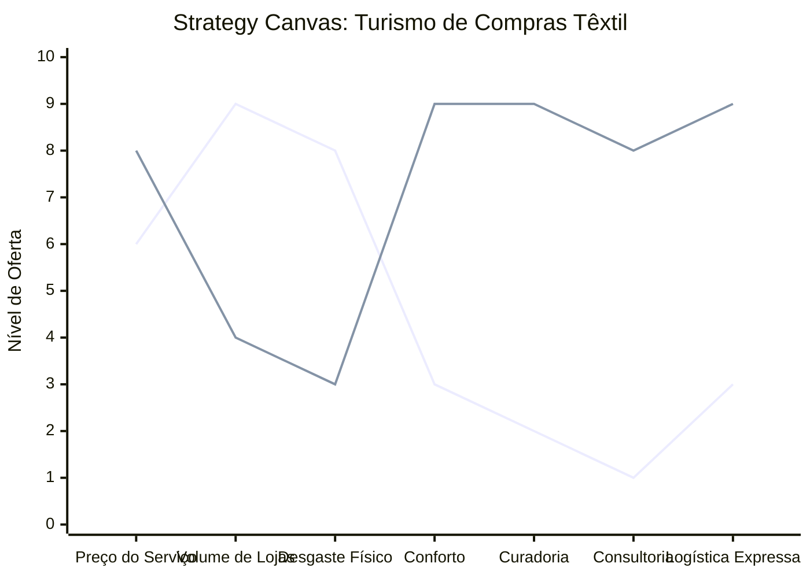

# Estudo de Caso: Turismo de Compras Têxtil

## Cenários

**Oceano Vermelho:**
- Foco em preço baixo e alto volume.
- Concorrência agressiva entre excursões padronizadas.
- Roteiros exaustivos focados em quantidade de lojas.
- Logística de transporte precária e desconfortável.
- Baixa diferenciação, dependência de comissões de atacados genéricos.

**Oceano Azul:**
- Foco na experiência de compra otimizada, curadoria e consultoria de moda.
- Público-alvo: Lojistas e revendedores buscando coleções exclusivas e eficiência.
- Roteiros confortáveis e altamente personalizados.
- Serviços agregados: logística inteligente de despacho e pré-seleção de fornecedores.
- Transporte premium e atendimento VIP.

## Matriz ERRC

- **Eliminar:** Visitas a lojas irrelevantes e excursões lotadas.
- **Reduzir:** Tempo de deslocamento, desgaste físico do comprador, guerra de preços.
- **Elevar:** Conforto, curadoria de tendências, eficiência operacional do cliente.
- **Criar:** Consultoria de moda integrada, despacho de mercadoria facilitado, parcerias com confecções de alto padrão.

## Strategy Canvas

*(Nota: Linha 1 = Oceano Vermelho; Linha 2 = Oceano Azul)*

## Veja Também

- [Pousadas e Campings](./pousadas-e-campings.md)
- [Academia de Escalada](./academia-de-escalada.md)
- [Personal Trainer](./personal-trainer.md)
- [Consultoria Empreendedora](./consultoria-empreendedora.md)
- [Hamburgueria Artesanal](./hamburgueria-artesanal.md)
- [Estética e Beleza](./estetica-e-beleza.md)
- [Pet Shop](./pet-shop.md)
