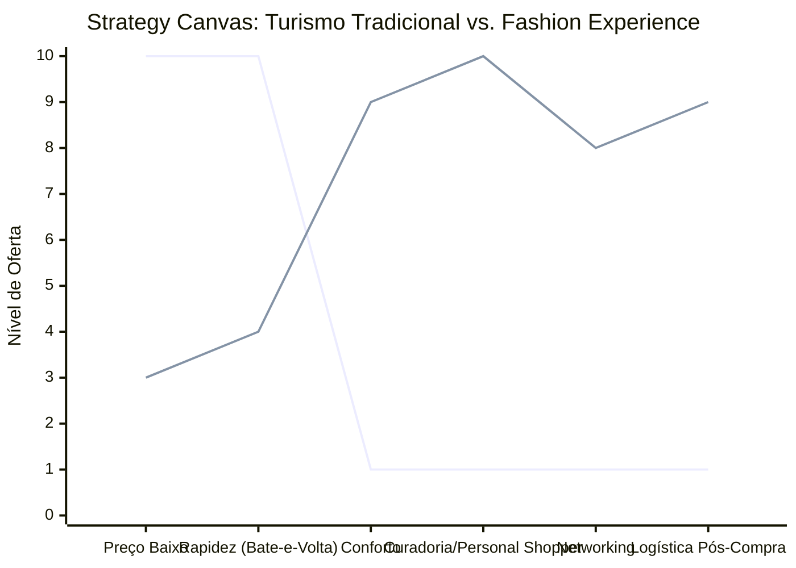

# Estudo de Caso Blue Ocean: Turismo de Compras Têxtil

## De "Sacoleiro" para "Fashion Experience"

### 1. O Cenário Atual (Oceano Vermelho)

O mercado de turismo de compras tradicional é focado na redução extrema de custos de transporte:

1. **Excursões em Massa ("Bate-e-Volta"):** Viagens noturnas e extremamente cansativas de ônibus lotados.
2. **Guerra de Preços no Transporte:** Competição unicamente focada em oferecer a "passagem mais barata" para cobrir a viagem.
3. **Falta de Estrutura:** Paradas em lojas de pouca qualidade para ganhos comissionados, ignorando as reais necessidades dos lojistas e revendedores.

### 2. A Estratégia do Oceano Azul: "Fashion Experience"

Este estudo propõe a transição do modelo exaustivo de turismo de compras (focado apenas no menor preço de transporte) para uma experiência de alto valor agregado e consultoria focada nos lucros do revendedor.

**A Nova Proposta de Valor:**

- **Foco:** Lojistas e revendedores que buscam peças de alta qualidade, tendências de moda, e que não querem passar pelo estresse logístico e exaustão física do turismo "sacoleiro".
- **Ambiente:** Viagem confortável (vans executivas, assentos confortáveis, Wi-Fi).
- **Modelo de Negócio:** Venda de uma experiência integrada (transporte premium + curadoria de moda + logística).

### 3. Strategy Canvas (Tela Estratégica)

O gráfico abaixo ilustra a mudança de foco da redução de custos operacionais (Oceano Vermelho) para o aumento de conforto e serviços de curadoria (Oceano Azul).

**Legenda:**

- **Linha 1:** Turismo Tradicional (Excursão)
- **Linha 2:** Fashion Experience (Blue Ocean)

### 4. Framework das Quatro Ações (ERRC Grid)

| Ação         | O que fazer                                                                                                                                                                                                           |
| :----------- | :-------------------------------------------------------------------------------------------------------------------------------------------------------------------------------------------------------------------- |
| **ELIMINAR** | **Viagens noturnas exaustivas:** Eliminar o modelo "bate-e-volta" insalubre. **Lojas comissionadas ruins:** Paradas em locais genéricos apenas para o motorista ganhar comissão.                                   |
| **REDUZIR**  | **Foco exclusivo no preço da passagem:** A proposta deixa de ser o transporte mais barato. **Tamanho dos grupos:** Reduzir de ônibus de 50 lugares para vans ou micro-ônibus executivos.                           |
| **AUMENTAR** | **Conforto e Segurança:** Assentos premium, Wi-Fi de alta velocidade, ambiente seguro e tranquilo. **Networking:** Promover conexão e troca de experiências entre lojistas e compradores durante a viagem.         |
| **CRIAR**    | **Serviço de Personal Shopper:** Curadoria especializada para otimizar as compras de moda. **Logística Integrada:** Serviços de despacho, embalagem e envio de mercadorias no pós-compra.                          |

### 5. Conclusão

Migrar do transporte de massa comoditizado para uma consultoria de compras (Fashion Experience). O cliente premium paga pelo acesso a peças exclusivas, inteligência de moda, curadoria especializada, conforto extremo e zero stress logístico. Dessa forma, cria-se um novo espaço de mercado que não compete por preços de passagens, mas pelo valor entregue ao negócio do cliente.

### 6. Veja Também (Outros Estudos de Caso)

- [Pousadas e Campings](./pousadas-e-campings.md)
- [Academia de Escalada](./academia-de-escalada.md)
- [Personal Trainer](./personal-trainer.md)
- [Consultoria Empreendedora](./consultoria-empreendedora.md)
- [Agência de Marketing](./agencia-de-marketing.md)
- [Barbearia](./barbearia.md)
- [Clínica de Estética](./clinica-de-estetica.md)
- [Pet Shop](./pet-shop.md)
- [Cafeteria](./cafeteria.md)
- [Oficina Mecânica](./oficina-mecanica.md)
- [Escola de Idiomas](./escola-de-idiomas.md)
- [Startup B2B SaaS](./startup-b2b-saas.md)
- [Food Truck e Comida de Rua](./food-truck.md)
- [Delivery de Comida Saudável](./delivery-de-comida-saudavel.md)
- [Loja de Roupas](./loja-de-roupas.md)
- [Estúdio de Yoga](./estudio-de-yoga.md)
- [Coworking de Nicho](./coworking-de-nicho.md)
- [Imobiliária Consultiva](./imobiliaria-consultiva.md)
