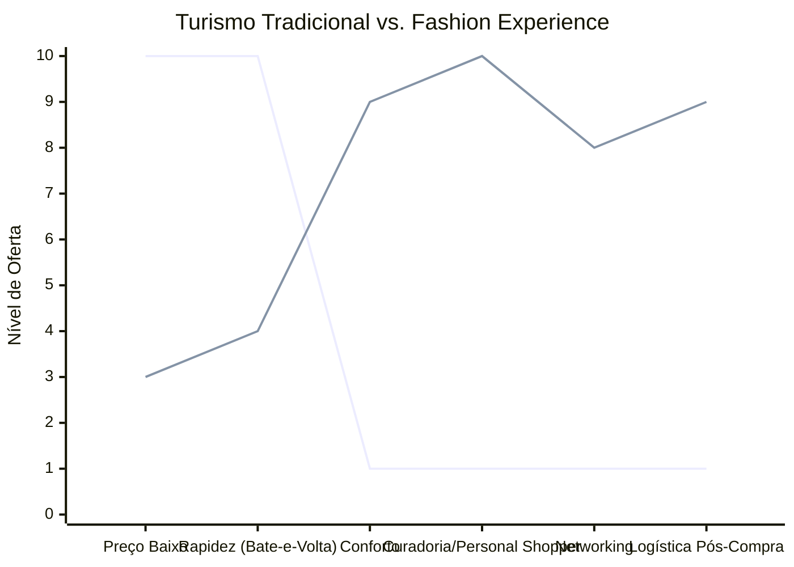

# Estudo de Caso Blue Ocean: Turismo de Compras Têxtil

## Estratégia Recomendada: De "Sacoleiro" para "Fashion Experience"

Este estudo propõe a transição do modelo exaustivo de turismo de compras (focado apenas no menor preço de transporte) para uma experiência de alto valor agregado.

### 1. Strategy Canvas

O gráfico abaixo ilustra a mudança de foco da redução de custos operacionais (Oceano Vermelho) para o aumento de conforto e serviços de curadoria (Oceano Azul).

**Legenda:**
- **Linha 1:** Turismo Tradicional (Excursão)
- **Linha 2:** Fashion Experience (Blue Ocean)

### 2. ERRC Grid (Quatro Ações)

| Ação | Estratégia Objetiva |
| :--- | :--- |
| **ELIMINAR** | Viagens noturnas exaustivas ("bate-e-volta") e paradas em lojas genéricas apenas por comissão. |
| **REDUZIR** | O foco exclusivo no preço da passagem. Tamanho dos grupos (de ônibus de 50 lugares para vans executivas). |
| **AUMENTAR** | Conforto (assentos, Wi-Fi), Segurança e Networking entre os lojistas/compradores durante a viagem. |
| **CRIAR** | Serviço de *Personal Shopper* para otimizar as compras e logística integrada de envio das mercadorias. |

### 3. Conclusão Objetiva

Migrar do transporte de massa comoditizado para uma consultoria de compras. O cliente premium paga pelo acesso a peças exclusivas, inteligência de moda e zero stress logístico.
