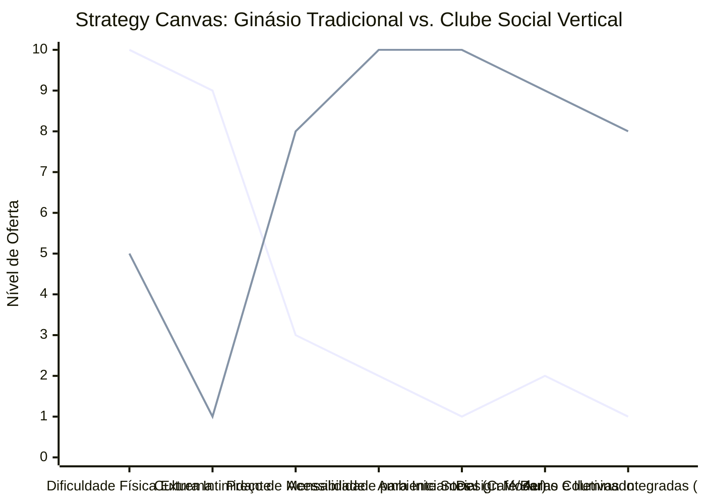

# Estudo de Caso Blue Ocean: Academia de Escalada

## De "Ginásio Hardcore" para "Clube Social Vertical e Hub de Bem-Estar"

### 1. O Cenário Atual (Oceano Vermelho)

O mercado tradicional de ginásios e arenas de escalada indoor é historicamente nichado, focado na performance extrema e intimidador para novos públicos:

1. **Foco Exclusivo na Alta Performance:** Estruturas criadas para atender atletas experientes e praticantes profissionais que buscam treinamento pesado e vias de extrema dificuldade física.
2. **Cultura Excludente ("Dirtbag"):** Ambientes frequentemente rústicos, sem climatização ou sistema de limpeza adequado, com excesso de magnésio em suspensão no ar e pouca ou nenhuma estrutura para convivência social pós-treino.
3. **Barreira de Entrada Elevada:** O uso obrigatório de equipamentos complexos e caros (cordas, cadeirinhas, mosquetões) e a exigência de um parceiro de segurança (para dar seg) afasta iniciantes e o público de fitness casual.
4. **Competição de Preço com Academias de Musculação:** Dificuldade de justificar tíquetes elevados, competindo diretamente com redes de academias tradicionais focadas em musculação barata.

### 2. A Estratégia do Oceano Azul: "Clube Social Vertical"

A estratégia propõe reposicionar a escalada de um esporte de nicho extremo e intimidador para uma atividade social ativa, de bem-estar urbano e entretenimento, transformando o ginásio no chamado "Terceiro Lugar" (entre a casa e o trabalho) do cliente.

**A Nova Proposta de Valor:**

- **Foco:** Profissionais liberais, famílias e pessoas que buscam uma alternativa divertida e social à musculação convencional, onde a conexão humana e a socialização são tão importantes quanto o exercício em si.
- **Ambiente:** Foco no *bouldering* (escalada sem cordas em paredes baixas sobre colchões de alta densidade), com design arquitetônico impecável, bem climatizado, iluminado e extremamente higiênico.
- **Modelo de Negócio:** Receitas diversificadas que combinam planos de adesão mensal, consumo qualificado em um café/bar integrado, locação de sapatilhas de escalada, eventos corporativos e venda de itens de marca própria.

### 3. Strategy Canvas (Tela Estratégica)

Comparativo entre o ginásio clássico de escalada voltado para treinamento avançado e o novo conceito de clube social vertical e de bem-estar.

**Legenda:**

- **Linha 1:** Ginásio Hardcore Tradicional
- **Linha 2:** Clube Social Vertical (Blue Ocean)

> **Nota:** O Clube Social Vertical reduz drasticamente a dificuldade extrema das rotas e a cultura intimidadora do esporte para criar uma experiência focada em Acessibilidade, Design, Socialização e Integração Holística, justificando a cobrança de um tíquete mensal muito superior.

### 4. Framework das Quatro Ações (ERRC Grid)

| Ação         | O que fazer                                                                                                                                                                                                      |
| :----------- | :--------------------------------------------------------------------------------------------------------------------------------------------------------------------------------------------------------------- |
| **ELIMINAR** | **Ambiente hostil e escuro:** Acabar com a cultura "dirtbag" que afasta e intimida novos clientes e iniciantes. **Exigência de parceiros/cordas:** Reduzir a dependência de sistemas de cordas focando em bouldering. |
| **REDUZIR**  | **Foco em performance atlética extrema:** Menos vias impossíveis que desmotivam o iniciante. **Odor e resíduos de suor:** Sistemas avançados de ventilação, exaustores e filtragem de pó de magnésio.         |
| **AUMENTAR** | **Limpeza e Estética Visual:** Ambientes bem iluminados, instagramáveis e banheiros premium de alto padrão. **Acessibilidade das vias:** Rotas fáceis que geram pequenas vitórias diárias para iniciantes.    |
| **CRIAR**    | **Áreas de Integração Ativa:** Cafés artesanais, espaços de coworking e bares com torneiras de chope artesanal. **Práticas de Bem-Estar Holísticas:** Estúdios de Yoga, massoterapia e treinos funcionais complementares. |

### 5. Conclusão

Transformar a escalada em um ecossistema social de convivência urbana. Ao remover a complexidade técnica e a barreira da cultura excludente, a academia atrai um público premium cansado de academias tradicionais. O negócio passa a competir no mercado de entretenimento qualificado e saúde mental. A receita deixa de depender apenas de planos mensais e passa a faturamento por consumo de alimentos e bebidas e eventos corporativos de alto valor.

### 6. Veja Também (Outros Estudos de Caso)

- [Clínica de Psicologia](./clinica-de-psicologia.md)
- [Estética Automotiva](./estetica-automotiva.md)
- [Turismo de Compras Têxtil](./turismo-compras-textil.md)
- [Pousadas e Campings](./pousadas-e-campings.md)
- [Personal Trainer](./personal-trainer.md)
- [Consultoria Empreendedora](./consultoria-empreendedora.md)
- [Agência de Automação de IA](./agencia-de-automacao-ia.md)
- [Micro Mercado Autónomo](./micro-mercado-autonomo.md)
- [BPO Financeiro e Contabilidade Consultiva](./bpo-financeiro-e-contabilidade.md)
- [Agência de Marketing](./agencia-de-marketing.md)
- [Barbearia](./barbearia.md)
- [Clínica de Estética](./clinica-de-estetica.md)
- [Pet Shop](./pet-shop.md)
- [Cafeteria](./cafeteria.md)
- [Oficina Mecânica](./oficina-mecanica.md)
- [Escola de Idiomas](./escola-de-idiomas.md)
- [Startup B2B SaaS](./startup-b2b-saas.md)
- [Food Truck e Comida de Rua](./food-truck.md)
- [Delivery de Comida Saudável](./delivery-de-comida-saudavel.md)
- [Loja de Roupas](./loja-de-roupas.md)
- [Estúdio de Yoga](./estudio-de-yoga.md)
- [Coworking de Nicho](./coworking-de-nicho.md)
- [Imobiliária Consultiva](./imobiliaria-consultiva.md)
